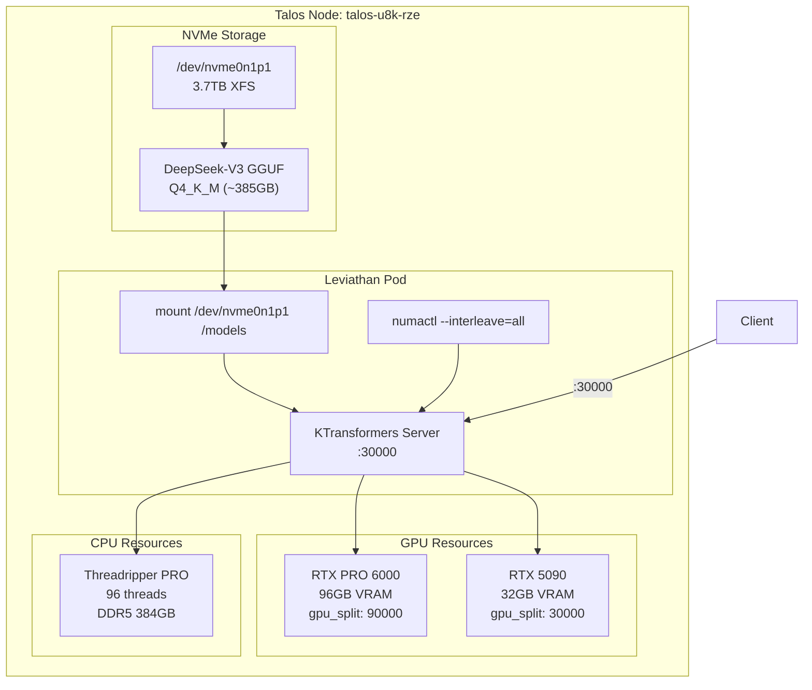

# Operation Leviathan: KTransformers Standard Build

## Objective
Build KTransformers inference engine without DeepGEMM for CPU-offloaded DeepSeek-V3 inference on Blackwell GPUs (SM 12.0).

---

## Critical Blockers & Fixes

| Issue | Root Cause | Fix |
|-------|-----------|-----|
| CUDA 13.1 vs PyTorch cu128 mismatch | KTransformers build checks CUDA version | Install CUDA 12.8 toolkit in container, set `CUDA_HOME` |
| Missing `cpufeature` | Undocumented build dependency | Pre-install before KTransformers |
| Missing `requirements.txt` | Repo structure changed | Use `pip install .` with dependencies inline |
| Wrong node name | `talos-node-0` doesn't exist | Use `talos-u8k-rze` |
| Wrong mount path | NVMe is partitioned | Mount `/dev/nvme0n1p1` not `/dev/nvme0n1` |

---

## Phase 3: Docker Build (Proxmox Host)

### File: `/root/docker/Dockerfile.leviathan`

```dockerfile
FROM 192.168.3.10:5000/omni/engine:bleeding-edge-v2

WORKDIR /app

# 1. INSTALL CUDA 12.8 TOOLKIT (Match PyTorch cu128)
# This bypasses the CUDA version mismatch error
RUN apt-get update && apt-get install -y wget && \
    wget https://developer.download.nvidia.com/compute/cuda/repos/ubuntu2204/x86_64/cuda-keyring_1.1-1_all.deb && \
    dpkg -i cuda-keyring_1.1-1_all.deb && \
    apt-get update && \
    apt-get install -y cuda-toolkit-12-8 && \
    rm -rf /var/lib/apt/lists/*

# 2. SET CUDA 12.8 AS BUILD ENVIRONMENT
ENV CUDA_HOME=/usr/local/cuda-12.8
ENV PATH=${CUDA_HOME}/bin:${PATH}
ENV LD_LIBRARY_PATH=${CUDA_HOME}/lib64:${LD_LIBRARY_PATH}

# 3. PRE-INSTALL BUILD DEPENDENCIES
RUN pip3 install cpufeature packaging ninja numpy --break-system-packages

# 4. CLONE KTRANSFORMERS
RUN git clone https://github.com/kvcache-ai/ktransformers.git . && \
    git submodule update --init --recursive

# 5. ARCHITECTURE FLAGS (No DeepGEMM)
ENV TORCH_CUDA_ARCH_LIST="9.0a 10.0 12.0"
ENV ENABLE_DEEPGEMM=0
ENV KTRANSFORMERS_FORCE_BUILD=1

# 6. CPU OPTIMIZATION (Threadripper/Zen5 AVX-512)
ENV CXXFLAGS="-march=native -mtune=native -O3"

# 7. BUILD & INSTALL
RUN pip3 install . --break-system-packages --no-build-isolation

# 8. RUNTIME TOOLS
RUN apt-get update && apt-get install -y numactl && rm -rf /var/lib/apt/lists/*

ENTRYPOINT ["python3", "-m", "ktransformers.server.main"]
```

### Build Commands
```bash
# On Proxmox Host (192.168.3.10)
docker build --network host \
  -f /root/docker/Dockerfile.leviathan \
  -t omni/engine:leviathan-standard \
  /root/docker/

docker tag omni/engine:leviathan-standard 192.168.3.10:5000/omni/engine:leviathan-standard
docker push 192.168.3.10:5000/omni/engine:leviathan-standard
```

---

## Phase 4: Deployment Manifest

### File: `manifests/leviathan-deploy.yaml`

```yaml
apiVersion: apps/v1
kind: Deployment
metadata:
  name: cortex-leviathan
  namespace: ai-workloads
  labels:
    app: leviathan-671b
spec:
  replicas: 1
  strategy:
    type: Recreate
  selector:
    matchLabels:
      app: leviathan-671b
  template:
    metadata:
      labels:
        app: leviathan-671b
    spec:
      runtimeClassName: nvidia
      nodeName: talos-u8k-rze  # FIXED: Correct node name
      tolerations:
        - key: "node-role.kubernetes.io/control-plane"
          operator: "Exists"
          effect: "NoSchedule"
        - key: "nvidia.com/gpu"
          operator: "Exists"
          effect: "NoSchedule"
      containers:
      - name: engine
        image: 192.168.3.10:5000/omni/engine:leviathan-standard
        imagePullPolicy: Always
        securityContext:
          privileged: true
        resources:
          limits:
            nvidia.com/gpu: "2"
            memory: "360Gi"
            cpu: "96"
          requests:
            nvidia.com/gpu: "2"
            memory: "256Gi"
            cpu: "48"
        env:
        - name: CUDA_VISIBLE_DEVICES
          value: "0,1"
        - name: ENABLE_DEEPGEMM
          value: "false"
        command: ["/bin/bash", "-c"]
        args:
          - |
            set -ex
            echo ">> MOUNTING NVME..."
            mkdir -p /models
            # FIXED: Mount partition, not raw disk
            NVME_PART=$(lsblk -bdn -o NAME,SIZE -p | awk '$2 > 3500000000000 {print $1"p1"}' | head -n 1)
            mount $NVME_PART /models || echo "Mount check: $?"
            
            echo ">> SUMMONING LEVIATHAN..."
            numactl --interleave=all \
            python3 -m ktransformers.server.main \
              --model_path /models/models/deepseek-v3-gguf \
              --model_name deepseek-v3 \
              --host 0.0.0.0 \
              --port 30000 \
              --cpu_offload_max_threads 96 \
              --gpu_split "90000,30000"
        ports:
        - containerPort: 30000
        volumeMounts:
        - name: shm
          mountPath: /dev/shm
      volumes:
      - name: shm
        emptyDir:
          medium: Memory
          sizeLimit: 64Gi
---
apiVersion: v1
kind: Service
metadata:
  name: leviathan-inference
  namespace: ai-workloads
spec:
  type: NodePort
  selector:
    app: leviathan-671b
  ports:
    - name: http
      port: 30000
      targetPort: 30000
      nodePort: 30000
      protocol: TCP
```

---

## Architecture Diagram



---

## Execution Sequence

| Step | Action | Target | Verification |
|------|--------|--------|--------------|
| 1 | Create Dockerfile.leviathan | `/root/docker/Dockerfile.leviathan` | File exists |
| 2 | Build Docker image | Proxmox Host | `docker images \| grep leviathan-standard` |
| 3 | Push to registry | `192.168.3.10:5000` | `curl 192.168.3.10:5000/v2/omni/engine/tags/list` |
| 4 | Update manifest | `manifests/leviathan-deploy.yaml` | YAML validates |
| 5 | Wait for download | sysadmin-logistics pod | Logs show "DOWNLOAD COMPLETE" |
| 6 | Deploy Leviathan | `kubectl apply -f manifests/leviathan-deploy.yaml` | Pod Running |
| 7 | Verify inference | `curl http://192.168.3.2:30000/health` | 200 OK |

---

## Definition of Done

- [ ] Docker image `omni/engine:leviathan-standard` built without errors
- [ ] Image pushed to `192.168.3.10:5000` registry
- [ ] Manifest uses correct node name (`talos-u8k-rze`)
- [ ] Manifest mounts partition (`/dev/nvme0n1p1`) not raw disk
- [ ] Download complete (385GB DeepSeek-V3 GGUF)
- [ ] Leviathan pod Running with 2 GPUs allocated
- [ ] `/health` endpoint responding on port 30000

---

## Risk Mitigation

| Risk | Mitigation |
|------|------------|
| CUDA 12.8 install fails | Fall back to `--no-build-isolation` with `CUDA_HOME` pointing to existing 12.8 if present |
| KTransformers build fails | Check for V0.3 prebuilt wheels as backup |
| GPU memory insufficient | Reduce `gpu_split` values, increase CPU offload |
| Mount fails | Verify partition exists with `lsblk` before deploy |
