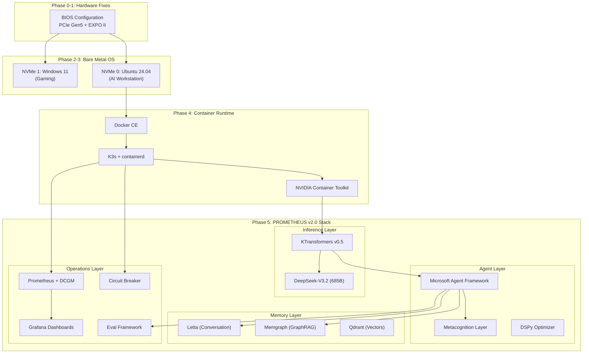
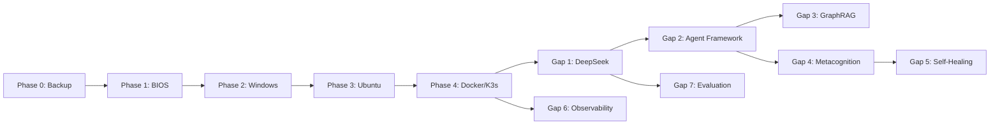

# OPERATION PROMETHEUS SOVEREIGN
## Unified Bare Metal Migration + PROMETHEUS v2.0 Implementation

---

## OBJECTIVE

Execute a complete infrastructure pivot from Proxmox VE virtualization to bare metal Ubuntu 24.04, while simultaneously deploying all 7 PROMETHEUS v2.0 components. This unified approach ensures hardware fixes, OS migration, and AI stack deployment are coordinated in a single execution flow.

---

## ARCHITECTURE OVERVIEW



---

## HARDWARE BASELINE (Redfish-Verified)

| Component | Specification | Status |
|-----------|---------------|--------|
| **CPU** | AMD Threadripper PRO 9995WX (96C/192T, Zen5) | ✅ |
| **RAM** | 384GB DDR5 ECC (8×48GB SK Hynix) | ⚠️ 6000 MT/s (target 6400) |
| **GPU 0** | RTX PRO 6000 Blackwell (96GB) | ⚠️ Gen1 link |
| **GPU 1** | RTX 5090 (32GB) | ⚠️ Gen1 link |
| **NVMe 0** | Crucial CT4000T705SSD3 (4TB Gen5) | Proxmox → Ubuntu |
| **NVMe 1** | WD_BLACK SN8100 (4TB Gen5) | Empty → Windows |
| **BMC** | ASUS ASMB11-iKVM @ 192.168.3.202 | ✅ Redfish ready |

---

## EXECUTION PHASES

### PHASE 0: Pre-Flight Preparation

**Objective:** Backup critical data, prepare ISOs, verify tooling

| Step | Action | Verification |
|------|--------|--------------|
| 0.1 | Backup Letta memories from `/var/lib/letta/` | `tar -czvf` + SCP to Mac |
| 0.2 | Backup Proxmox configs `/etc/pve/`, `/root/manifests/` | `tar -czvf` + SCP to Mac |
| 0.3 | Download Windows 11 Pro ISO (24H2) | Verify SHA256 |
| 0.4 | Download Ubuntu 24.04.1 Desktop ISO | Verify SHA256 |
| 0.5 | Host ISOs on Proxmox HTTP server (:8080) | `curl -I` test from Mac |
| 0.6 | Verify Redfish MCP connectivity | `mcp_redfish_list_servers` returns 192.168.3.202 |

**Files to Create:**
- `~/backups/iron-sovereign-YYYYMMDD/letta-backup.tar.gz`
- `~/backups/iron-sovereign-YYYYMMDD/proxmox-configs.tar.gz`

---

### PHASE 1: BIOS Fixes (CRITICAL - Hardware Unlocking)

**Objective:** Fix PCIe Gen1 bottleneck (12.8x bandwidth loss) and RAM underclocking

| Step | Action | BIOS Path | Value |
|------|--------|-----------|-------|
| 1.1 | Access BIOS via BMC KVM | `https://192.168.3.202` → Remote Control → HTML5 KVM | - |
| 1.2 | Set Early Link Speed | AMD CBS → NBIO → PCIe → `CbsCmnEarlyLinkSpeedSHP` | **GEN5** |
| 1.3 | Verify Target Link Speed | AMD CBS → NBIO → PCIe → `CbsCmnPcieTargetLinkSpeedSHP` | GEN5 (confirm) |
| 1.4 | Enable EXPO II Profile | AI Tweaker → Memory → D.O.C.P./EXPO | **EXPO II** |
| 1.5 | Verify RAM Target | AI Tweaker → Memory Speed | 6400 MT/s |
| 1.6 | Save & Cold Reboot | F10 → Power cycle (not warm restart) | - |

**Verification (Post-Reboot):**
```bash
# Boot any Linux live USB
lspci -vvv -s f1:00.0 | grep "LnkSta:"  # Should show: Speed 32GT/s
sudo dmidecode -t memory | grep "Speed"  # Should show: 6400 MT/s
```

---

### PHASE 2: Windows Installation (NVMe 1)

**Objective:** Install Windows 11 Pro for gaming on secondary NVMe

| Step | Action | Target |
|------|--------|--------|
| 2.1 | Mount ISO via Redfish Virtual Media | `http://192.168.3.10:8080/iso/Win11_24H2_Pro.iso` |
| 2.2 | Set boot override to CD | Redfish PATCH `/Systems/Self` |
| 2.3 | Power cycle via Redfish | ResetType: ForceRestart |
| 2.4 | Install Windows on NVMe 1 | WD_BLACK SN8100 only |
| 2.5 | Install NVIDIA drivers | Latest from nvidia.com |
| 2.6 | Shut down cleanly | - |

**Partition Layout (NVMe 1):**
- EFI: 512MB
- MSR: 128MB  
- C: 1TB (Windows)
- D: ~3TB (Games/Data)

---

### PHASE 3: Ubuntu Installation (NVMe 0) - POINT OF NO RETURN

**Objective:** Install Ubuntu 24.04 Desktop, replacing Proxmox

| Step | Action | Target |
|------|--------|--------|
| 3.1 | Mount Ubuntu ISO via Redfish | `http://192.168.3.10:8080/iso/ubuntu-24.04.1-desktop-amd64.iso` |
| 3.2 | Boot from CD | Redfish boot override |
| 3.3 | Install Ubuntu on NVMe 0 | Crucial CT4000T705SSD3 - **WIPES PROXMOX** |
| 3.4 | Create partitions | /boot/efi, /, /home, /nvme |
| 3.5 | Install GRUB to NVMe 0 EFI | Auto-detects Windows |
| 3.6 | First boot → Verify dual-boot menu | GRUB shows Ubuntu + Windows |
| 3.7 | Add kernel parameters | `amd_iommu=on iommu=pt pcie_aspm=off` |
| 3.8 | Install NVIDIA driver | PPA → latest version |
| 3.9 | Mount /nvme partition | fstab with UUID |

**Partition Layout (NVMe 0):**
- /boot/efi: 512MB (GRUB primary)
- /: 500GB ext4
- /home: 500GB ext4
- /nvme: ~3TB XFS (models/datasets)

**Verification:**
```bash
nvidia-smi  # Both GPUs visible
nvidia-smi -q | grep "Link Gen"  # Gen 5
free -h  # 384GB total
```

---

### PHASE 4: Container Runtime Setup

**Objective:** Install Docker, K3s, and NVIDIA Container Toolkit

| Step | Action | Command/Config |
|------|--------|----------------|
| 4.1 | Install Docker CE | `curl -fsSL https://get.docker.com \| sh` |
| 4.2 | Install K3s | `curl -sfL https://get.k3s.io \| sh -` |
| 4.3 | Install NVIDIA Container Toolkit | nvidia-container-toolkit package |
| 4.4 | Configure containerd for NVIDIA | `nvidia-ctk runtime configure --runtime=containerd` |
| 4.5 | Configure Docker for NVIDIA | `nvidia-ctk runtime configure --runtime=docker` |
| 4.6 | Create nvidia RuntimeClass | K3s manifest in `/var/lib/rancher/k3s/server/manifests/` |
| 4.7 | Restart K3s | `systemctl restart k3s` |

**Verification:**
```bash
docker run --rm --gpus all nvidia/cuda:13.0.1-base-ubi9 nvidia-smi
kubectl get nodes  # Ready
kubectl get runtimeclass  # nvidia exists
```

---

### PHASE 5: PROMETHEUS v2.0 Stack Deployment

#### Gap 1: DeepSeek V3.2 + KTransformers

| Step | Action | Location |
|------|--------|----------|
| 5.1.1 | Verify model files exist | `/nvme/models/deepseek-v3-gguf/` |
| 5.1.2 | Build KTransformers container | `docker/Dockerfile.leviathan` |
| 5.1.3 | Deploy inference server | Docker with `--gpu_split "90000,30000"` |
| 5.1.4 | Test OpenAI-compatible endpoint | `curl http://localhost:8000/v1/models` |

**Note:** Upgrade to V3.2 when KTransformers adds support

#### Gap 2: Microsoft Agent Framework

| Step | Action | Location |
|------|--------|----------|
| 5.2.1 | Clone repository | `github.com/microsoft/agent-framework` |
| 5.2.2 | Configure Semantic Kernel + AutoGen | `config/agent-framework.yaml` |
| 5.2.3 | Deploy via Docker Compose | Port 8080 (API) |
| 5.2.4 | Integrate with KTransformers backend | Point to localhost:8000 |

#### Gap 3: GraphRAG (Memgraph)

| Step | Action | Location |
|------|--------|----------|
| 5.3.1 | Deploy Memgraph container | Port 7687 |
| 5.3.2 | Configure tree-sitter AST parsing | Python service |
| 5.3.3 | Index codebase symbols | Cypher queries |
| 5.3.4 | Create MCP server for graph queries | `mcp-memgraph` |

#### Gap 4: Metacognition Layer

| Step | Action | Location |
|------|--------|----------|
| 5.4.1 | Implement self-monitoring hooks | Python service |
| 5.4.2 | Add verification gates | Pre/post-action checks |
| 5.4.3 | Configure confabulation detection | Cross-reference retrieved evidence |
| 5.4.4 | Integrate with Agent Framework | Middleware pattern |

#### Gap 5: Self-Healing (Circuit Breaker)

| Step | Action | Location |
|------|--------|----------|
| 5.5.1 | Deploy Envoy sidecar | K3s pod spec |
| 5.5.2 | Configure circuit breaker rules | Closed → Half-Open → Open |
| 5.5.3 | Add GPU health monitoring | DCGM daemon |
| 5.5.4 | Configure auto-rollback triggers | Argo Rollouts (optional) |

#### Gap 6: Observability Stack

| Step | Action | Ports |
|------|--------|-------|
| 5.6.1 | Deploy Prometheus | 9090 |
| 5.6.2 | Deploy DCGM Exporter | 9400 |
| 5.6.3 | Deploy Grafana | 3000 |
| 5.6.4 | Import GPU/Inference dashboards | Grafana provisioning |
| 5.6.5 | Configure Alertmanager | GPU temp, latency, error rate |

#### Gap 7: Evaluation Framework

| Step | Action | Location |
|------|--------|----------|
| 5.7.1 | Install Braintrust SDK | `pip install braintrust` |
| 5.7.2 | Create golden dataset (50+ scenarios) | `/nvme/eval/golden/` |
| 5.7.3 | Configure CI/CD eval gate | GitHub Actions |
| 5.7.4 | Deploy Grafana dashboard for quality trends | - |

---

## VERIFICATION MATRIX

| Phase | Target | Verification Command | Expected |
|-------|--------|---------------------|----------|
| 1 | PCIe Gen5 | `nvidia-smi -q \| grep "Link Gen"` | 5 |
| 1 | RAM Speed | `sudo dmidecode -t memory \| grep Speed` | 6400 MT/s |
| 3 | Dual-Boot | GRUB menu on boot | Ubuntu + Windows |
| 3 | GPU Access | `nvidia-smi` | Both GPUs visible |
| 4 | K3s Ready | `kubectl get nodes` | Ready status |
| 5.1 | Inference | `curl localhost:8000/v1/models` | Model listed |
| 5.3 | GraphRAG | `mgconsole` query | Nodes returned |
| 5.6 | Observability | `curl localhost:9090/api/v1/targets` | Targets up |

---

## ROLLBACK PLAN

**If bare metal fails after Phase 3:**

1. Boot from Proxmox VE ISO on NVMe 0
2. Reinstall Proxmox VE 9.x
3. Restore VM configs from backup
4. Re-create Talos VM with schematic ID `d58fba8495bf...`
5. Redeploy previous stack

**Time estimate:** 2-4 hours

---

## SUCCESS CRITERIA (Definition of Done)

| Metric | Target |
|--------|--------|
| PCIe Link Speed | Gen5 (32GT/s) on both GPUs |
| RAM Speed | 6400 MT/s |
| System RAM Available | > 350GB for inference |
| DeepSeek-V3 TTFT | < 2 seconds |
| Dual-Boot | GRUB shows Ubuntu + Windows, both boot |
| All 7 PROMETHEUS Gaps | Deployed and functional |
| Grafana Dashboards | GPU metrics visible |
| Mac → Ubuntu SSH | Single hop, < 100ms latency |

---

## STEP → TARGETS → VERIFICATION TRACEABILITY

| Step | Targets Modified | Verification |
|------|-----------------|--------------|
| 1.2 | BIOS: CbsCmnEarlyLinkSpeedSHP | lspci LnkSta shows 32GT/s |
| 1.4 | BIOS: EXPO II Profile | dmidecode shows 6400 MT/s |
| 3.3 | NVMe 0 partitions | lsblk shows /boot/efi, /, /home, /nvme |
| 3.8 | NVIDIA driver | nvidia-smi shows both GPUs |
| 4.2 | K3s installation | kubectl get nodes |
| 5.1.3 | KTransformers deployment | curl /v1/models |
| 5.3.1 | Memgraph container | mgconsole connects |
| 5.6.1-3 | Observability stack | Grafana login works |

---

## KEY FILES & LOCATIONS (Post-Migration)

| Purpose | Path |
|---------|------|
| Models | `/nvme/models/` |
| Letta Memory | `~/letta/` |
| Memgraph Data | `/nvme/memgraph/` |
| Prometheus Data | `/nvme/prometheus/` |
| Agent Configs | `~/Protocol_Omni/` |
| Docker Compose Files | `~/Protocol_Omni/docker/` |

---

## DEPENDENCIES & SEQUENCING



**Critical Path:** P0 → P1 → P2 → P3 → P4 → Gap 1 → Gap 2

**Parallel After Phase 4:**
- Gap 6 (Observability) can run parallel to Gap 1
- Gap 7 (Evaluation) can run parallel to Gap 3-5
