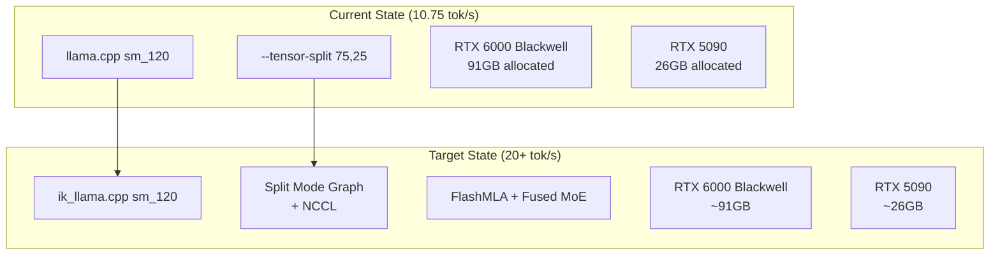
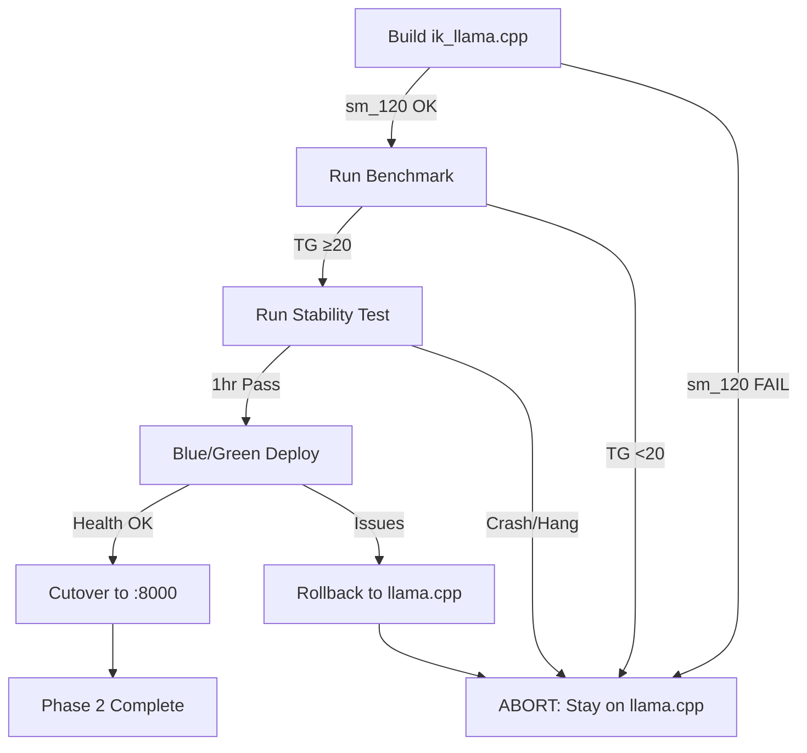

# Phase 2: ik_llama.cpp Performance Optimization

## Objective

Replace standard llama.cpp with ik_llama.cpp to improve DeepSeek-V3.2 inference throughput from **10.75 tok/s → 20+ tok/s** while maintaining 1-hour continuous stability.



---

## Key Performance Features (ik_llama.cpp)

| Feature | Benefit | Source |
|---------|---------|--------|
| **Split Mode Graph** | 3-4x multi-GPU speedup via NCCL | PR #1080 |
| **FlashMLA** | Optimized Multi-head Latent Attention for DeepSeek | PR #408 |
| **Fused MoE** | Combined expert routing + compute | Main README |
| **Flash Attention CUDA** | 20% TG speedup for GQA models | PR #370 |
| **Tensor Overrides** | Hybrid GPU/CPU inference tuning | Main README |

---

## Gating Criteria (HARD GATES)

| Gate | Threshold | Action if Failed |
|------|-----------|------------------|
| **Compilation** | sm_120 kernels present | Abort, stay on llama.cpp |
| **Performance** | ≥20 tok/s generation | Abort, stay on llama.cpp |
| **Stability** | 1 hour continuous, 0 crashes | Abort, stay on llama.cpp |
| **Memory** | No OOM or memory leaks | Abort, stay on llama.cpp |

---

## Implementation Phases

### Phase 2.1: SANDBOX Build (No Production Impact)

**Location:** `/nvme/sandbox/ik_llama.cpp/`

**Build Script:**

```bash
# Clone ik_llama.cpp
git clone https://github.com/ikawrakow/ik_llama.cpp.git /nvme/sandbox/ik_llama.cpp
cd /nvme/sandbox/ik_llama.cpp

# Build with sm_120 (Blackwell) + NCCL
cmake -B build \
    -DGGML_CUDA=ON \
    -DCMAKE_CUDA_ARCHITECTURES="120" \
    -DGGML_NCCL=ON \
    -DGGML_CUDA_FORCE_DMMV=ON \
    -DGGML_CUDA_FA_ALL_QUANTS=ON \
    -DCMAKE_BUILD_TYPE=Release

cmake --build build --config Release -j $(nproc)

# Verify sm_120 kernels
cuobjdump build/bin/libggml-cuda.so 2>&1 | grep "sm_120"
```

**Acceptance Criteria:**
- [ ] Build completes without errors
- [ ] `sm_120` kernels present in binary
- [ ] NCCL linked (verified via `ldd`)

---

### Phase 2.2: Benchmark Methodology

**Tool:** ik_llama.cpp `sweep_bench` (built-in)

**Baseline (Current llama.cpp):**
| Metric | Value | Command |
|--------|-------|---------|
| Generation (TG) | 10.75 tok/s | Logged in agent.md |
| Prompt Eval (PP) | ~100 tok/s | Logged in agent.md |

**Benchmark Commands:**

```bash
# Standard benchmark (matches current config)
./build/bin/llama-bench \
    -m /nvme/models/deepseek-v3.2-dq3/Q3_K_M/DeepSeek-V3-0324-Q3_K_M-00001-of-00007.gguf \
    -ngl 19 \
    -ts 75,25 \
    -c 8192 \
    -b 512 \
    --flash-attn \
    -t 5

# Split Mode Graph benchmark (NCCL multi-GPU)
./build/bin/llama-bench \
    -m /nvme/models/deepseek-v3.2-dq3/Q3_K_M/DeepSeek-V3-0324-Q3_K_M-00001-of-00007.gguf \
    -ngl 999 \
    --split-mode graph \
    -c 8192 \
    --flash-attn \
    -t 5
```

**Metrics to Capture:**

| Metric | Target | Measurement |
|--------|--------|-------------|
| `tg` (tokens/sec) | ≥20 | llama-bench output |
| `pp` (prompt/sec) | ≥100 | llama-bench output |
| VRAM Usage | ≤117GB total | `nvidia-smi` |
| Memory Leaks | 0 | `valgrind` or RSS monitoring |

---

### Phase 2.3: Stability Testing Protocol

**Duration:** 1 hour continuous inference

**Test Script:**

```bash
#!/bin/bash
# stability-test.sh

START=$(date +%s)
DURATION=3600  # 1 hour
PROMPTS=0
ERRORS=0

while [ $(($(date +%s) - START)) -lt $DURATION ]; do
    curl -s http://localhost:8000/v1/chat/completions \
        -H "Content-Type: application/json" \
        -d '{
            "model": "deepseek-v3.2",
            "messages": [{"role": "user", "content": "Write a haiku about quantum computing"}],
            "max_tokens": 100
        }' > /dev/null
    
    if [ $? -ne 0 ]; then
        ERRORS=$((ERRORS + 1))
    fi
    
    PROMPTS=$((PROMPTS + 1))
    sleep 5  # ~720 prompts over 1 hour
done

echo "Completed: $PROMPTS prompts, $ERRORS errors"
```

**Monitoring During Test:**

| Metric | Command | Threshold |
|--------|---------|-----------|
| GPU Memory | `nvidia-smi -l 60` | No OOM |
| Process RSS | `ps aux | grep llama` | <20GB growth |
| Container Health | `docker ps` | Status: Up |
| Error Rate | `docker logs deepseek-v32 2>&1 | grep -i error` | 0 critical |

**Known Risk - KV Cache Fill (Issue #982):**

```bash
# Monitor KV cache usage during stress test
# If inference hangs, need to implement cache eviction
curl localhost:8000/health | jq '.kv_cache_usage'
```

---

### Phase 2.4: Dockerfile Update

**New File:** `docker/Dockerfile.ik-blackwell`

```dockerfile
# ik_llama.cpp with sm_120 (Blackwell) + NCCL
FROM nvidia/cuda:13.0.1-devel-ubuntu24.04 as builder

RUN apt-get update && apt-get install -y \
    git cmake build-essential \
    libnccl2 libnccl-dev \
    && rm -rf /var/lib/apt/lists/*

WORKDIR /build
RUN git clone https://github.com/ikawrakow/ik_llama.cpp.git .

RUN cmake -B build \
    -DGGML_CUDA=ON \
    -DCMAKE_CUDA_ARCHITECTURES="120" \
    -DGGML_NCCL=ON \
    -DGGML_CUDA_FORCE_DMMV=ON \
    -DGGML_CUDA_FA_ALL_QUANTS=ON \
    -DCMAKE_BUILD_TYPE=Release \
    && cmake --build build --config Release -j $(nproc)

# Runtime image
FROM nvidia/cuda:13.0.1-runtime-ubuntu24.04

RUN apt-get update && apt-get install -y libnccl2 && rm -rf /var/lib/apt/lists/*

COPY --from=builder /build/build/bin/llama-server /usr/local/bin/
COPY --from=builder /build/build/lib*.so /usr/local/lib/

ENV LD_LIBRARY_PATH=/usr/lib/x86_64-linux-gnu:/usr/local/lib:$LD_LIBRARY_PATH

EXPOSE 8000
ENTRYPOINT ["llama-server"]
```

---

### Phase 2.5: Blue/Green Deployment

**Strategy:** Run ik_llama.cpp on separate port (:8001) while llama.cpp remains on :8000

```yaml
# docker/omni-stack.yaml addition
  deepseek-v32-ik:
    build:
      context: .
      dockerfile: Dockerfile.ik-blackwell
    container_name: deepseek-v32-ik
    profiles: ["phase2-sandbox"]
    deploy:
      resources:
        reservations:
          devices:
            - driver: nvidia
              count: all
              capabilities: [gpu]
    environment:
      CUDA_VISIBLE_DEVICES: "0,1"
    volumes:
      - /nvme/models:/models:ro
    command:
      - --model /models/deepseek-v3.2-dq3/Q3_K_M/DeepSeek-V3-0324-Q3_K_M-00001-of-00007.gguf
      - --host 0.0.0.0
      - --port 8001
      - --n-gpu-layers 999
      - --split-mode graph
      - --ctx-size 8192
      - --flash-attn
    ports:
      - "8001:8001"
    networks:
      - omni-network
      - internal_brain
```

**Rollback Procedure:**

```bash
# If Phase 2 fails at any gate:
docker stop deepseek-v32-ik
docker rm deepseek-v32-ik
# Original deepseek-v32 on :8000 remains untouched
```

---

## File Changes Summary

| File | Action | Purpose |
|------|--------|---------|
| `docker/Dockerfile.ik-blackwell` | CREATE | ik_llama.cpp build recipe |
| `docker/omni-stack.yaml` | MODIFY | Add `deepseek-v32-ik` service (profile: phase2-sandbox) |
| `scripts/ik-stability-test.sh` | CREATE | 1-hour stability test script |
| `scripts/ik-benchmark.sh` | CREATE | Benchmark automation |
| `docs/architecture/phase2-evaluation.md` | CREATE | Document findings |

---

## Risk Assessment

| Risk | Likelihood | Impact | Mitigation |
|------|------------|--------|------------|
| sm_120 kernel missing | Low | Critical | Verify with `cuobjdump` before deploy |
| NCCL incompatibility | Medium | High | Build with `-DGGML_NCCL=OFF` fallback |
| KV cache hang (#982) | Medium | High | Implement cache eviction, monitor health |
| Memory leak | Medium | Medium | 1-hour stress test validates |
| Flash Attention regression | Low | Medium | Benchmark PP/TG before/after |

---

## Verification / Definition of Done

| Step | Verification | Success Criteria |
|------|--------------|------------------|
| 2.1 Build | `cuobjdump | grep sm_120` | sm_120 kernels present |
| 2.2 Benchmark | `llama-bench` output | TG ≥20 tok/s |
| 2.3 Stability | `stability-test.sh` output | 0 errors in 1 hour |
| 2.4 Dockerfile | `docker build` success | Image < 10GB |
| 2.5 Blue/Green | `curl localhost:8001/health` | 200 OK |

---

## Step → Targets → Verification Traceability

| Step | Target Files | Verification Command |
|------|--------------|---------------------|
| Clone & Build | `/nvme/sandbox/ik_llama.cpp/` | `cuobjdump build/bin/libggml-cuda.so 2>&1 \| grep sm_120` |
| Benchmark | `llama-bench` output | `grep "tg:" benchmark.log` ≥20 |
| Stability Test | `scripts/ik-stability-test.sh` | Exit code 0, errors=0 |
| Dockerfile | `docker/Dockerfile.ik-blackwell` | `docker build -t omni/ik-llama:sm120` |
| Deploy Sandbox | `docker/omni-stack.yaml` | `curl localhost:8001/health` |
| Documentation | `docs/architecture/phase2-evaluation.md` | File exists with results |

---

## Decision Matrix



---

## Constraints

- **SANDBOX ONLY**: ik_llama.cpp runs on :8001, production remains on :8000
- **No model changes**: Same Q3_K_M weights
- **Same VRAM budget**: ~117GB across both GPUs
- **Rollback ready**: Original container untouched until all gates pass
