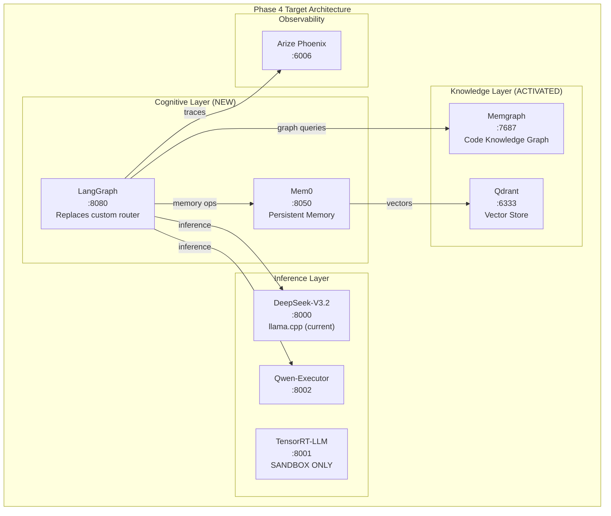
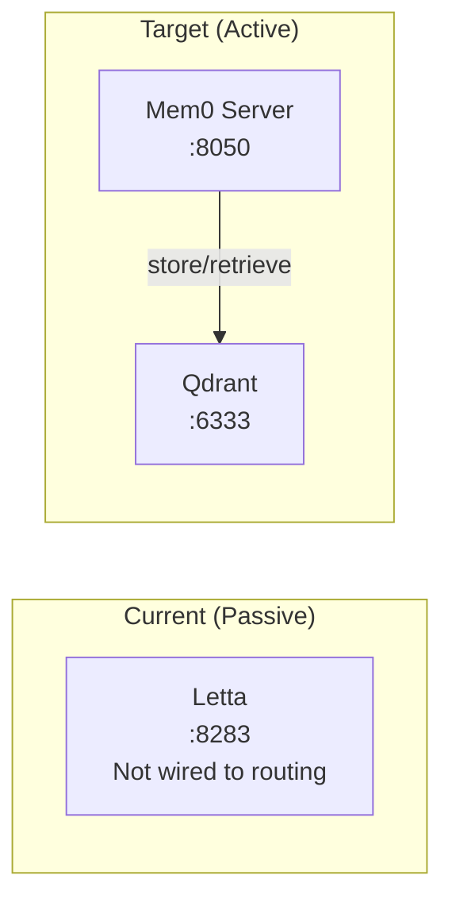
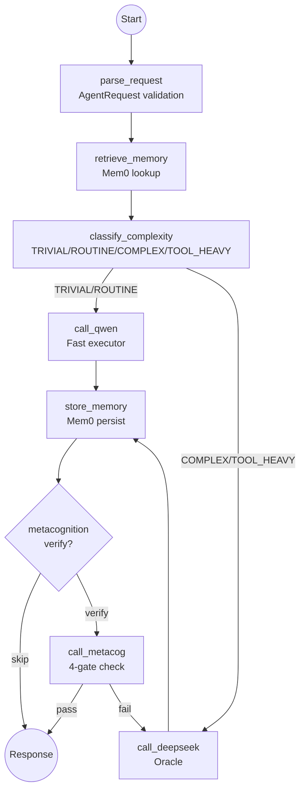
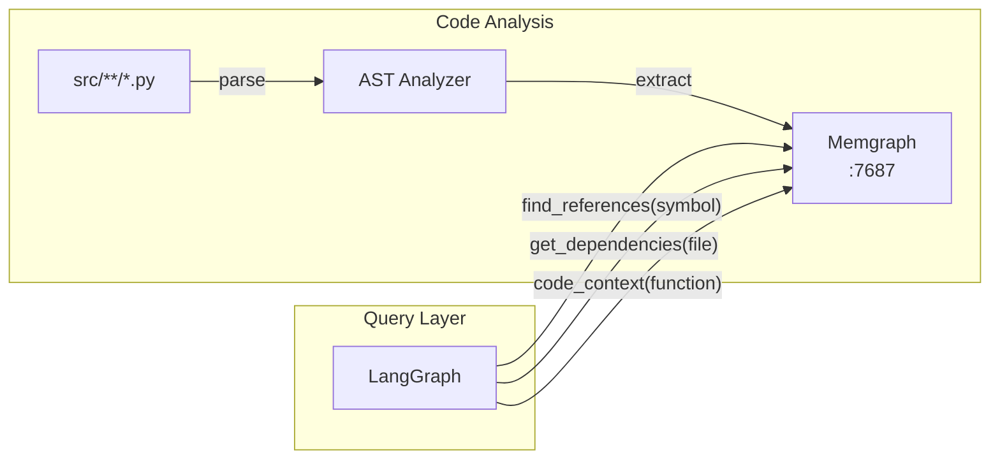
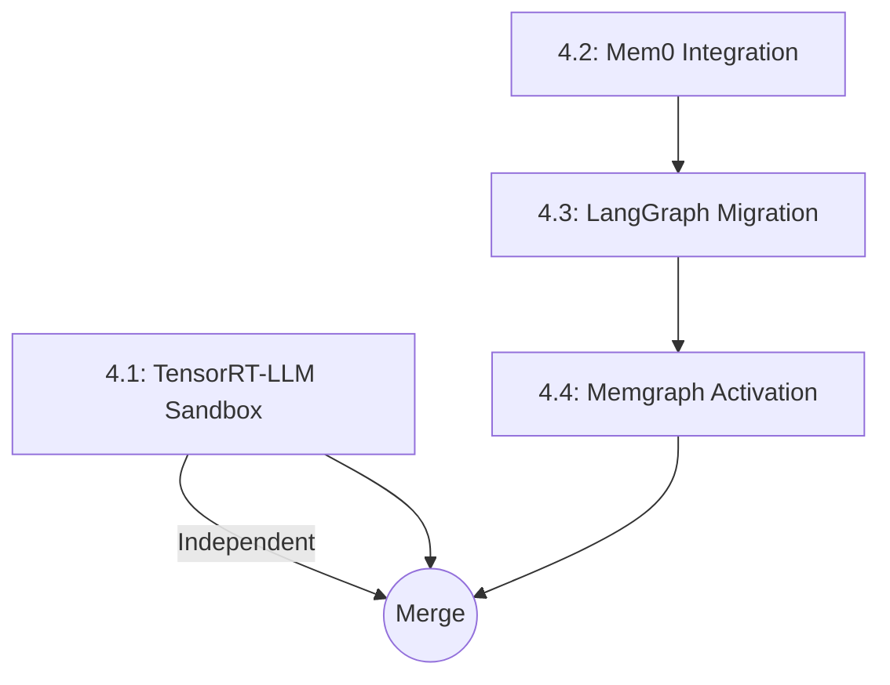

# Phase 4: SOVEREIGN COGNITION

**Objective:** Upgrade Protocol OMNI from passive infrastructure to active cognitive system with persistent memory, graph-based routing, and optionally faster inference.

---

## Architecture Vision

---

## Phase 4.1: TensorRT-LLM Sandbox Evaluation

**Objective:** Test TensorRT-LLM with DeepSeek-V3.2-NVFP4 on consumer Blackwell (sm_120) in isolated sandbox.

### Constraints

| Constraint | Value | Rationale |
|------------|-------|-----------|
| GPU Architecture | sm_120 | Consumer Blackwell (RTX PRO 6000 + RTX 5090) |
| Community Support | Yes | NVIDIA does not officially test consumer Blackwell |
| NVFP4 Support | Unknown | Requires testing |
| Target Improvement | 2-3x throughput | Current: 10.75 tok/s, Target: 20-30 tok/s |

### Tasks

1. **Create sandbox Dockerfile** for TensorRT-LLM
   - Base: `nvcr.io/nvidia/tensorrt-llm:latest`
   - Build with `CUDA_ARCHITECTURES=120`
   - Target: `docker/Dockerfile.trt-sandbox`

2. **Download NVFP4 model weights**
   - Source: `nvidia/DeepSeek-V3.2-NVFP4` on HuggingFace
   - Target: `/nvme/models/deepseek-v32-nvfp4/`

3. **Add sandbox service to Docker Compose**
   - Profile: `trt-sandbox` (isolated, not default)
   - Port: 8001 (avoid conflict with production :8000)
   - Network: `internal_brain` only

4. **Benchmark comparison**
   - Metric: tok/s at 2K context, 512 output
   - Compare: llama.cpp (current) vs TensorRT-LLM
   - Stability test: 1 hour continuous inference

### Definition of Done

| Check | Command | Success Criteria |
|-------|---------|------------------|
| Container builds | `docker build -f Dockerfile.trt-sandbox` | Exit 0 |
| Model loads | `curl localhost:8001/health` | `{"status":"ok"}` |
| NVFP4 active | Check logs for "NVFP4" | Kernel loaded |
| Throughput test | `llama-bench` equivalent | >15 tok/s |
| Stability | 1hr inference loop | No OOM, no hangs |

### Go/No-Go Decision

- **GO:** ≥15 tok/s stable → Promote to production on :8000
- **NO-GO:** <15 tok/s OR unstable → Document findings, keep llama.cpp

---

## Phase 4.2: Mem0 Memory Integration

**Objective:** Replace passive Letta with Mem0 for production-grade persistent memory (26% better accuracy, 91% faster per benchmarks).

### Architecture

### Tasks

1. **Add Mem0 service to Docker Compose**
   - Image: `mem0ai/mem0:latest`
   - Port: 8050
   - Volume: `/nvme/mem0:/data`
   - Environment: Point to Qdrant for vector storage

2. **Create Mem0 client wrapper**
   - Target: `src/memory/mem0_client.py`
   - Functions: `store_memory()`, `retrieve_memory()`, `search_memory()`
   - OTEL instrumentation for Phoenix traces

3. **Integrate with routing layer**
   - Before model call: Retrieve relevant memories
   - After model response: Store interaction as memory
   - Scope: COMPLEX and TOOL_HEAVY tasks only (skip TRIVIAL)

4. **Migrate Letta data (optional)**
   - Export Letta memories: `/nvme/letta/*.json`
   - Transform to Mem0 format
   - Import to Mem0

### Files to Create/Modify

| File | Action | Purpose |
|------|--------|---------|
| `docker/omni-stack.yaml` | MODIFY | Add mem0 service |
| `src/memory/__init__.py` | CREATE | Memory module init |
| `src/memory/mem0_client.py` | CREATE | Mem0 API wrapper |
| `src/agent/router.py` | MODIFY | Memory retrieval/storage hooks |

### Definition of Done

| Check | Command | Success Criteria |
|-------|---------|------------------|
| Mem0 running | `curl localhost:8050/health` | 200 OK |
| Store memory | POST to `/add` | Memory ID returned |
| Retrieve memory | GET `/search?query=...` | Relevant memories returned |
| Phoenix trace | Check UI | `mem0_store`, `mem0_retrieve` spans visible |

---

## Phase 4.3: LangGraph Cognitive Routing Migration

**Objective:** Migrate from custom `CognitiveRouter` to LangGraph for industry-standard DAG-based control, better observability, and conditional branching.

### Current State Analysis

| Component | Location | Lines | Replacement |
|-----------|----------|-------|-------------|
| `AgentRequest` | `router.py:21-92` | 72 | Keep (input schema) |
| `CognitiveRouter` | `router.py:94-180` | 86 | Replace with LangGraph |
| `AgentOrchestrator` | `router.py:182-550` | 368 | Refactor to LangGraph nodes |

### LangGraph Architecture

### Tasks

1. **Add LangGraph dependency**
   - Target: `src/agent/requirements.txt`
   - Package: `langgraph>=0.3.0`

2. **Create LangGraph workflow**
   - Target: `src/agent/graph.py`
   - Define nodes: `parse_request`, `retrieve_memory`, `classify_complexity`, `call_model`, `store_memory`, `metacog_verify`
   - Define edges with conditional routing

3. **Create node implementations**
   - Target: `src/agent/nodes/`
   - Files: `memory.py`, `classification.py`, `inference.py`, `metacognition.py`
   - Each node returns state update

4. **Refactor main.py to use graph**
   - Replace `AgentOrchestrator.process()` with `graph.invoke()`
   - Replace `AgentOrchestrator.process_stream()` with `graph.astream()`

5. **Preserve OTEL instrumentation**
   - LangGraph has native OTEL support
   - Configure Phoenix exporter in graph init

6. **Deprecate old router**
   - Move `router.py` to `router_legacy.py`
   - Update imports in `main.py`

### Files to Create/Modify

| File | Action | Purpose |
|------|--------|---------|
| `src/agent/requirements.txt` | MODIFY | Add langgraph |
| `src/agent/graph.py` | CREATE | LangGraph workflow definition |
| `src/agent/nodes/__init__.py` | CREATE | Nodes module |
| `src/agent/nodes/memory.py` | CREATE | Mem0 retrieve/store nodes |
| `src/agent/nodes/classification.py` | CREATE | Complexity estimation node |
| `src/agent/nodes/inference.py` | CREATE | Model call nodes |
| `src/agent/nodes/metacognition.py` | CREATE | Verification node |
| `src/agent/main.py` | MODIFY | Use graph instead of orchestrator |
| `src/agent/router_legacy.py` | RENAME | Archive old implementation |

### Definition of Done

| Check | Command | Success Criteria |
|-------|---------|------------------|
| Graph compiles | `python -c "from agent.graph import workflow"` | No errors |
| Simple request | POST `/v1/chat/completions` | Response returned |
| Streaming works | POST with `stream: true` | SSE chunks received |
| Phoenix traces | Check UI | Graph nodes visible as spans |
| Complexity routing | Test "ssh deploy" prompt | Routed to DeepSeek |

---

## Phase 4.4: Memgraph Knowledge Graph Activation

**Objective:** Wire Memgraph into the cognitive loop for code context and relationship queries.

### Current State

- Memgraph running on :7687 but **not connected to routing**
- 16GB memory limit configured
- Data directory: `/nvme/memgraph/data`

### Architecture

### Tasks

1. **Create Memgraph schema**
   - Node types: `File`, `Class`, `Function`, `Import`
   - Edge types: `CONTAINS`, `CALLS`, `IMPORTS`, `INHERITS`
   - Target: `scripts/memgraph-schema.cypher`

2. **Create code indexer script**
   - Parse `src/**/*.py` with Python AST
   - Extract symbols, relationships
   - Insert into Memgraph
   - Target: `scripts/index_code.py`

3. **Create Memgraph client**
   - Target: `src/knowledge/memgraph_client.py`
   - Functions: `find_references()`, `get_dependencies()`, `get_code_context()`

4. **Add knowledge node to LangGraph**
   - Before `call_model`: Query Memgraph for relevant code context
   - Inject context into prompt
   - Scope: TOOL_HEAVY tasks with code-related queries

5. **Run initial indexing**
   - Index `src/` directory
   - Verify in Memgraph Lab (:7444)

### Files to Create/Modify

| File | Action | Purpose |
|------|--------|---------|
| `scripts/memgraph-schema.cypher` | CREATE | Graph schema DDL |
| `scripts/index_code.py` | CREATE | AST → Memgraph indexer |
| `src/knowledge/__init__.py` | CREATE | Knowledge module |
| `src/knowledge/memgraph_client.py` | CREATE | Memgraph query wrapper |
| `src/agent/nodes/knowledge.py` | CREATE | LangGraph knowledge node |
| `src/agent/graph.py` | MODIFY | Add knowledge node |

### Definition of Done

| Check | Command | Success Criteria |
|-------|---------|------------------|
| Schema applied | `mgconsole < schema.cypher` | No errors |
| Code indexed | `python scripts/index_code.py` | Nodes created |
| Query works | `MATCH (f:Function) RETURN count(f)` | >0 |
| Graph node works | Test "where is router defined" | Code context in response |

---

## Execution Order (Dependencies)

| Phase | Depends On | Can Parallelize |
|-------|------------|-----------------|
| 4.1 TensorRT-LLM | None | Yes (independent sandbox) |
| 4.2 Mem0 | None | Yes |
| 4.3 LangGraph | 4.2 (memory nodes) | No |
| 4.4 Memgraph | 4.3 (graph nodes) | No |

---

## Risk Mitigation

| Risk | Mitigation |
|------|------------|
| TensorRT-LLM sm_120 incompatible | Sandbox profile, no production impact |
| Mem0 performance regression | Benchmark against Letta before deprecating |
| LangGraph learning curve | Keep `router_legacy.py` for rollback |
| Memgraph memory exhaustion | 16GB limit already configured |

---

## Verification Matrix

| Step | Targets | Verification |
|------|---------|--------------|
| 4.1 | `Dockerfile.trt-sandbox`, `omni-stack.yaml` | `curl :8001/health`, `llama-bench` |
| 4.2 | `src/memory/`, `omni-stack.yaml` | Phoenix traces show mem0 spans |
| 4.3 | `src/agent/graph.py`, `src/agent/nodes/` | E2E request through graph |
| 4.4 | `src/knowledge/`, `scripts/` | Cypher query returns indexed code |

---

## Rollback Plan

1. **TensorRT-LLM**: Delete sandbox profile, no production impact
2. **Mem0**: Restore Letta as primary, Mem0 becomes secondary
3. **LangGraph**: Rename `router_legacy.py` back to `router.py`, revert imports
4. **Memgraph**: Leave running but disconnect from graph (no data loss)
