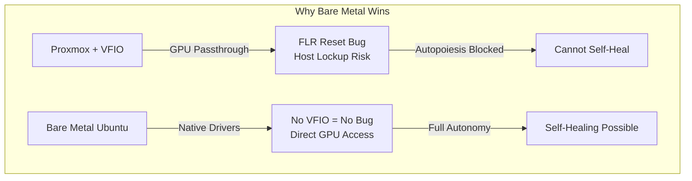
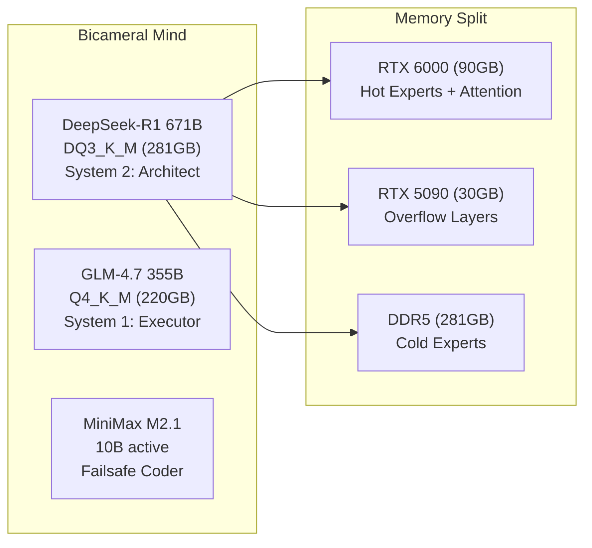

# Protocol OMNI v13.0: TITANIUM SOVEREIGN
## Unified Bare Metal Migration + PROMETHEUS v2.0 + v12.5 Corrections

---

## OBJECTIVE

Execute a complete infrastructure pivot from Proxmox VE to bare metal Ubuntu 24.04, deploying the full PROMETHEUS v2.0 stack with v12.5 Audit corrections. This unified plan resolves all identified fatal errors while leveraging bare metal to eliminate the Blackwell Reset Bug entirely.

---

## ARCHITECTURAL RATIONALE



| Dimension | Proxmox (Current) | Bare Metal v13.0 |
|-----------|-------------------|------------------|
| Blackwell Reset Bug | **FATAL** - Host lockup on VM restart | **ELIMINATED** - No VFIO layer |
| RAM Available | 300GB (VM slice) | 384GB (full access) |
| Model Fit (DQ3_K_M 281GB) | Marginal (19GB headroom) | **103GB headroom** |
| SSH Complexity | Mac → Proxmox → Talos → Pod | Mac → Ubuntu (direct) |
| Self-Healing | Suicide Logic Bomb risk | Phoenix Maneuver safe |

---

## V12.5 AUDIT CORRECTIONS INTEGRATED

### ✅ Blackwell Reset Bug (FLR)
- **v12.5 Recommended:** Pin Proxmox kernel 6.14.8-2-bpo12-pve
- **v13.0 Solution:** Bare metal eliminates VFIO entirely—**bug cannot occur**
- **Bonus:** Install Ubuntu HWE kernel 6.14 for best Blackwell driver compatibility

### ✅ Memory Lie (386GB → 281GB)
- **v12.5 Finding:** Q4_K_M (386GB) exceeds 384GB RAM—instant OOM
- **v13.0 Mandate:** **DQ3_K_M quantization only** (~281GB)
- **Headroom:** 103GB for OS, KV cache, GLM-4.7 orchestration

### ✅ DeepGEMM Paradox (Hybrid Backend)
- **v12.5 Finding:** `ENABLE_DEEPGEMM=0` kills CPU inference (20→1.5 t/s)
- **v13.0 Solution:** Hybrid configuration
  ```bash
  ENABLE_DEEPGEMM=1           # CPU AVX-512 kernels enabled
  SGLANG_ENABLE_JIT_DEEPGEMM=0 # GPU JIT disabled (SM 12.0 incompatible)
  KTRANSFORMERS_BACKEND_GPU=flashinfer  # Safe GPU attention
  ```

---

## HARDWARE BASELINE

| Component | Specification | Status |
|-----------|---------------|--------|
| CPU | AMD Threadripper PRO 9995WX (96C, Zen5) | ✅ |
| RAM | 384GB DDR5 ECC (8×48GB) | ⚠️ Fix: EXPO II → 6400 MT/s |
| GPU 0 | RTX PRO 6000 Blackwell (96GB) | ⚠️ Fix: PCIe → Gen5 |
| GPU 1 | RTX 5090 (32GB) | ⚠️ Fix: PCIe → Gen5 |
| NVMe 0 | Crucial CT4000T705SSD3 (4TB) | Target: Ubuntu 24.04 |
| NVMe 1 | WD_BLACK SN8100 (4TB) | Target: Windows 11 |
| BMC | ASUS ASMB11-iKVM @ 192.168.3.202 | ✅ Redfish ready |

---

## EXECUTION PHASES

### PHASE 0: Pre-Flight Preparation

| Step | Action | Verification |
|------|--------|--------------|
| 0.1 | Backup Letta memories: `tar -czvf /tmp/letta-backup.tar.gz /var/lib/letta/` | File exists, non-zero size |
| 0.2 | Backup Proxmox configs: `tar -czvf /tmp/proxmox-configs.tar.gz /etc/pve/ /root/manifests/` | File exists |
| 0.3 | SCP backups to Mac: `~/backups/titanium-sovereign-YYYYMMDD/` | Files on Mac verified |
| 0.4 | Download Windows 11 Pro ISO (24H2) | SHA256 verified |
| 0.5 | Download Ubuntu 24.04.1 Desktop ISO | SHA256 verified |
| 0.6 | Host ISOs on Proxmox HTTP server (:8080) | `curl -I` returns 200 |
| 0.7 | Download DeepSeek-R1 DQ3_K_M GGUF (~281GB) | Files on `/nvme/models/` |

**Critical Pre-Download:**
```bash
# Ensure correct quantization is downloaded BEFORE wipe
huggingface-cli download unsloth/DeepSeek-R1-GGUF \
  --include "*DQ3_K_M*" \
  --local-dir /nvme/models/deepseek-r1-dq3
```

---

### PHASE 1: BIOS Fixes (CRITICAL - Hardware Unlocking)

| Step | BIOS Path | Current | Target |
|------|-----------|---------|--------|
| 1.1 | AMD CBS → NBIO → PCIe → `CbsCmnEarlyLinkSpeedSHP` | Auto | **GEN5** |
| 1.2 | AMD CBS → NBIO → PCIe → `CbsCmnPcieTargetLinkSpeedSHP` | GEN5 | Verify GEN5 |
| 1.3 | AI Tweaker → Memory → D.O.C.P./EXPO | Disabled | **EXPO II** |
| 1.4 | Advanced → CPU → NPS (Nodes Per Socket) | NPS1 | **NPS4** |
| 1.5 | Save & **Cold Reboot** (power cycle) | - | - |

**Verification (Boot any Linux USB):**
```bash
lspci -vvv -s f1:00.0 | grep "LnkSta:"  # Expected: Speed 32GT/s
sudo dmidecode -t memory | grep "Speed"  # Expected: 6400 MT/s
numactl --hardware  # Expected: 4 NUMA nodes
```

---

### PHASE 2: Windows 11 Installation (NVMe 1)

| Step | Action | Target |
|------|--------|--------|
| 2.1 | Mount ISO via Redfish Virtual Media | Win11_24H2_Pro.iso |
| 2.2 | Set boot override to CD | Redfish PATCH |
| 2.3 | Power cycle via Redfish | ForceRestart |
| 2.4 | Install Windows on **NVMe 1 only** (WD_BLACK) | Custom install |
| 2.5 | Install NVIDIA drivers (580.x) | nvidia.com |
| 2.6 | Configure for gaming | - |
| 2.7 | Shut down cleanly | - |

**Partition Layout (NVMe 1):**
- EFI: 512MB
- MSR: 128MB
- C: 1TB (Windows)
- D: ~3TB (Games/Data)

---

### PHASE 3: Ubuntu 24.04 Installation (NVMe 0) - POINT OF NO RETURN

| Step | Action | Target |
|------|--------|--------|
| 3.1 | Mount Ubuntu ISO via Redfish | ubuntu-24.04.1-desktop-amd64.iso |
| 3.2 | Boot from CD | Redfish boot override |
| 3.3 | Install Ubuntu on **NVMe 0** (Crucial) | **WIPES PROXMOX** |
| 3.4 | Partition: /boot/efi (512MB), / (500GB), /home (500GB), /nvme (~3TB XFS) | - |
| 3.5 | Install GRUB to NVMe 0 EFI | Auto-detects Windows |
| 3.6 | First boot → Verify dual-boot GRUB menu | Ubuntu + Windows entries |

**Post-Install Configuration:**

```bash
# 1. Install HWE Kernel 6.14 (best Blackwell compatibility)
sudo apt install linux-generic-hwe-24.04

# 2. Kernel parameters for GPU stability
sudo nano /etc/default/grub
# Add: GRUB_CMDLINE_LINUX_DEFAULT="quiet splash amd_iommu=on iommu=pt pcie_aspm=off"
sudo update-grub

# 3. NPS4 NUMA verification
numactl --hardware  # Should show 4 nodes

# 4. Install NVIDIA driver
sudo add-apt-repository ppa:graphics-drivers/ppa
sudo apt update && sudo apt install nvidia-driver-580

# 5. Reboot and verify
sudo reboot
nvidia-smi  # Both GPUs visible
nvidia-smi -q | grep "Link Gen"  # Should show Gen 5
```

**Mount /nvme partition:**
```bash
NVME_PART="/dev/nvme0n1p4"  # The ~3TB XFS partition
sudo mkfs.xfs -L nvme-data ${NVME_PART}
NVME_UUID=$(sudo blkid -s UUID -o value ${NVME_PART})
echo "UUID=${NVME_UUID} /nvme xfs defaults,noatime 0 2" | sudo tee -a /etc/fstab
sudo mkdir -p /nvme && sudo mount -a
sudo chown $USER:$USER /nvme
```

---

### PHASE 4: Container Runtime Setup

| Step | Action | Command |
|------|--------|---------|
| 4.1 | Install Docker CE | `curl -fsSL https://get.docker.com \| sh` |
| 4.2 | Install K3s | `curl -sfL https://get.k3s.io \| sh -` |
| 4.3 | Install NVIDIA Container Toolkit | nvidia-container-toolkit package |
| 4.4 | Configure containerd for NVIDIA | `nvidia-ctk runtime configure --runtime=containerd` |
| 4.5 | Configure Docker for NVIDIA | `nvidia-ctk runtime configure --runtime=docker` |
| 4.6 | Create nvidia RuntimeClass | K3s manifest |
| 4.7 | Restart K3s | `systemctl restart k3s` |

**Verification:**
```bash
docker run --rm --gpus all nvidia/cuda:13.0.1-base-ubi9 nvidia-smi
kubectl get nodes  # Ready
kubectl get runtimeclass  # nvidia exists
```

---

### PHASE 5: PROMETHEUS v2.0 Stack Deployment

#### 5.1 DeepSeek-R1 + KTransformers (Cognitive Core)



**KTransformers Build (Hybrid DeepGEMM):**

Create `docker/Dockerfile.titanium`:
```dockerfile
FROM nvidia/cuda:13.0.1-devel-ubuntu24.04

# Hybrid DeepGEMM Configuration (v12.5 Fix)
ENV ENABLE_DEEPGEMM=1                    # CPU AVX-512 enabled
ENV SGLANG_ENABLE_JIT_DEEPGEMM=0         # GPU JIT disabled (SM 12.0)
ENV KTRANSFORMERS_BACKEND_GPU=flashinfer # Safe GPU attention
ENV KTRANSFORMERS_ARCH=avx512            # Zen5 optimization
ENV TORCH_CUDA_ARCH_LIST="9.0a 10.0 12.0"

# Model target (v12.5 Fix - DQ3_K_M only)
ENV MODEL_FILE="DeepSeek-R1-DQ3_K_M.gguf"

# Build KTransformers with NUMA awareness
RUN pip3 install numactl ktransformers --break-system-packages
```

**Deployment:**
```bash
docker run -d \
  --name deepseek-r1 \
  --gpus all \
  --shm-size=64g \
  -v /nvme/models:/models \
  -p 8000:8000 \
  omni/ktransformers:titanium \
  numactl --interleave=all python3 -m ktransformers.server.main \
    --model /models/deepseek-r1-dq3/DeepSeek-R1-DQ3_K_M.gguf \
    --gpu_split "90000,30000" \
    --host 0.0.0.0 \
    --port 8000
```

#### 5.2 Microsoft Agent Framework (Orchestration)

| Step | Action | Port |
|------|--------|------|
| 5.2.1 | Clone `github.com/microsoft/agent-framework` | - |
| 5.2.2 | Configure Semantic Kernel + AutoGen integration | - |
| 5.2.3 | Deploy via Docker Compose | 8080 |
| 5.2.4 | Point to KTransformers backend (localhost:8000) | - |

#### 5.3 GraphRAG (Memgraph)

```bash
docker run -d \
  --name memgraph \
  -p 7687:7687 \
  -v /nvme/memgraph:/var/lib/memgraph \
  memgraph/memgraph-mage
```

#### 5.4 AutoGLM (Mobile Orchestration)

```bash
docker run -d \
  --name autoglm \
  --device /dev/bus/usb \
  -p 8088:8088 \
  -v /nvme/autoglm:/data \
  omni/autoglm:latest
```

#### 5.5 Phoenix Maneuver (Self-Healing)

Add to `docker/omni-stack.yaml`:
```yaml
services:
  phoenix-sidecar:
    image: alpine:latest
    restart: "no"
    volumes:
      - /var/run/docker.sock:/var/run/docker.sock
      - /nvme/phoenix:/state
    entrypoint: ["/bin/sh", "-c"]
    command:
      - |
        # Wait for signal file
        while [ ! -f /state/restart-requested ]; do sleep 1; done
        rm /state/restart-requested
        sleep 10  # Grace period
        docker compose -f /state/omni-stack.yaml up -d --force-recreate
```

#### 5.6 Observability Stack

```yaml
# docker/observability-stack.yaml
services:
  prometheus:
    image: prom/prometheus:latest
    ports: ["9090:9090"]
    volumes:
      - ./prometheus.yml:/etc/prometheus/prometheus.yml
      - /nvme/prometheus:/prometheus

  grafana:
    image: grafana/grafana:latest
    ports: ["3000:3000"]
    volumes:
      - /nvme/grafana:/var/lib/grafana

  dcgm-exporter:
    image: nvcr.io/nvidia/k8s/dcgm-exporter:latest
    runtime: nvidia
    ports: ["9400:9400"]
```

#### 5.7 Evaluation Framework

```bash
pip install braintrust
# Configure with API key
# Create golden dataset at /nvme/eval/golden/
```

---

## VERIFICATION MATRIX

| Phase | Target | Command | Expected |
|-------|--------|---------|----------|
| 1 | PCIe Gen5 | `nvidia-smi -q \| grep "Link Gen"` | 5 |
| 1 | RAM Speed | `sudo dmidecode -t memory \| grep Speed` | 6400 MT/s |
| 1 | NUMA Nodes | `numactl --hardware` | 4 nodes |
| 3 | Dual-Boot | GRUB menu on boot | Ubuntu + Windows |
| 3 | GPU Access | `nvidia-smi` | Both GPUs, 128GB total |
| 4 | K3s Ready | `kubectl get nodes` | Ready status |
| 5.1 | Inference | `curl localhost:8000/v1/models` | Model listed |
| 5.1 | Memory Fit | `free -h` during inference | &lt; 300GB used |
| 5.3 | GraphRAG | `mgconsole` query | Nodes returned |
| 5.6 | Observability | `curl localhost:9090/api/v1/targets` | Targets up |

---

## STEP → TARGETS → VERIFICATION TRACEABILITY

| Step | Targets Modified | Verification |
|------|------------------|--------------|
| 1.1 | BIOS: CbsCmnEarlyLinkSpeedSHP | `lspci` LnkSta shows 32GT/s |
| 1.3 | BIOS: EXPO II Profile | `dmidecode` shows 6400 MT/s |
| 1.4 | BIOS: NPS4 | `numactl --hardware` shows 4 nodes |
| 3.3 | NVMe 0 partitions | `lsblk` shows /boot/efi, /, /home, /nvme |
| 3.6 | GRUB configuration | Boot menu shows Ubuntu + Windows |
| 4.2 | K3s installation | `kubectl get nodes` |
| 5.1 | KTransformers + DQ3_K_M | `curl /v1/models` returns model |
| 5.3 | Memgraph container | `mgconsole` connects |
| 5.5 | Phoenix sidecar | Restart signal triggers recreation |
| 5.6 | Observability stack | Grafana login works |

---

## ROLLBACK PLAN

**If bare metal fails after Phase 3:**

1. Boot from Proxmox VE ISO on NVMe 0
2. Reinstall Proxmox VE 9.x
3. Restore VM configs from backup
4. Re-create Talos VM with schematic ID `d58fba8495bf...`
5. Redeploy previous stack

**Recovery Time:** 2-4 hours

---

## SUCCESS CRITERIA (Definition of Done)

| Metric | Target | Weight |
|--------|--------|--------|
| PCIe Link Speed | Gen5 (32GT/s) on both GPUs | CRITICAL |
| RAM Speed | 6400 MT/s | HIGH |
| NUMA Topology | NPS4 (4 nodes) | HIGH |
| Model Loaded | DeepSeek-R1 DQ3_K_M (281GB) | CRITICAL |
| Memory Headroom | &gt; 80GB free during inference | CRITICAL |
| Inference Speed | &gt; 15 t/s (hybrid DeepGEMM) | HIGH |
| Dual-Boot | GRUB shows Ubuntu + Windows, both boot | MEDIUM |
| All 7 PROMETHEUS Gaps | Deployed and functional | HIGH |
| Phoenix Maneuver | Self-restart works without lockup | CRITICAL |
| Mac → Ubuntu SSH | Single hop, &lt; 100ms latency | MEDIUM |

---

## KEY FILES &amp; LOCATIONS (Post-Migration)

| Purpose | Path |
|---------|------|
| Models | `/nvme/models/` |
| KTransformers Config | `~/Protocol_Omni/docker/Dockerfile.titanium` |
| Letta Memory | `~/letta/` |
| Memgraph Data | `/nvme/memgraph/` |
| Prometheus Data | `/nvme/prometheus/` |
| Agent Configs | `~/Protocol_Omni/` |
| Phoenix State | `/nvme/phoenix/` |
| Eval Golden Set | `/nvme/eval/golden/` |

---

## CHANGELOG FROM PREVIOUS PLANS

| Item | Iron Sovereign | Prometheus Sovereign | **v13.0 Titanium** |
|------|----------------|----------------------|-------------------|
| Quantization | Q4_K_M (386GB) | Q4_K_M implied | **DQ3_K_M (281GB)** |
| DeepGEMM | Disabled | Not specified | **Hybrid (CPU=1, JIT=0)** |
| NUMA | Not mentioned | Not mentioned | **NPS4 mandatory** |
| Self-Healing | None | Circuit Breaker | **Phoenix Maneuver** |
| Kernel | Generic Ubuntu | Generic Ubuntu | **HWE 6.14** |
| AutoGLM | None | Planned | **USB passthrough** |
| FLR Bug | Unknown | Unknown | **Eliminated (no VFIO)** |

