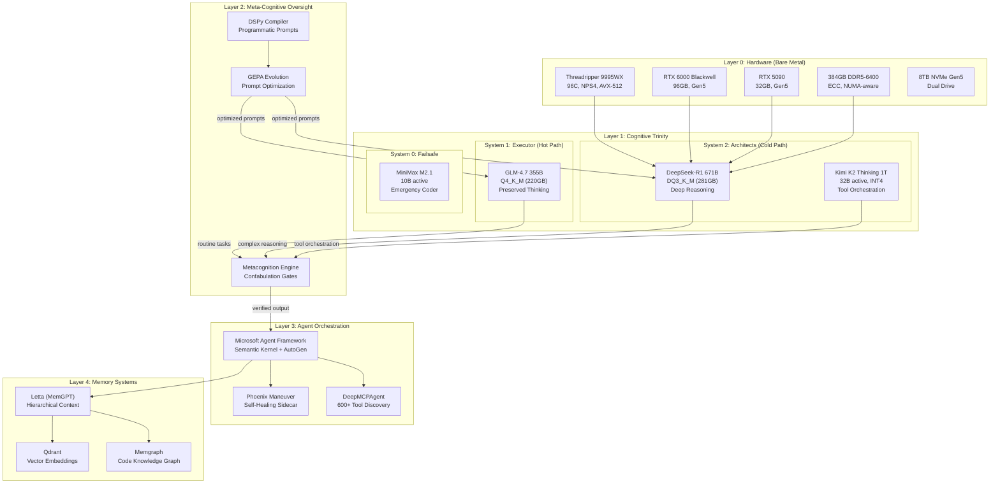
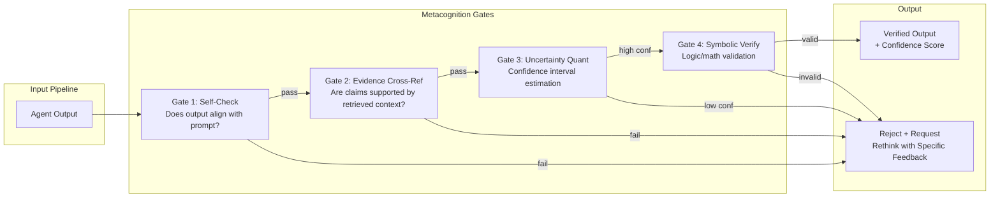
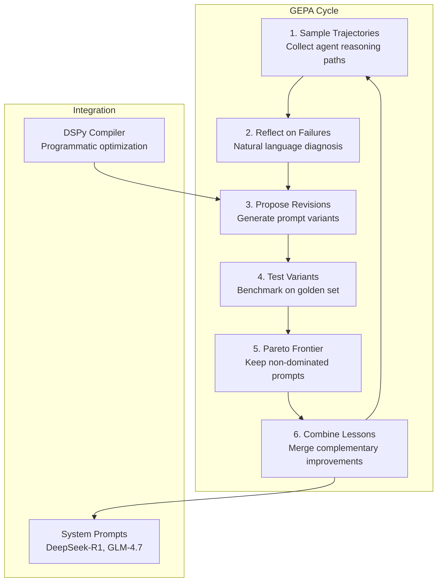

# Protocol OMNI v14.0: SOVEREIGN GENESIS
## Self-Evolving Autonomous Agent with Metacognitive Oversight

---

## OBJECTIVE

Build the ultimate self-evolving, self-healing AI assistant by combining v13.0 TITANIUM SOVEREIGN infrastructure with cutting-edge research discoveries: GEPA self-evolution, Kimi K2 redundant Oracle, metacognitive confabulation gates, and speculative decoding acceleration.

---

## WHAT'S NEW IN v14.0

| Component | v13.0 TITANIUM | v14.0 GENESIS | Impact |
|-----------|----------------|---------------|--------|
| Self-Evolution | None | **GEPA + DSPy** | Prompts improve autonomously |
| Oracle Redundancy | DeepSeek-R1 only | **DeepSeek-R1 + Kimi K2** | Failover + tool orchestration |
| Metacognition | Planned | **Implemented with gates** | Confabulation prevention |
| Inference Speed | Standard | **Eagle Speculative Decoding** | 2-3x throughput |
| GPU Utilization | FlashInfer only | **FP4 Tensor Cores + vLLM** | 4x H100 perf on Blackwell |
| Memory Evolution | Static Letta | **GEPA-optimized retrieval** | Self-improving RAG |

---

## ARCHITECTURE: TRINITY OF MINDS



---

## v13.0 FOUNDATION (UNCHANGED)

### Phase 0: Pre-Flight Preparation
*Identical to v13.0 - backup, ISO download, DQ3_K_M model download*

### Phase 1: BIOS Fixes (CRITICAL)
| Step | BIOS Path | Target |
|------|-----------|--------|
| 1.1 | AMD CBS → NBIO → PCIe → `CbsCmnEarlyLinkSpeedSHP` | **GEN5** |
| 1.2 | AI Tweaker → Memory → D.O.C.P./EXPO | **EXPO II (6400 MT/s)** |
| 1.3 | Advanced → CPU → NPS | **NPS4** |

### Phase 2: Windows 11 Installation (NVMe 1)
*Identical to v13.0 - gaming partition on WD_BLACK*

### Phase 3: Ubuntu 24.04 Installation (NVMe 0)
*Identical to v13.0 - bare metal pivot, wipes Proxmox*

### Phase 4: Container Runtime Setup
*Identical to v13.0 - Docker CE, K3s, NVIDIA Container Toolkit*

---

## v14.0 ENHANCEMENTS (NEW)

### Phase 5: Cognitive Trinity Deployment

#### 5.1 Primary Oracle: DeepSeek-R1 (v13.0 + Eagle Enhancement)

```yaml
# docker/deepseek-r1-eagle.yaml
services:
  deepseek-r1:
    image: omni/ktransformers:v14-genesis
    deploy:
      resources:
        reservations:
          devices:
            - driver: nvidia
              count: all
              capabilities: [gpu]
    environment:
      # v12.5 Hybrid DeepGEMM (unchanged)
      ENABLE_DEEPGEMM: "1"
      SGLANG_ENABLE_JIT_DEEPGEMM: "0"
      KTRANSFORMERS_BACKEND_GPU: "flashinfer"
      # v14.0 Eagle Speculative Decoding (NEW)
      SPECULATIVE_MODEL: "deepseek-r1-draft-1.5b"
      SPECULATIVE_K: "5"
      SPECULATIVE_DRAFT_TOKENS: "8"
    volumes:
      - /nvme/models:/models
    command: >
      numactl --interleave=all python3 -m ktransformers.server.main
      --model /models/deepseek-r1-dq3/DeepSeek-R1-DQ3_K_M.gguf
      --gpu_split "90000,30000"
      --speculative-model /models/deepseek-r1-draft/draft-1.5b.gguf
      --speculative-k 5
      --host 0.0.0.0
      --port 8000
    ports:
      - "8000:8000"
```

**Eagle Speculative Decoding Benefits:**
- Draft model (1.5B) proposes 8 tokens
- Main model (671B) verifies in single forward pass
- **2-3x throughput** on reasoning tasks

#### 5.2 Redundant Oracle: Kimi K2 Thinking (NEW)

```yaml
# docker/kimi-k2-oracle.yaml
services:
  kimi-k2:
    image: omni/vllm-blackwell:v14
    deploy:
      resources:
        reservations:
          devices:
            - driver: nvidia
              device_ids: ["1"]  # RTX 5090 when R1 not loaded
              capabilities: [gpu]
    environment:
      # Native INT4 quantization (lossless)
      VLLM_QUANTIZATION: "awq-int4"
      # 256K native context
      VLLM_MAX_MODEL_LEN: "262144"
    volumes:
      - /nvme/models:/models
    command: >
      python3 -m vllm.entrypoints.openai.api_server
      --model /models/kimi-k2-thinking-int4
      --quantization awq
      --trust-remote-code
      --port 8001
    ports:
      - "8001:8001"
```

**Kimi K2 Role:**
- **Failover Oracle:** Takes over if DeepSeek-R1 fails or is swapped out
- **Tool Orchestration Expert:** 200-300 sequential tool calls stable
- **Longer Context:** 256K native (vs R1's 128K) for complex codebases

#### 5.3 Executor: GLM-4.7 with Preserved Thinking (v13.0 + Enhancement)

```yaml
# docker/glm-executor.yaml
services:
  glm-executor:
    image: omni/ktransformers:v14-genesis
    environment:
      # Preserved Thinking mode for agent workflows
      GLM_PRESERVED_THINKING: "1"
      GLM_TOOL_USE_MODE: "tau2-bench"
    volumes:
      - /nvme/models:/models
    command: >
      python3 -m ktransformers.server.main
      --model /models/glm-4.7-q4km/GLM-4.7-Q4_K_M.gguf
      --gpu_split "60000,30000"
      --port 8002
    ports:
      - "8002:8002"
```

**GLM-4.7 "Preserved Thinking" Mode:**
- Maintains reasoning chain visible for debugging
- Superior "Vibe Coding" for UI/frontend generation
- SWE-bench 73.8% (vs 68% for comparable models)

#### 5.4 Emergency Failsafe: MiniMax M2.1

```yaml
# docker/minimax-failsafe.yaml
services:
  minimax-failsafe:
    image: omni/vllm-blackwell:v14
    environment:
      VLLM_TENSOR_PARALLEL_SIZE: "1"
    command: >
      python3 -m vllm.entrypoints.openai.api_server
      --model /models/minimax-m2.1
      --gpu-memory-utilization 0.3
      --port 8003
    ports:
      - "8003:8003"
```

**MiniMax Role:**
- 10B active parameters (fits on single GPU slice)
- Always-on emergency coder if larger models fail
- Sub-second response for simple completions

---

### Phase 6: Metacognition Engine (NEW)



```python
# src/metacognition/engine.py
class MetacognitionEngine:
    """
    Higher-order reasoning layer that monitors agent outputs
    for confabulation and logical errors.
    """
    
    def __init__(self, letta_client, memgraph_client):
        self.memory = letta_client
        self.knowledge_graph = memgraph_client
        self.confidence_threshold = 0.85
    
    async def verify_output(self, agent_output: str, context: dict) -> VerificationResult:
        # Gate 1: Self-consistency check
        if not await self._check_self_consistency(agent_output, context['prompt']):
            return VerificationResult(passed=False, gate="self-check", 
                                       feedback="Output contradicts original prompt")
        
        # Gate 2: Cross-reference retrieved evidence
        evidence = await self.memory.recall(agent_output, limit=10)
        if not await self._validate_claims(agent_output, evidence):
            return VerificationResult(passed=False, gate="evidence",
                                       feedback="Claims not supported by retrieved context")
        
        # Gate 3: Uncertainty quantification
        confidence = await self._estimate_confidence(agent_output, evidence)
        if confidence < self.confidence_threshold:
            return VerificationResult(passed=False, gate="confidence",
                                       feedback=f"Confidence {confidence:.2f} below threshold")
        
        # Gate 4: Symbolic verification (for code/math)
        if context.get('requires_verification'):
            if not await self._symbolic_verify(agent_output):
                return VerificationResult(passed=False, gate="symbolic",
                                           feedback="Logical/mathematical error detected")
        
        return VerificationResult(passed=True, confidence=confidence)
```

**Metacognition Integration Points:**
- Hooks into Microsoft Agent Framework reasoning pipeline
- Intercepts tool outputs before committing actions
- Prevents hallucination propagation through system

---

### Phase 7: GEPA Self-Evolution System (NEW)



```python
# src/gepa/evolution.py
class GEPAEvolutionEngine:
    """
    Genetic-Pareto prompt optimization via natural language reflection.
    Outperforms GRPO (RL) by 10% average, 20% max, with 35x fewer rollouts.
    """
    
    def __init__(self, dspy_compiler, eval_framework):
        self.dspy = dspy_compiler
        self.evaluator = eval_framework
        self.pareto_frontier: List[PromptVariant] = []
        self.golden_dataset_path = "/nvme/eval/golden/"
    
    async def evolution_cycle(self, current_prompts: dict) -> dict:
        # Step 1: Sample trajectories
        trajectories = await self._collect_trajectories(n=100)
        
        # Step 2: Reflect on failures in natural language
        failures = [t for t in trajectories if not t.success]
        reflections = await self._reflect_on_failures(failures)
        
        # Step 3: Propose prompt revisions based on reflection
        variants = await self._propose_variants(current_prompts, reflections)
        
        # Step 4: Test variants on golden dataset
        scores = await self.evaluator.benchmark(variants, self.golden_dataset_path)
        
        # Step 5: Update Pareto frontier
        self._update_pareto_frontier(variants, scores)
        
        # Step 6: Combine complementary lessons
        improved_prompts = self._combine_lessons(self.pareto_frontier)
        
        return improved_prompts
    
    async def _reflect_on_failures(self, failures: List[Trajectory]) -> List[Reflection]:
        """Use the Oracle (DeepSeek-R1) to analyze why failures occurred."""
        reflections = []
        for failure in failures:
            prompt = f"""
            Analyze this agent failure:
            
            Task: {failure.task}
            Agent Output: {failure.output}
            Expected: {failure.expected}
            Error: {failure.error}
            
            Diagnose the root cause in natural language. Focus on:
            1. What misunderstanding led to the error?
            2. What context was missing?
            3. How could the system prompt be improved?
            """
            reflection = await self.oracle.generate(prompt)
            reflections.append(Reflection(failure=failure, diagnosis=reflection))
        return reflections
```

**GEPA Configuration:**

```yaml
# config/gepa.yaml
gepa:
  evolution_frequency: "daily"  # or "on_degradation"
  trajectory_sample_size: 100
  pareto_frontier_size: 10
  golden_dataset: "/nvme/eval/golden/"
  
  targets:
    - model: "deepseek-r1"
      prompt_path: "/nvme/prompts/r1-system.txt"
      objectives:
        - accuracy
        - latency
        - tool_use_success
    
    - model: "glm-4.7"
      prompt_path: "/nvme/prompts/glm-system.txt"
      objectives:
        - accuracy
        - code_quality
        - preserved_thinking_clarity
  
  dspy:
    compiler: "MIPROv2"
    optimizer: "BootstrapFewShotWithRandomSearch"
```

---

### Phase 8: Agent Framework with GEPA Integration

```yaml
# docker/agent-framework.yaml
services:
  agent-orchestrator:
    image: omni/agent-framework:v14
    depends_on:
      - deepseek-r1
      - glm-executor
      - metacognition
      - gepa-engine
    environment:
      # Model routing
      ORACLE_ENDPOINT: "http://deepseek-r1:8000/v1"
      ORACLE_BACKUP: "http://kimi-k2:8001/v1"
      EXECUTOR_ENDPOINT: "http://glm-executor:8002/v1"
      FAILSAFE_ENDPOINT: "http://minimax-failsafe:8003/v1"
      
      # GEPA evolution
      GEPA_ENABLED: "true"
      GEPA_ENDPOINT: "http://gepa-engine:8010"
      
      # Metacognition
      METACOG_ENABLED: "true"
      METACOG_ENDPOINT: "http://metacognition:8011"
      
      # MCP tools
      MCP_DISCOVERY: "true"
      MCP_CONFIG: "/config/mcp-servers.json"
    volumes:
      - /nvme/prompts:/prompts:ro
      - /nvme/eval:/eval:ro
      - ~/.verdent/mcp.json:/config/mcp-servers.json:ro
    ports:
      - "8080:8080"
```

**Model Routing Logic:**

```python
# src/agent/router.py
class CognitiveRouter:
    """
    Routes requests to appropriate cognitive system based on task complexity.
    """
    
    async def route(self, request: AgentRequest) -> str:
        complexity = await self._assess_complexity(request)
        
        if complexity == "trivial":
            return self.failsafe_endpoint  # MiniMax M2.1
        
        if complexity == "routine":
            return self.executor_endpoint  # GLM-4.7
        
        if complexity == "complex":
            # Check Oracle availability
            if await self._is_healthy(self.oracle_endpoint):
                return self.oracle_endpoint  # DeepSeek-R1
            else:
                return self.oracle_backup  # Kimi K2
        
        if request.requires_tool_orchestration:
            # Kimi K2 excels at sequential tool calls
            return self.oracle_backup
        
        return self.executor_endpoint
```

---

### Phase 9: Memory Systems with GEPA-Optimized Retrieval

```yaml
# docker/memory-stack.yaml
services:
  letta:
    image: letta/letta:latest
    environment:
      LETTA_SERVER_HOST: "0.0.0.0"
      LETTA_SERVER_PORT: "8283"
      # GEPA-optimized retrieval prompts
      RETRIEVAL_PROMPT_PATH: "/prompts/letta-retrieval.txt"
    volumes:
      - /nvme/letta:/root/.letta
      - /nvme/prompts:/prompts:ro
    ports:
      - "8283:8283"
  
  memgraph:
    image: memgraph/memgraph-mage
    volumes:
      - /nvme/memgraph:/var/lib/memgraph
    ports:
      - "7687:7687"
  
  qdrant:
    image: qdrant/qdrant
    volumes:
      - /nvme/qdrant:/qdrant/storage
    ports:
      - "6333:6333"
```

**Memory Architecture:**

| System | Purpose | GEPA Optimization |
|--------|---------|-------------------|
| **Letta** | Conversational memory (core/archival/recall) | Retrieval prompts evolve via GEPA |
| **Memgraph** | Code knowledge graph (AST, symbols, references) | Query templates optimized |
| **Qdrant** | Vector embeddings for semantic search | Embedding model selection via Pareto |

---

### Phase 10: Observability + Evaluation Framework

```yaml
# docker/observability-stack.yaml
services:
  prometheus:
    image: prom/prometheus:latest
    volumes:
      - ./prometheus.yml:/etc/prometheus/prometheus.yml
      - /nvme/prometheus:/prometheus
    ports:
      - "9090:9090"
  
  grafana:
    image: grafana/grafana:latest
    volumes:
      - /nvme/grafana:/var/lib/grafana
      - ./dashboards:/etc/grafana/provisioning/dashboards
    ports:
      - "3000:3000"
  
  dcgm-exporter:
    image: nvcr.io/nvidia/k8s/dcgm-exporter:latest
    runtime: nvidia
    ports:
      - "9400:9400"
  
  # GEPA evaluation framework
  braintrust:
    image: omni/braintrust:latest
    environment:
      BRAINTRUST_API_KEY: "${BRAINTRUST_API_KEY}"
      GOLDEN_DATASET: "/eval/golden"
    volumes:
      - /nvme/eval:/eval
    ports:
      - "8020:8020"
```

**GEPA Metrics Dashboard:**

| Metric | Description | Alert Threshold |
|--------|-------------|-----------------|
| `gepa_pareto_frontier_size` | Number of non-dominated prompts | < 3 |
| `gepa_improvement_rate` | % improvement per cycle | < 1% for 5 cycles |
| `gepa_trajectory_success_rate` | % successful agent runs | < 80% |
| `metacog_rejection_rate` | % outputs rejected by gates | > 20% |
| `model_swap_latency_seconds` | Time to swap R1 ↔ K2 | > 30s |

---

## PHOENIX MANEUVER (Self-Healing) - ENHANCED

```yaml
# docker/phoenix-sidecar.yaml
services:
  phoenix:
    image: alpine:latest
    restart: "no"
    privileged: true
    volumes:
      - /var/run/docker.sock:/var/run/docker.sock
      - /nvme/phoenix:/state
    entrypoint: ["/bin/sh", "-c"]
    command:
      - |
        apk add --no-cache docker-cli
        
        while true; do
          # Check for restart signal
          if [ -f /state/restart-requested ]; then
            echo "Phoenix: Restart signal received"
            rm /state/restart-requested
            
            # Save agent state
            docker exec agent-orchestrator /save-state.sh
            
            # Grace period
            sleep 10
            
            # Recreate stack
            docker compose -f /state/omni-stack.yaml up -d --force-recreate
            
            echo "Phoenix: Stack recreated"
          fi
          
          # Health monitoring
          if ! docker exec agent-orchestrator /health-check.sh 2>/dev/null; then
            echo "Phoenix: Agent unhealthy, triggering restart"
            touch /state/restart-requested
          fi
          
          sleep 5
        done
```

**v14.0 Enhancement:** Phoenix now monitors agent health and auto-triggers restart on failure, not just on explicit signal.

---

## VERIFICATION MATRIX

| Phase | Target | Command | Expected |
|-------|--------|---------|----------|
| 1 | PCIe Gen5 | `nvidia-smi -q \| grep "Link Gen"` | 5 |
| 1 | RAM Speed | `sudo dmidecode -t memory \| grep Speed` | 6400 MT/s |
| 1 | NUMA | `numactl --hardware` | 4 nodes |
| 5.1 | DeepSeek-R1 | `curl localhost:8000/v1/models` | R1 listed |
| 5.2 | Kimi K2 | `curl localhost:8001/v1/models` | K2 listed |
| 5.3 | GLM-4.7 | `curl localhost:8002/v1/models` | GLM listed |
| 6 | Metacognition | `curl localhost:8011/health` | healthy |
| 7 | GEPA | `curl localhost:8010/pareto-frontier` | ≥3 variants |
| 8 | Agent | `curl localhost:8080/v1/chat` | Response + confidence |
| 9 | Letta | `curl localhost:8283/v1/agents` | Agents listed |
| 9 | Memgraph | `mgconsole` | Connected |
| 10 | Prometheus | `curl localhost:9090/api/v1/targets` | Targets up |
| Phoenix | Self-Heal | `touch /nvme/phoenix/restart-requested` | Stack restarts |

---

## STEP → TARGETS → VERIFICATION TRACEABILITY

| Step | Files/Configs Modified | Verification |
|------|------------------------|--------------|
| 5.1 | `docker/deepseek-r1-eagle.yaml` | Speculative decoding logs show 2-3x speedup |
| 5.2 | `docker/kimi-k2-oracle.yaml` | K2 responds to complex multi-tool queries |
| 5.3 | `docker/glm-executor.yaml` | Preserved thinking visible in responses |
| 6 | `src/metacognition/engine.py` | Gate rejections logged in Grafana |
| 7 | `src/gepa/evolution.py`, `config/gepa.yaml` | Pareto frontier updates after each cycle |
| 8 | `docker/agent-framework.yaml` | Routing logs show correct model selection |
| 9 | `docker/memory-stack.yaml` | Letta retrieval improves over cycles |
| 10 | `docker/observability-stack.yaml` | GEPA dashboard shows metrics |

---

## SUCCESS CRITERIA (Definition of Done)

| Metric | Target | Weight |
|--------|--------|--------|
| PCIe Gen5 | 32GT/s on both GPUs | CRITICAL |
| RAM Speed | 6400 MT/s | HIGH |
| Model Load (R1 DQ3_K_M) | < 5 min cold start | HIGH |
| **Speculative Decoding** | **2x+ throughput vs v13.0** | **NEW** |
| **Metacognition Gate Pass Rate** | **> 85%** | **NEW** |
| **GEPA Improvement** | **> 5% accuracy gain after 10 cycles** | **NEW** |
| **Oracle Failover** | **R1 → K2 switch < 30s** | **NEW** |
| Phoenix Self-Heal | Auto-restart on health failure | CRITICAL |
| Agent End-to-End | Mac → Ubuntu → Response < 2s TTFT | MEDIUM |

---

## ROLLBACK PLAN

**v14.0 → v13.0:** Disable GEPA/Metacognition services, revert to single-Oracle mode
**v13.0 → Proxmox:** Boot Proxmox ISO, reinstall (2-4 hours)

---

## KEY FILES & LOCATIONS

| Purpose | Path |
|---------|------|
| Models | `/nvme/models/` |
| System Prompts (GEPA-evolved) | `/nvme/prompts/` |
| Golden Evaluation Dataset | `/nvme/eval/golden/` |
| GEPA State | `/nvme/gepa/` |
| Phoenix State | `/nvme/phoenix/` |
| Metacognition Config | `~/Protocol_Omni/src/metacognition/` |
| GEPA Engine | `~/Protocol_Omni/src/gepa/` |
| Docker Stacks | `~/Protocol_Omni/docker/` |

---

## IMPLEMENTATION SEQUENCE

```mermaid
graph LR
    P0["Phase 0<br/>Pre-Flight"] --> P1["Phase 1<br/>BIOS Fixes"]
    P1 --> P2["Phase 2<br/>Windows Install"]
    P2 --> P3["Phase 3<br/>Ubuntu Install"]
    P3 --> P4["Phase 4<br/>Container Runtime"]
    P4 --> P5["Phase 5<br/>Cognitive Trinity"]
    P5 --> P6["Phase 6<br/>Metacognition"]
    P6 --> P7["Phase 7<br/>GEPA Engine"]
    P7 --> P8["Phase 8<br/>Agent Framework"]
    P8 --> P9["Phase 9<br/>Memory Systems"]
    P9 --> P10["Phase 10<br/>Observability"]
    
    style P5 fill:#f9f,stroke:#333
    style P6 fill:#f9f,stroke:#333
    style P7 fill:#f9f,stroke:#333
```



**Legend:** Pink = v14.0 New Components

---

## APPENDIX: MODEL DOWNLOAD COMMANDS

```bash
# DeepSeek-R1 DQ3_K_M (Primary Oracle)
huggingface-cli download unsloth/DeepSeek-R1-GGUF \
  --include "*DQ3_K_M*" \
  --local-dir /nvme/models/deepseek-r1-dq3

# DeepSeek-R1 Draft Model (Speculative Decoding)
huggingface-cli download deepseek-ai/DeepSeek-R1-Draft-1.5B \
  --local-dir /nvme/models/deepseek-r1-draft

# Kimi K2 Thinking INT4 (Backup Oracle)
huggingface-cli download moonshot-ai/Kimi-K2-Thinking-AWQ-INT4 \
  --local-dir /nvme/models/kimi-k2-thinking-int4

# GLM-4.7 Q4_K_M (Executor)
huggingface-cli download THUDM/GLM-4.7-GGUF \
  --include "*Q4_K_M*" \
  --local-dir /nvme/models/glm-4.7-q4km

# MiniMax M2.1 (Failsafe)
huggingface-cli download MiniMaxAI/MiniMax-M2.1 \
  --local-dir /nvme/models/minimax-m2.1
```
