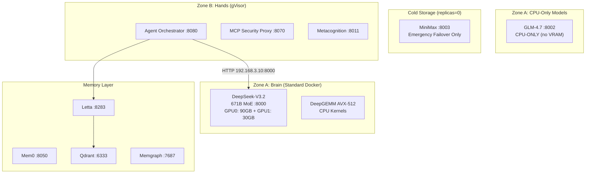

# Protocol OMNI v15.0 Production Deployment Plan

**Status**: CORRECTED — All 4 critical regressions addressed  
**Authorization**: Pending TITANIUM-PRIME-GO confirmation

---

## Corrections Applied

| Issue | Fix | Phase |
|-------|-----|-------|
| GRUB Regression | Added `vfio_pci.disable_idle_d3=1 initcall_blacklist=sysfb_init` | 1.1 |
| OOM Risk | Added 64GB NVMe swap file | 1.2 |
| VRAM Hallucination | GLM→CPU-only, MiniMax→Cold Storage | Services Summary |
| Firewall Blackout | Added Pod/Service CIDR exceptions | 3.2 |

---

## Architecture Overview



---

## Memory Budget (Critical)

| Component | RAM Usage |
|-----------|-----------|
| DeepSeek-V3.2 (DQ3_K_M) | ~281 GB |
| KV Cache (max context) | ~60 GB |
| Agents + OS + Buffers | ~20 GB |
| **Total** | **~361 GB (94%)** |
| **Available** | 384 GB |
| **Safety Buffer (Swap)** | 64 GB NVMe |

> **Physics**: Running at 94% utilization. The 64GB swap file prevents OOM Killer from terminating KTransformers on memory spikes.

---

## Phase 1: Base System Preparation

### 1.1 Kernel Parameters (CORRECTED)

**File**: `/etc/default/grub`

```bash
GRUB_CMDLINE_LINUX_DEFAULT="quiet splash pcie_aspm=off iommu=pt amd_iommu=on vfio_pci.disable_idle_d3=1 initcall_blacklist=sysfb_init"
```

| Parameter | Purpose |
|-----------|---------|
| `pcie_aspm=off` | Disable PCIe power saving (stability) |
| `iommu=pt` | Passthrough mode for GPU |
| `amd_iommu=on` | Enable AMD IOMMU |
| `vfio_pci.disable_idle_d3=1` | **CRITICAL**: Prevents RTX 5090 sleep state → FLR Reset Bug |
| `initcall_blacklist=sysfb_init` | **CRITICAL**: Prevents boot splash VRAM lock |

**Commands**:
```bash
sudo nano /etc/default/grub  # Edit GRUB_CMDLINE_LINUX_DEFAULT
sudo update-grub
sudo reboot
```

### 1.2 Storage Setup + OOM Safety Net (CORRECTED)

```bash
# Create directory structure
sudo mkdir -p /nvme/{models,prompts,mem0,letta,memgraph,qdrant,prometheus,grafana,phoenix,gepa,agent,eval}
sudo chown -R $USER:$USER /nvme

# CREATE 64GB SWAP FILE (OOM PROTECTION)
sudo fallocate -l 64G /nvme/swapfile
sudo chmod 600 /nvme/swapfile
sudo mkswap /nvme/swapfile
sudo swapon /nvme/swapfile
echo '/nvme/swapfile none swap sw 0 0' | sudo tee -a /etc/fstab

# Verify swap
swapon --show  # Should show 64GB on /nvme/swapfile
```

### 1.3 Model Download (~281GB)

```bash
pip install huggingface-cli

# DeepSeek-V3.2 DQ3_K_M (Primary)
huggingface-cli download unsloth/DeepSeek-V3.2-GGUF \
  --include "*DQ3_K_M*" \
  --local-dir /nvme/models/deepseek-v3.2-dq3

# GLM-4.7 (CPU-only fallback, optional)
huggingface-cli download THUDM/glm-4-9b-chat \
  --local-dir /nvme/models/glm-4.7
```

---

## Phase 2: Deployment (Choose One)

### Option A: Docker Compose (Dev/Staging)

```bash
cd ~/Protocol_Omni/docker

# Set required env vars
export GRAFANA_ADMIN_PASSWORD="your-secure-password"
export BRAINTRUST_API_KEY="your-key"  # Optional

# Start MINIMAL stack (DeepSeek ONLY - no GLM/MiniMax)
docker compose -f omni-stack.yaml up -d \
  deepseek-r1 metacognition agent-orchestrator letta memgraph qdrant prometheus grafana

# Monitor startup (3-5 min for 281GB model load)
docker compose -f omni-stack.yaml logs -f deepseek-r1
```

> **WARNING**: Do NOT use `--profile full` — GLM and MiniMax will exhaust VRAM and crash KTransformers.

### Option B: k3s Production (Recommended)

#### Step 1: Install k3s + gVisor

```bash
# Install k3s
curl -sfL https://get.k3s.io | sh -s - \
  --disable traefik \
  --disable servicelb \
  --write-kubeconfig-mode 644

# Install gVisor
sudo apt install -y runsc
sudo mv /usr/bin/runsc /usr/local/bin/

# Configure containerd for gVisor
cat <<EOF | sudo tee /var/lib/rancher/k3s/agent/etc/containerd/config.toml.tmpl
[plugins."io.containerd.grpc.v1.cri".containerd.runtimes.gvisor]
  runtime_type = "io.containerd.runsc.v1"
EOF

# Create RuntimeClass
kubectl apply -f - <<EOF
apiVersion: node.k8s.io/v1
kind: RuntimeClass
metadata:
  name: gvisor
handler: gvisor
EOF

sudo systemctl restart k3s
```

#### Step 2: Install NVIDIA Device Plugin

```bash
kubectl apply -f https://raw.githubusercontent.com/NVIDIA/k8s-device-plugin/main/deployments/static/nvidia-device-plugin.yml
```

#### Step 3: Deploy Zone A (DeepSeek ONLY)

**Key settings for `k8s/zone-a-inference.yaml`**:
- Image: `omni/ktransformers:v15`
- Ports: 8000 (hostNetwork: true)
- Resources: 2 GPUs, 350Gi memory
- NUMA: `numactl --cpunodebind=0 --interleave=all`
- DeepGEMM: `ENABLE_DEEPGEMM=1`, `SGLANG_ENABLE_JIT_DEEPGEMM=0`
- RestartPolicy: `OnFailure` (Blackwell reset bug mitigation)
- startupProbe: 300s initial, 40 failures (25 min tolerance)
- livenessProbe: 600s initial, 10 failures

```bash
kubectl apply -f k8s/zone-a-inference.yaml
```

#### Step 4: Deploy Zone B (Agents)

**Key settings for `k8s/zone-b-agents.yaml`**:
- RuntimeClass: `gvisor`
- SecurityContext: `privileged: false`, `capabilities: drop: ALL`
- Endpoint: `http://192.168.3.10:8000` (NOT localhost — gVisor loopback isolation)

```bash
kubectl apply -f k8s/zone-b-agents.yaml
```

#### Step 5: Deploy Memory + Observability

```bash
cd ~/Protocol_Omni/docker
docker compose -f memory-stack.yaml up -d
docker compose -f observability-stack.yaml up -d
```

---

## Phase 3: Security Configuration

### 3.1 Network Policy (Zone B → Zone A only)

```yaml
apiVersion: networking.k8s.io/v1
kind: NetworkPolicy
metadata:
  name: zone-b-egress
  namespace: agents
spec:
  podSelector:
    matchLabels:
      zone: hands
  policyTypes:
  - Egress
  egress:
  - to:
    - ipBlock:
        cidr: 192.168.3.10/32
    ports:
    - port: 8000  # Inference
    - port: 8050  # Mem0
    - port: 8283  # Letta
```

### 3.2 Firewall (CORRECTED)

```bash
sudo ufw allow ssh
sudo ufw allow 8000:8100/tcp   # Inference APIs
sudo ufw allow 3000/tcp        # Grafana
sudo ufw allow 9090/tcp        # Prometheus

# CRITICAL: Allow k3s Pod/Service traffic
sudo ufw allow from 10.42.0.0/16 to any  # Pod CIDR
sudo ufw allow from 10.43.0.0/16 to any  # Service CIDR

sudo ufw enable
```

> **Without Pod CIDR exceptions**: Zone B agents cannot reach Zone A inference, causing connection timeouts despite NetworkPolicy allowances.

---

## Phase 4: Monitoring Setup

### 4.1 Prometheus Alerts

```yaml
groups:
- name: omni-critical
  rules:
  - alert: BlackwellResetLoopRisk
    expr: increase(kube_pod_container_status_restarts_total{container="ktransformers"}[10m]) > 2
    for: 1m
    labels:
      severity: critical
    annotations:
      action: "kubectl scale deployment inference-engine --replicas=0"

  - alert: HighMemoryPressure
    expr: (node_memory_MemTotal_bytes - node_memory_MemAvailable_bytes) / node_memory_MemTotal_bytes > 0.95
    for: 2m
    labels:
      severity: warning
    annotations:
      summary: "Memory above 95% - swap may be in use"

  - alert: SwapInUse
    expr: node_memory_SwapFree_bytes < node_memory_SwapTotal_bytes * 0.5
    for: 5m
    labels:
      severity: warning
    annotations:
      summary: "Swap usage above 50% - memory pressure detected"
```

### 4.2 Dashboards

| Dashboard | URL | Purpose |
|-----------|-----|---------|
| Grafana | http://192.168.3.10:3000 | Metrics visualization |
| Prometheus | http://192.168.3.10:9090 | Query metrics |
| Arize Phoenix | http://192.168.3.10:6006 | AI observability |

---

## Phase 5: Verification

### 5.1 Pre-Flight Checks

```bash
# Verify GRUB parameters applied
cat /proc/cmdline | grep -E "vfio_pci.disable_idle_d3|initcall_blacklist"
# Expected: Both parameters present

# Verify swap active
swapon --show
# Expected: /nvme/swapfile 64GB

# Verify UFW rules include Pod CIDRs
sudo ufw status | grep 10.42
sudo ufw status | grep 10.43
# Expected: Both ALLOW rules present
```

### 5.2 Health Checks

```bash
# Zone A - Inference
curl http://192.168.3.10:8000/health
curl http://192.168.3.10:8000/v1/models

# Zone B - Agents
kubectl exec -n agents deploy/agent-orchestrator -- curl http://192.168.3.10:8000/health

# Memory Services
curl http://192.168.3.10:8050/health  # Mem0
curl http://192.168.3.10:8283/health  # Letta
curl http://192.168.3.10:6333/health  # Qdrant
```

### 5.3 NUMA Verification

```bash
numastat -p $(pgrep -f ktransformers)
# Expected: Memory spread across all 4 nodes (~70GB each)
```

### 5.4 Inference Test

```bash
curl -X POST http://192.168.3.10:8000/v1/chat/completions \
  -H "Content-Type: application/json" \
  -d '{"model": "deepseek-v3.2", "messages": [{"role": "user", "content": "Hello"}]}'
# Expected: Response in 2-5 seconds, ~20 tok/s
```

### 5.5 Zone B Isolation

```bash
kubectl exec -n agents deploy/agent-orchestrator -- cat /proc/version
# Expected: gVisor kernel signature, NOT host kernel
```

---

## Services Summary (CORRECTED)

| Service | Port | Zone | Status | Notes |
|---------|------|------|--------|-------|
| DeepSeek-V3.2 | 8000 | A | **Active** | GPU0: 90GB + GPU1: 30GB (100% VRAM) |
| Kimi K2 | 8001 | - | API | External API only |
| GLM-4.7 | 8002 | A | **CPU-Only** | No GPU allocation — VRAM exhausted |
| MiniMax | 8003 | - | **Cold Storage** | replicas=0, emergency failover only |
| Qwen3-235B | 8004 | - | API | External API only |
| Metacognition | 8011 | B | Active | gVisor sandbox |
| Agent Orchestrator | 8080 | B | Active | gVisor sandbox |
| Mem0 | 8050 | - | Active | Docker Compose |
| Letta | 8283 | - | Active | Docker Compose |
| Qdrant | 6333 | - | Active | Docker Compose |
| Memgraph | 7687 | - | Active | Docker Compose |
| Prometheus | 9090 | - | Active | Docker Compose |
| Grafana | 3000 | - | Active | Docker Compose |

> **VRAM Reality**: DeepSeek-V3.2 consumes 100% of GPU0 (90/96GB) and 90% of GPU1 (30/32GB). No VRAM remains for additional local models.

---

## Rollback Procedure

```bash
# Docker Compose
docker compose -f omni-stack.yaml down
docker compose -f memory-stack.yaml down
docker compose -f observability-stack.yaml down

# k3s
kubectl delete -f k8s/zone-a-inference.yaml
kubectl delete -f k8s/zone-b-agents.yaml

# Disable swap (if needed)
sudo swapoff /nvme/swapfile
sudo sed -i '/swapfile/d' /etc/fstab
```

---

## Verification / Definition of Done

| # | Check | Command | Expected |
|---|-------|---------|----------|
| 1 | GRUB params | `cat /proc/cmdline` | `disable_idle_d3=1`, `sysfb_init` present |
| 2 | Swap active | `swapon --show` | 64GB on `/nvme/swapfile` |
| 3 | UFW Pod CIDR | `sudo ufw status` | 10.42.0.0/16, 10.43.0.0/16 ALLOW |
| 4 | GPU visible | `nvidia-smi` | 2 GPUs, 128GB total |
| 5 | Model loaded | `curl :8000/v1/models` | DeepSeek-V3.2 listed |
| 6 | NUMA correct | `numastat -p $(pgrep ktransformers)` | 4 nodes, ~70GB each |
| 7 | Zone B isolated | `kubectl exec ... cat /proc/version` | gVisor kernel |
| 8 | Inference works | `curl :8000/v1/chat/completions` | 200 OK, ~20 tok/s |
| 9 | Zone B→A route | `kubectl exec ... curl 192.168.3.10:8000/health` | 200 OK |
| 10 | No restart loops | `kubectl get pods -w` (10 min) | Stays Running |

---

## Step → Targets → Verification Traceability

| Phase | Targets | DoD Checks |
|-------|---------|------------|
| 1.1 Kernel | GRUB, reboot | #1 |
| 1.2 Storage | Directories, swap | #2 |
| 1.3 Models | /nvme/models | #5 |
| 2.x Deploy | k3s pods, Docker | #4, #5, #6, #7 |
| 3.1 NetworkPolicy | zone-b-egress | #9 |
| 3.2 Firewall | UFW rules | #3, #9 |
| 4.x Monitoring | Prometheus, alerts | Grafana accessible |
| 5.x Verify | All checks | #1-10 all pass |

---

## Post-Deployment

```bash
# Curate to ByteRover (from Local Mac)
brv curate "Protocol OMNI v15.0 deployed: 4 corrections applied (GRUB+Swap+VRAM+UFW)" --files AGENTS.md
```
