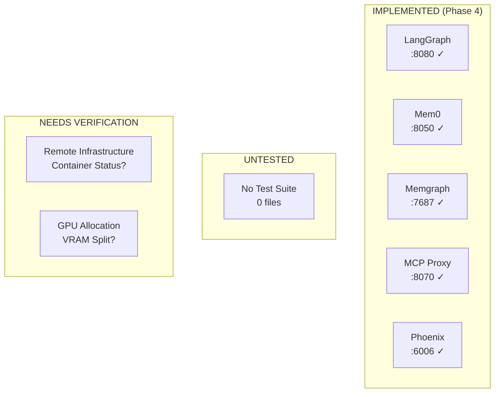

# Protocol OMNI v16.0: Test Suite & Next Steps Plan

> **For Claude:** REQUIRED SUB-SKILL: Use `superpowers:executing-plans` to implement this plan task-by-task.

**Goal:** Validate all Phase 4 SOVEREIGN COGNITION implementations and define Phase 5 roadmap.

**Architecture:** Two-tier testing: Unit tests run locally (Mac), Integration tests run remotely via SSH on bare metal (192.168.3.10). All tests use pytest + pytest-asyncio.

**Tech Stack:** pytest, pytest-asyncio, httpx, ruff, mypy

---

## Current State Summary



| Component | Status | Files | Test Coverage |
|-----------|--------|-------|---------------|
| LangGraph Workflow | IMPLEMENTED | `src/agent/graph.py` | **0%** |
| Classification Node | IMPLEMENTED | `src/agent/nodes/classification.py` | **0%** |
| Inference Node | IMPLEMENTED | `src/agent/nodes/inference.py` | **0%** |
| Memory Nodes | IMPLEMENTED | `src/agent/nodes/memory.py` | **0%** |
| Mem0 Client | IMPLEMENTED | `src/memory/mem0_client.py` | **0%** |
| Memgraph Client | IMPLEMENTED | `src/knowledge/memgraph_client.py` | **0%** |
| MCP Proxy | IMPLEMENTED | `src/mcp_proxy/gateway.py` | **0%** |

---

## Part A: Infrastructure Verification (Remote)

### Task 1: Verify Bare Metal Host

**Target:** Confirm SSH access and hardware state

**Step 1: SSH and check host identity**
```bash
ssh omni@192.168.3.10 "hostname && uname -a"
```
Expected: `omni-prime` + Ubuntu 24.04

**Step 2: Verify GPU visibility**
```bash
ssh omni@192.168.3.10 "nvidia-smi --query-gpu=index,name,memory.total --format=csv"
```
Expected:
```
0, NVIDIA RTX PRO 6000 Blackwell, 98304 MiB
1, NVIDIA GeForce RTX 5090, 32768 MiB
```

**Step 3: Verify Docker containers running**
```bash
ssh omni@192.168.3.10 "cd ~/Protocol_Omni/docker && docker compose -f omni-stack.yaml ps --format 'table {{.Name}}\t{{.Status}}\t{{.Ports}}'"
```
Expected: All core services Up (deepseek-v32, mcp-proxy, arize-phoenix, qdrant, memgraph, prometheus, grafana)

---

### Task 2: Health Check All Services

**Target:** Verify each service responds to health endpoints

**Step 1: DeepSeek-V3.2 (Oracle)**
```bash
ssh omni@192.168.3.10 "curl -sf http://localhost:8000/health | jq"
```
Expected: `{"status":"ok"}`

**Step 2: MCP Proxy (Security Gateway)**
```bash
ssh omni@192.168.3.10 "curl -sf http://localhost:8070/health | jq"
```
Expected: `{"status":"ok","policy":"deny"}`

**Step 3: Arize Phoenix (Observability)**
```bash
ssh omni@192.168.3.10 "curl -sf http://localhost:6006/health | jq"
```
Expected: 200 OK

**Step 4: Qdrant (Vectors)**
```bash
ssh omni@192.168.3.10 "curl -sf http://localhost:6333/health | jq"
```
Expected: `{"title":"qdrant - vector similarity engine"}`

**Step 5: Memgraph (Knowledge Graph)**
```bash
ssh omni@192.168.3.10 "echo 'RETURN 1 as n;' | docker exec -i memgraph mgconsole"
```
Expected: `1`

---

## Part B: Unit Tests (Local)

### Task 3: Create Test Directory Structure

**Files:**
- Create: `tests/__init__.py`
- Create: `tests/conftest.py`
- Create: `tests/unit/__init__.py`
- Create: `tests/integration/__init__.py`

**Step 1: Create test directories**
```bash
mkdir -p tests/unit tests/integration
touch tests/__init__.py tests/unit/__init__.py tests/integration/__init__.py
```

**Step 2: Create conftest.py with fixtures**

Create: `tests/conftest.py`
```python
"""
Protocol OMNI v16.0 Test Configuration

Fixtures for unit and integration tests.
"""

import pytest
import asyncio
from typing import AsyncGenerator

@pytest.fixture(scope="session")
def event_loop():
    """Create event loop for async tests."""
    loop = asyncio.new_event_loop()
    yield loop
    loop.close()

@pytest.fixture
def mock_messages():
    """Sample chat messages for testing."""
    return [
        {"role": "system", "content": "You are a helpful assistant."},
        {"role": "user", "content": "Hello, how are you?"},
    ]

@pytest.fixture
def complex_prompt():
    """Prompt that should trigger COMPLEX routing."""
    return "Analyze the GPU VRAM allocation and calculate efficiency ratio for the Blackwell tensor split."

@pytest.fixture
def trivial_prompt():
    """Prompt that should trigger TRIVIAL routing."""
    return "Hello"

@pytest.fixture
def routine_prompt():
    """Prompt that should trigger ROUTINE routing."""
    return "Write a Python function to sort a list."
```

**Step 3: Run to verify setup**
```bash
pytest tests/ --collect-only
```
Expected: 0 tests collected (no errors)

**Step 4: Commit**
```bash
git add tests/
git commit -m "test: add test directory structure and conftest"
```

---

### Task 4: Classification Node Unit Tests

**Files:**
- Create: `tests/unit/test_classification.py`

**Step 1: Write classification tests**

Create: `tests/unit/test_classification.py`
```python
"""
Tests for classification node (Sovereign Vocabulary).
"""

import pytest
from src.agent.nodes.classification import (
    classify_complexity,
    SOVEREIGN_VOCABULARY,
    COMPLEX_INDICATORS,
)
from src.agent.nodes.state import GraphState, ComplexityLevel


class TestClassifyComplexity:
    """Test complexity classification logic."""

    def test_trivial_greeting(self):
        """Short greetings should be TRIVIAL."""
        state: GraphState = {"prompt": "Hello", "messages": []}
        result = classify_complexity(state)
        
        assert result["complexity"] == ComplexityLevel.TRIVIAL
        assert "trivial" in result["routing_reason"].lower()

    def test_sovereign_vocabulary_gpu(self):
        """GPU-related prompts trigger COMPLEX via Sovereign Vocabulary."""
        state: GraphState = {"prompt": "Check the GPU VRAM allocation", "messages": []}
        result = classify_complexity(state)
        
        assert result["complexity"] == ComplexityLevel.COMPLEX
        assert "gpu" in result["routing_reason"].lower()

    def test_sovereign_vocabulary_ssh(self):
        """SSH-related prompts trigger COMPLEX."""
        state: GraphState = {"prompt": "SSH to the server and check logs", "messages": []}
        result = classify_complexity(state)
        
        assert result["complexity"] == ComplexityLevel.COMPLEX
        assert "ssh" in result["routing_reason"].lower()

    def test_complex_indicator_analyze(self):
        """Analysis requests trigger COMPLEX."""
        state: GraphState = {"prompt": "Analyze the performance metrics", "messages": []}
        result = classify_complexity(state)
        
        assert result["complexity"] == ComplexityLevel.COMPLEX

    def test_routine_default(self):
        """Simple coding tasks default to ROUTINE."""
        state: GraphState = {"prompt": "Write a function to add two numbers", "messages": []}
        result = classify_complexity(state)
        
        assert result["complexity"] == ComplexityLevel.ROUTINE

    def test_long_prompt_is_complex(self):
        """Prompts over 500 chars are COMPLEX."""
        long_prompt = "x" * 600
        state: GraphState = {"prompt": long_prompt, "messages": []}
        result = classify_complexity(state)
        
        assert result["complexity"] == ComplexityLevel.COMPLEX
        assert "long prompt" in result["routing_reason"].lower()

    def test_deepseek_routing(self):
        """COMPLEX tasks route to DeepSeek."""
        state: GraphState = {"prompt": "Calculate the power efficiency", "messages": []}
        result = classify_complexity(state)
        
        assert result["model_name"] == "deepseek-v3.2"
        assert "deepseek" in result["endpoint"]

    def test_qwen_routing(self):
        """ROUTINE tasks route to Qwen."""
        state: GraphState = {"prompt": "Write a hello world function", "messages": []}
        result = classify_complexity(state)
        
        assert result["model_name"] == "qwen2.5-coder-7b"
        assert "qwen" in result["endpoint"]

    def test_all_sovereign_vocabulary_covered(self):
        """Verify all sovereign vocabulary triggers COMPLEX."""
        for keyword in SOVEREIGN_VOCABULARY:
            state: GraphState = {"prompt": f"Test {keyword} functionality", "messages": []}
            result = classify_complexity(state)
            assert result["complexity"] == ComplexityLevel.COMPLEX, f"Failed for: {keyword}"
```

**Step 2: Run tests to verify**
```bash
cd /Users/a/Documents/Protocol_Omni
PYTHONPATH=. pytest tests/unit/test_classification.py -v
```
Expected: All tests PASS

**Step 3: Commit**
```bash
git add tests/unit/test_classification.py
git commit -m "test: add classification node unit tests"
```

---

### Task 5: MCP Proxy Allowlist Unit Tests

**Files:**
- Create: `tests/unit/test_mcp_allowlist.py`

**Step 1: Write allowlist tests**

Create: `tests/unit/test_mcp_allowlist.py`
```python
"""
Tests for MCP proxy allowlist logic.
"""

import pytest
import tempfile
import yaml
from pathlib import Path

import sys
sys.path.insert(0, str(Path(__file__).parent.parent.parent / "src" / "mcp_proxy"))

from allowlist import ToolAllowlist


@pytest.fixture
def sample_allowlist_yaml():
    """Create a temporary allowlist config."""
    config = {
        "version": "1.0",
        "policy": "deny",
        "allowed_tools": {
            "mcp_ssh-mcp": {
                "methods": ["ssh_connect", "ssh_execute"],
                "rate_limit": "10/min",
                "audit": True,
            },
            "mcp_github": {
                "methods": ["search_code", "get_file_contents"],
                "rate_limit": "20/min",
                "audit": False,
            },
        },
        "denied_tools": ["mcp_filesystem", "mcp_shell"],
    }
    
    with tempfile.NamedTemporaryFile(mode="w", suffix=".yaml", delete=False) as f:
        yaml.dump(config, f)
        return f.name


class TestToolAllowlist:
    """Test allowlist permission logic."""

    def test_allowed_tool_permitted(self, sample_allowlist_yaml):
        """Allowed tools with matching methods are permitted."""
        allowlist = ToolAllowlist(sample_allowlist_yaml)
        
        assert allowlist.is_allowed("mcp_ssh-mcp", "ssh_connect") is True
        assert allowlist.is_allowed("mcp_ssh-mcp", "ssh_execute") is True

    def test_allowed_tool_wrong_method_denied(self, sample_allowlist_yaml):
        """Allowed tools with non-listed methods are denied."""
        allowlist = ToolAllowlist(sample_allowlist_yaml)
        
        assert allowlist.is_allowed("mcp_ssh-mcp", "ssh_dangerous") is False

    def test_denied_tool_always_blocked(self, sample_allowlist_yaml):
        """Explicitly denied tools are always blocked."""
        allowlist = ToolAllowlist(sample_allowlist_yaml)
        
        assert allowlist.is_allowed("mcp_filesystem", "read") is False
        assert allowlist.is_allowed("mcp_shell", "execute") is False

    def test_unlisted_tool_denied_by_default(self, sample_allowlist_yaml):
        """Tools not in allowlist are denied (default deny policy)."""
        allowlist = ToolAllowlist(sample_allowlist_yaml)
        
        assert allowlist.is_allowed("mcp_unknown", "any_method") is False

    def test_rate_limit_parsing(self, sample_allowlist_yaml):
        """Rate limits are correctly parsed."""
        allowlist = ToolAllowlist(sample_allowlist_yaml)
        permission = allowlist.get_permission("mcp_ssh-mcp")
        
        limit, window = permission.parse_rate_limit()
        assert limit == 10
        assert window == 60  # 1 minute

    def test_list_allowed_tools(self, sample_allowlist_yaml):
        """list_allowed_tools returns all permitted tool names."""
        allowlist = ToolAllowlist(sample_allowlist_yaml)
        tools = allowlist.list_allowed_tools()
        
        assert "mcp_ssh-mcp" in tools
        assert "mcp_github" in tools
        assert "mcp_filesystem" not in tools
```

**Step 2: Run tests**
```bash
PYTHONPATH=. pytest tests/unit/test_mcp_allowlist.py -v
```
Expected: All tests PASS

**Step 3: Commit**
```bash
git add tests/unit/test_mcp_allowlist.py
git commit -m "test: add MCP allowlist unit tests"
```

---

### Task 6: Mem0 Client Unit Tests (Mocked)

**Files:**
- Create: `tests/unit/test_mem0_client.py`

**Step 1: Write Mem0 client tests**

Create: `tests/unit/test_mem0_client.py`
```python
"""
Tests for Mem0 client wrapper.
"""

import pytest
from unittest.mock import AsyncMock, patch, MagicMock
from datetime import datetime

from src.memory.mem0_client import (
    Mem0Client,
    Memory,
    MemorySearchResult,
    format_memories_for_context,
)


class TestMem0Client:
    """Test Mem0 client methods."""

    @pytest.fixture
    def client(self):
        return Mem0Client(base_url="http://localhost:8050")

    @pytest.mark.asyncio
    async def test_health_check_success(self, client):
        """Health check returns True when service is up."""
        mock_response = MagicMock()
        mock_response.status_code = 200
        
        with patch.object(client, "_get_client") as mock_get:
            mock_http = AsyncMock()
            mock_http.get = AsyncMock(return_value=mock_response)
            mock_get.return_value = mock_http
            
            result = await client.health_check()
            assert result is True

    @pytest.mark.asyncio
    async def test_health_check_failure(self, client):
        """Health check returns False when service is down."""
        with patch.object(client, "_get_client") as mock_get:
            mock_http = AsyncMock()
            mock_http.get = AsyncMock(side_effect=Exception("Connection refused"))
            mock_get.return_value = mock_http
            
            result = await client.health_check()
            assert result is False

    @pytest.mark.asyncio
    async def test_store_memory_success(self, client):
        """Store memory returns memory ID on success."""
        mock_response = MagicMock()
        mock_response.status_code = 200
        mock_response.json.return_value = {"id": "mem-12345"}
        mock_response.raise_for_status = MagicMock()
        
        with patch.object(client, "_get_client") as mock_get:
            mock_http = AsyncMock()
            mock_http.post = AsyncMock(return_value=mock_response)
            mock_get.return_value = mock_http
            
            result = await client.store_memory(
                content="User prefers Python",
                user_id="user-1",
            )
            assert result == "mem-12345"

    @pytest.mark.asyncio
    async def test_search_memory_returns_results(self, client):
        """Search memory returns MemorySearchResult with memories."""
        mock_response = MagicMock()
        mock_response.status_code = 200
        mock_response.json.return_value = {
            "results": [
                {
                    "id": "mem-1",
                    "memory": "User prefers Python",
                    "metadata": {},
                    "created_at": "2026-01-23T10:00:00",
                    "score": 0.95,
                }
            ]
        }
        mock_response.raise_for_status = MagicMock()
        
        with patch.object(client, "_get_client") as mock_get:
            mock_http = AsyncMock()
            mock_http.post = AsyncMock(return_value=mock_response)
            mock_get.return_value = mock_http
            
            result = await client.search_memory(
                query="What language does user prefer?",
                user_id="user-1",
            )
            
            assert len(result.memories) == 1
            assert result.memories[0].content == "User prefers Python"
            assert result.memories[0].score == 0.95


class TestFormatMemoriesForContext:
    """Test memory formatting helper."""

    def test_empty_memories(self):
        """Empty list returns empty string."""
        result = format_memories_for_context([])
        assert result == ""

    def test_single_memory(self):
        """Single memory is formatted correctly."""
        memories = [
            Memory(
                id="1",
                content="User likes TypeScript",
                metadata={},
                created_at=datetime.now(),
            )
        ]
        result = format_memories_for_context(memories)
        
        assert "<relevant_memories>" in result
        assert "User likes TypeScript" in result
        assert "</relevant_memories>" in result

    def test_truncation(self):
        """Long memories are truncated."""
        memories = [
            Memory(
                id=str(i),
                content="x" * 500,
                metadata={},
                created_at=datetime.now(),
            )
            for i in range(20)
        ]
        result = format_memories_for_context(memories, max_tokens=100)
        
        assert "truncated" in result
```

**Step 2: Run tests**
```bash
PYTHONPATH=. pytest tests/unit/test_mem0_client.py -v
```
Expected: All tests PASS

**Step 3: Commit**
```bash
git add tests/unit/test_mem0_client.py
git commit -m "test: add Mem0 client unit tests"
```

---

### Task 7: LangGraph Workflow Unit Tests

**Files:**
- Create: `tests/unit/test_graph.py`

**Step 1: Write graph workflow tests**

Create: `tests/unit/test_graph.py`
```python
"""
Tests for LangGraph cognitive workflow.
"""

import pytest
from src.agent.graph import (
    parse_request,
    should_use_memory,
    route_by_complexity,
    get_graph_health,
)
from src.agent.nodes.state import GraphState, ComplexityLevel


class TestParseRequest:
    """Test request parsing node."""

    def test_extracts_prompt_from_messages(self):
        """Prompt is extracted from last user message."""
        state: GraphState = {
            "prompt": "",
            "messages": [
                {"role": "user", "content": "First question"},
                {"role": "assistant", "content": "First answer"},
                {"role": "user", "content": "Second question"},
            ],
        }
        result = parse_request(state)
        
        assert result["prompt"] == "Second question"

    def test_preserves_explicit_prompt(self):
        """Explicit prompt is not overwritten."""
        state: GraphState = {
            "prompt": "Explicit prompt",
            "messages": [{"role": "user", "content": "Message prompt"}],
        }
        result = parse_request(state)
        
        assert result["prompt"] == "Explicit prompt"


class TestShouldUseMemory:
    """Test memory retrieval routing."""

    def test_skip_for_trivial_greetings(self):
        """Memory is skipped for short greetings."""
        state: GraphState = {"prompt": "hello"}
        result = should_use_memory(state)
        assert result == "skip"

    def test_retrieve_for_substantive_prompts(self):
        """Memory is retrieved for substantive prompts."""
        state: GraphState = {"prompt": "Explain the architecture of the system"}
        result = should_use_memory(state)
        assert result == "retrieve"

    def test_skip_thanks(self):
        """Memory is skipped for thank you messages."""
        state: GraphState = {"prompt": "thanks!"}
        result = should_use_memory(state)
        assert result == "skip"


class TestRouteByComplexity:
    """Test model routing by complexity."""

    def test_complex_routes_to_deepseek(self):
        """COMPLEX tasks route to DeepSeek."""
        state: GraphState = {"complexity": ComplexityLevel.COMPLEX}
        result = route_by_complexity(state)
        assert result == "deepseek"

    def test_tool_heavy_routes_to_deepseek(self):
        """TOOL_HEAVY tasks route to DeepSeek."""
        state: GraphState = {"complexity": ComplexityLevel.TOOL_HEAVY}
        result = route_by_complexity(state)
        assert result == "deepseek"

    def test_routine_routes_to_qwen(self):
        """ROUTINE tasks route to Qwen."""
        state: GraphState = {"complexity": ComplexityLevel.ROUTINE}
        result = route_by_complexity(state)
        assert result == "qwen"

    def test_trivial_routes_to_qwen(self):
        """TRIVIAL tasks route to Qwen."""
        state: GraphState = {"complexity": ComplexityLevel.TRIVIAL}
        result = route_by_complexity(state)
        assert result == "qwen"


class TestGraphHealth:
    """Test graph health check."""

    def test_health_check_returns_status(self):
        """Health check returns compiled status."""
        result = get_graph_health()
        
        assert result["status"] == "ok"
        assert result["graph_compiled"] is True
        assert "nodes" in result
        assert "parse" in result["nodes"]
```

**Step 2: Run tests**
```bash
PYTHONPATH=. pytest tests/unit/test_graph.py -v
```
Expected: All tests PASS

**Step 3: Commit**
```bash
git add tests/unit/test_graph.py
git commit -m "test: add LangGraph workflow unit tests"
```

---

## Part C: Integration Tests (Remote)

### Task 8: Remote Integration Test Suite

**Files:**
- Create: `tests/integration/test_remote_services.py`

**Step 1: Write remote integration tests**

Create: `tests/integration/test_remote_services.py`
```python
"""
Integration tests for remote services on bare metal.

Requires SSH access to 192.168.3.10.
Run with: pytest tests/integration/ -v --run-remote
"""

import pytest
import subprocess


def ssh_exec(cmd: str) -> tuple[int, str, str]:
    """Execute command via SSH."""
    result = subprocess.run(
        ["ssh", "omni@192.168.3.10", cmd],
        capture_output=True,
        text=True,
        timeout=30,
    )
    return result.returncode, result.stdout, result.stderr


@pytest.fixture(scope="module")
def verify_ssh_access():
    """Verify SSH access before running tests."""
    code, out, err = ssh_exec("echo ok")
    if code != 0:
        pytest.skip("SSH access unavailable")


@pytest.mark.remote
class TestDeepSeekOracle:
    """Test DeepSeek-V3.2 Oracle service."""

    def test_health_endpoint(self, verify_ssh_access):
        """DeepSeek health endpoint responds."""
        code, out, _ = ssh_exec("curl -sf http://localhost:8000/health")
        assert code == 0
        assert "ok" in out.lower() or "{" in out

    def test_models_endpoint(self, verify_ssh_access):
        """DeepSeek lists available models."""
        code, out, _ = ssh_exec("curl -sf http://localhost:8000/v1/models")
        assert code == 0
        assert "deepseek" in out.lower() or "model" in out.lower()


@pytest.mark.remote
class TestMCPProxy:
    """Test MCP Security Proxy."""

    def test_health_with_deny_policy(self, verify_ssh_access):
        """MCP proxy health shows deny policy."""
        code, out, _ = ssh_exec("curl -sf http://localhost:8070/health")
        assert code == 0
        assert "deny" in out

    def test_allowed_tools_list(self, verify_ssh_access):
        """MCP proxy lists allowed tools."""
        code, out, _ = ssh_exec("curl -sf http://localhost:8070/allowed-tools")
        assert code == 0
        assert "mcp_ssh" in out

    def test_denied_tool_returns_403(self, verify_ssh_access):
        """Invoking denied tool returns 403."""
        cmd = """curl -sf -o /dev/null -w '%{http_code}' -X POST http://localhost:8070/invoke -H 'Content-Type: application/json' -d '{"tool":"mcp_shell","method":"exec","arguments":{}}'"""
        code, out, _ = ssh_exec(cmd)
        assert out.strip() == "403"


@pytest.mark.remote
class TestPhoenixObservability:
    """Test Arize Phoenix observability."""

    def test_phoenix_health(self, verify_ssh_access):
        """Phoenix health endpoint responds."""
        code, out, _ = ssh_exec("curl -sf http://localhost:6006/health")
        assert code == 0


@pytest.mark.remote
class TestQdrantVectors:
    """Test Qdrant vector store."""

    def test_qdrant_health(self, verify_ssh_access):
        """Qdrant health endpoint responds."""
        code, out, _ = ssh_exec("curl -sf http://localhost:6333/health")
        assert code == 0


@pytest.mark.remote
class TestMemgraphKnowledgeGraph:
    """Test Memgraph knowledge graph."""

    def test_memgraph_query(self, verify_ssh_access):
        """Memgraph accepts Cypher queries."""
        code, out, _ = ssh_exec("echo 'RETURN 1 as n;' | docker exec -i memgraph mgconsole 2>/dev/null")
        assert code == 0 or "1" in out
```

**Step 2: Add pytest marker for remote tests**

Modify: `tests/conftest.py` (append)
```python
def pytest_configure(config):
    config.addinivalue_line(
        "markers", "remote: mark test as requiring SSH to bare metal"
    )

def pytest_addoption(parser):
    parser.addoption(
        "--run-remote",
        action="store_true",
        default=False,
        help="Run remote integration tests",
    )

def pytest_collection_modifyitems(config, items):
    if not config.getoption("--run-remote"):
        skip_remote = pytest.mark.skip(reason="need --run-remote to run")
        for item in items:
            if "remote" in item.keywords:
                item.add_marker(skip_remote)
```

**Step 3: Run remote tests**
```bash
PYTHONPATH=. pytest tests/integration/ -v --run-remote
```
Expected: All tests PASS (if infrastructure is up)

**Step 4: Commit**
```bash
git add tests/integration/ tests/conftest.py
git commit -m "test: add remote integration tests"
```

---

## Part D: Linting & Type Checking

### Task 9: Run Static Analysis

**Step 1: Run ruff linter**
```bash
ruff check src/
```
Expected: No errors (or fix reported issues)

**Step 2: Run mypy type checker**
```bash
mypy src/ --ignore-missing-imports
```
Expected: No errors (or fix reported issues)

**Step 3: Commit fixes if any**
```bash
git add -u
git commit -m "fix: resolve lint and type errors"
```

---

## Part E: Update Version & Documentation

### Task 10: Sync pyproject.toml Version

**Files:**
- Modify: `pyproject.toml`

**Step 1: Update version to 16.0.0**

```toml
[project]
name = "protocol-omni"
version = "16.0.0"
description = "Protocol OMNI v16.0 - SOVEREIGN COGNITION with LangGraph + Mem0"
```

**Step 2: Commit**
```bash
git add pyproject.toml
git commit -m "chore: bump version to 16.0.0"
```

---

## Part F: Phase 5 Roadmap (Next Steps)

### Proposed Phase 5: AUTONOMOUS VERIFICATION

| Phase | Objective | Key Components |
|-------|-----------|----------------|
| 5.1 | Automated Test Gate | Pre-commit hooks, CI pipeline |
| 5.2 | Self-Healing Infrastructure | Auto-restart on OOM, GPU FLR recovery |
| 5.3 | Prompt Evolution | GEPA → Production with A/B testing |
| 5.4 | Multi-Agent Orchestration | LangGraph → Multi-node DAG |

```mermaid
graph TD
    subgraph "Phase 5.1: Test Gate"
        CI["GitHub Actions"]
        HOOK["Pre-commit"]
        GATE["Quality Gate"]
    end
    
    subgraph "Phase 5.2: Self-Healing"
        WATCH["Watchdog Service"]
        RESTART["Auto-Restart Logic"]
        FLR["FLR Recovery"]
    end
    
    subgraph "Phase 5.3: Prompt Evolution"
        GEPA["GEPA Engine"]
        AB["A/B Testing"]
        PROM["Prometheus Metrics"]
    end
    
    subgraph "Phase 5.4: Multi-Agent"
        MULTI["Multi-Node LangGraph"]
        COORD["Agent Coordinator"]
    end
    
    CI --> HOOK --> GATE
    WATCH --> RESTART --> FLR
    GEPA --> AB --> PROM
    MULTI --> COORD
```



---

## Verification Checklist

| Task | Target | Verification Command |
|------|--------|---------------------|
| 1 | SSH Access | `ssh omni@192.168.3.10 hostname` |
| 2 | Services Up | `docker compose ps` |
| 3 | Test Structure | `pytest --collect-only` |
| 4 | Classification Tests | `pytest tests/unit/test_classification.py` |
| 5 | Allowlist Tests | `pytest tests/unit/test_mcp_allowlist.py` |
| 6 | Mem0 Tests | `pytest tests/unit/test_mem0_client.py` |
| 7 | Graph Tests | `pytest tests/unit/test_graph.py` |
| 8 | Remote Tests | `pytest tests/integration/ --run-remote` |
| 9 | Lint/Type | `ruff check src/ && mypy src/` |
| 10 | Version | `grep version pyproject.toml` |

---

## Dependencies

```
Task 3 → Task 4, 5, 6, 7 (test structure required first)
Task 1, 2 → Task 8 (verify infra before integration tests)
Task 4-8 → Task 9 (all code changes before lint)
Task 9 → Task 10 (lint before version bump)
```
