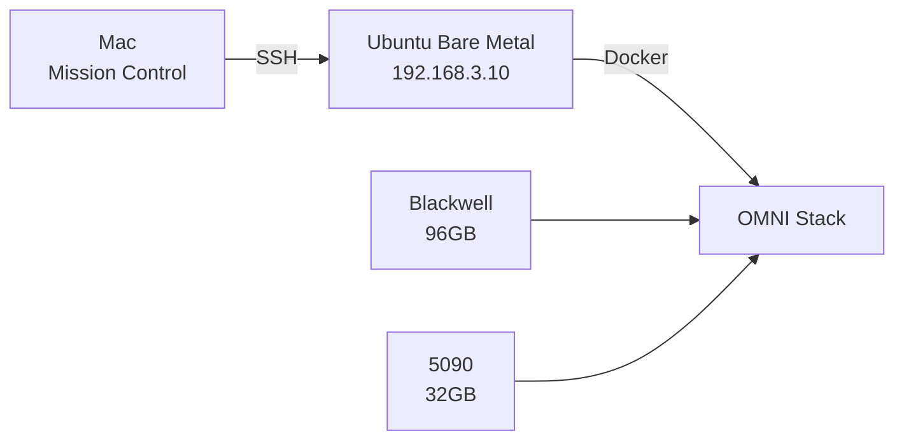

# Protocol OMNI (v16.3.5)

> **Last Updated**: 2026-01-26 | **Phase**: 4.5 Complete | **Status**: Lazarus PHASE 3 PARTIAL - kt-kernel works, balance_serve blocked

This is a **routing document**. Details live in `docs/`. Use The Map below.

---

## Status

| Item | Value |
|------|-------|
| **Phase** | 4.5 In Progress |
| **Version** | v16.3.6 |
| **Active Op** | Lazarus Phase 3 - **PARTIAL** (kt-kernel + SGLang OK, balance_serve blocked) |
| **Blocker** | 🛑 `sched_ext` requires balance_serve C++20 build (complex, deferred) |
| **Next Step** | Use llama.cpp for DeepSeek-R1 inference (proven working) |
| **Model Ready** | DeepSeek-R1 Q4_K_M (377GB, 9 chunks) at `/nvme/models/deepseek-r1/` |
| **Container** | `omni/ktransformers-lazarus:phase3` (48.3GB) - kt-kernel 0.5.1 + SGLang |

---

## Critical Directives (Concrete Bunker, No-Go Zones)

| Directive | Why | Reference |
|-----------|-----|-----------|
| **Concrete Bunker** | Use llama.cpp. KTransformers = VIABLE (sm_120 verified, PyTorch 2.11+). vLLM blocked. SGLang = re-evaluate. | [Lessons Learned](docs/architecture/lessons-learned.md) |
| **NPS1 BIOS** | Unified NUMA required for 671B inference (2.1x speedup). | [Tech Stack](docs/architecture/tech_stack.md) |
| **Bare Metal Build** | Docker VMM disabled = 300% perf regression. Build on host. | [Lessons Learned](docs/architecture/lessons-learned.md#f-003) |
| **MCP Proxy** | All tool calls via `:8070` (Default Deny policy). | [Security](docs/security/overview.md) |
| **5-Minute Rule** | 671B model timeout = 300s. Don't reduce. | [Troubleshooting](docs/operations/troubleshooting.md) |
| **Sync `httpx`** | Use sync `httpx.Client` for llama.cpp (AsyncClient causes 400s). | [Lessons Learned](docs/architecture/lessons-learned.md#f-007) |

---

## The Map (Context Index)

### When to Read Which Document

| Trigger | Document | Contains |
|---------|----------|----------|
| **Before architectural changes** | [Lessons Learned](docs/architecture/lessons-learned.md) | Failed paths, anti-patterns, what NOT to do |
| **Before suggesting alt inference engines** | [Lessons Learned](docs/architecture/lessons-learned.md) | KTransformers, vLLM, SGLang, ik_llama failures |
| **Hardware specs / versions needed** | [Tech Stack](docs/architecture/tech_stack.md) | GPU UUIDs, BIOS settings, driver versions |
| **Service ports / health checks** | [Commands](docs/operations/commands.md) | Port mappings, curl commands |
| **Container issues** | [Troubleshooting](docs/operations/troubleshooting.md) | Common fixes, restart procedures |
| **Roadmap / priorities** | [Phase 4.5 Roadmap](docs/roadmap_phase_4_5.md) | Phase status, P1-P4 tasks |
| **Adding new code** | [Development Setup](docs/development/setup.md) | Rebuild commands, OTEL instrumentation |
| **MCP tool permissions** | [Security Overview](docs/security/overview.md) | Allowlist, rate limits, denied tools |
| **GPU isolation / zones** | [Zone Security](docs/architecture/zone-security.md) | Zone A/B split, Blackwell reset bug |
| **Memory architecture** | [Memory Systems](docs/architecture/memory-systems.md) | Mem0, Qdrant, Memgraph config |

### Key Files Index

| File | Usage Trigger | Purpose |
|------|---------------|---------|
| `docker/omni-stack.yaml` | [READ FOR INFRA] | Service definitions, port mappings, volumes |
| `src/agent/` | [READ FOR ORCHESTRATION] | LangGraph orchestration, nodes, routing |
| `docs/architecture/tech_stack.md` | [READ FOR VERSIONS] | Driver versions, stack choices, hardware specs |
| `src/agent/graph.py` | [READ FOR ROUTING] | LangGraph DAG, node connections |
| `src/agent/nodes/` | [READ FOR COGNITION] | Classification, inference, memory, status logic |
| `src/agent/tools/status.py` | [READ FOR INTROSPECTION] | Sovereign status tool (GPU/Mem0 metrics) |
| `src/mcp_proxy/gateway.py` | [READ FOR SECURITY] | MCP Default Deny gateway |
| `config/mcp-allowlist.yaml` | [READ FOR PERMISSIONS] | Tool rate limits, audit settings |
| `scripts/benchmark_dragrace.py` | [READ FOR PERF] | Benchmark procedure |
| `scripts/build-metal-container.sh` | [READ FOR BUILD] | Bare metal to Docker packaging |

### Key Directories

| Path | Contents |
|------|----------|
| `/nvme/models/` | Model weights (DeepSeek-V3.2, Qwen2.5-Coder-7B) |
| `~/Protocol_Omni/docker/` | Docker Compose stacks |
| `~/Protocol_Omni/src/` | Python source |
| `~/Protocol_Omni/config/` | Stack configuration |

---

## Quick Reference

### Credentials

| Target | User | Details |
|--------|------|---------|
| Host | `omni@192.168.3.10` | Pass: `135610aa` |
| BMC | `admin@192.168.3.202` | Pass: `Aa135610` |

### Core Services

| Service | Port | Role |
|---------|------|------|
| DeepSeek-V3.2 | 8000 | Oracle (Complex tasks) |
| Qwen Executor | 8002 | CPU Executor (Routine tasks) |
| MCP Proxy | 8070 | Security Gateway |
| Agent Orchestrator | 8080 | Cognitive Router |
| Arize Phoenix | 6006 | OTEL Traces |
| Prometheus | 9090 | Metrics |
| Grafana | 3000 | Dashboards |

### MCP Tools

| Tool | Use Case |
|------|----------|
| `ssh omni@192.168.3.10` | **PRIMARY** - Native SSH (YOLO mode enabled, all patterns pass) |
| `mcp_ssh-mcp` | Fallback - Remote execution (when YOLO mode not enabled) |
| `mcp_github` | GitHub operations |
| `mcp_serena` | Code navigation |
| `mcp_redfish` | BMC access |
| `mcp_context7` | Library docs |
| `mcp_agent-browser` | Browser automation |

---

## System Overview



---

## Mandate

1. **Surgical Precision**: Use container APIs over host reboots.
2. **Memory First**: Query `brv` before acting. Curate discoveries after.
3. **MCP Security**: All tool invocations via `:8070` proxy.
4. **Verification**: Never assume containers are up; check with `docker compose ps`.
5. **Read Before Suggest**: Check [Lessons Learned](docs/architecture/lessons-learned.md) before proposing infrastructure changes.

---

## Post-Session Protocol (MANDATORY)

Before declaring "done" or asking "what's next?":

```bash
# 1. Curate state to ByteRover
brv curate "<What changed>" --files <path>

# 2. Update AGENTS.md Status section if needed (manual)

# 3. Use summarizing-project-state skill if context is heavy
```

**Output when syncing**: `Architecting Memory... [Syncing ByteRover]`

---

*This is a routing document. Details live in `docs/`. Credentials are intentional for AI agent access.*
