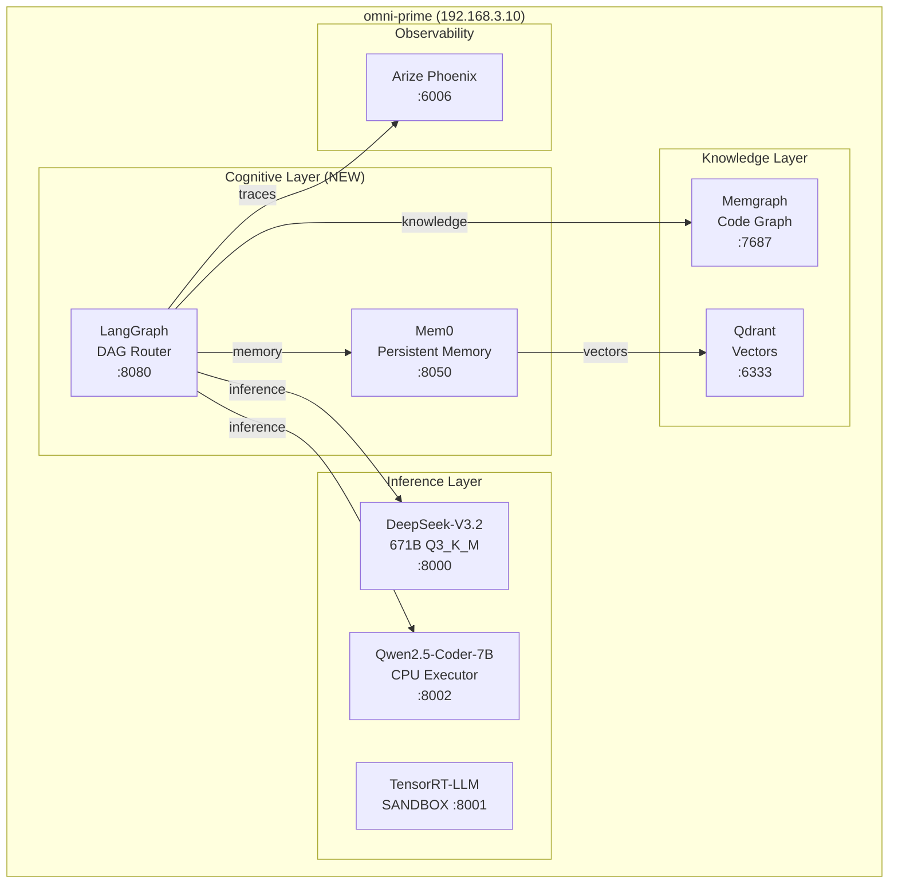

# Protocol OMNI v16.2.2: SOVEREIGN COGNITION

Self-evolving AI infrastructure on bare metal Blackwell silicon.

[](LICENSE)

## Overview

Protocol OMNI v16.2.2 is a self-hosted AI inference stack running on Ubuntu 24.04 with dual NVIDIA Blackwell GPUs (96GB + 32GB). Following the **Concrete Bunker Doctrine**, it uses llama.cpp with explicit sm_120 compilation for maximum stability.

**v16.2.2 (Phase 4)**: LangGraph cognitive workflow, Mem0 persistent memory, Memgraph code knowledge graph, TensorRT-LLM sandbox.



## Quick Start

```bash
# SSH to host
ssh omni@192.168.3.10

# Start the stack
cd /nvme/src/docker
GRAFANA_ADMIN_PASSWORD=admin123 docker compose -f omni-stack.yaml up -d

# Verify services (wait 5-10 min for model load)
curl http://localhost:8000/health   # DeepSeek Oracle
curl http://localhost:8070/health   # MCP Security Proxy
curl http://localhost:8080/health   # Agent Orchestrator
```

## Hardware

| Component | Specification |
|-----------|---------------|
| **CPU** | AMD Threadripper PRO 9995WX (96 cores, 192 threads, AVX-512) |
| **RAM** | 384GB DDR5-6400 ECC (NPS=1 Unified NUMA) |
| **GPU 0** | NVIDIA RTX PRO 6000 Blackwell (96GB, SM 12.0) |
| **GPU 1** | NVIDIA RTX 5090 (32GB, SM 12.0) |
| **Storage** | 2× 4TB NVMe Gen5 |
| **Network** | Ubuntu 24.04 @ 192.168.3.10 |

## Services

| Service | Port | Purpose | Throughput |
|---------|------|---------|------------|
| DeepSeek-V3.2 | 8000 | Oracle (671B Q3_K_M) | 10.9 tok/s |
| Qwen-Executor | 8002 | Fast Executor (CPU-only) | 16.39 tok/s |
| **TensorRT-LLM** | 8001 | **Sandbox** (NVFP4) | TBD |
| LangGraph | 8080 | DAG Cognitive Router | — |
| **Mem0** | 8050 | **Persistent Memory** | — |
| MCP Proxy | 8070 | Security Gateway (Default Deny) | — |
| Arize Phoenix | 6006 | AI Observability (OTEL) | — |
| Metacognition | 8011 | 4-gate verification | — |
| GEPA Engine | 8010 | Prompt evolution | — |
| Qdrant | 6333 | Vector store | — |
| Memgraph | 7687 | Code knowledge graph | — |
| Prometheus | 9090 | Metrics | — |
| Grafana | 3000 | Dashboards | — |

## VRAM Allocation

| GPU | Allocated | Total | Utilization |
|-----|-----------|-------|-------------|
| RTX PRO 6000 Blackwell | 91 GB | 98 GB | 93% |
| RTX 5090 | 26 GB | 33 GB | 81% |

> **Note**: DeepSeek-V3.2 uses all GPU VRAM. The Qwen executor runs CPU-only using the Threadripper's 192 threads.

## Project Structure

```
Protocol_Omni/
├── README.md              # This file
├── AGENTS.md              # AI agent operational doctrine
├── docker/                # Docker Compose stacks
│   ├── omni-stack.yaml    # Master compose file
│   ├── Dockerfile.blackwell  # sm_120 inference image
│   └── Dockerfile.trt-sandbox # TensorRT-LLM sandbox
├── src/                   # Python modules
│   ├── agent/             # LangGraph cognitive workflow
│   │   ├── graph.py       # DAG workflow definition
│   │   └── nodes/         # Node implementations
│   ├── memory/            # Mem0 integration
│   ├── knowledge/         # Memgraph client
│   └── mcp_proxy/         # Security gateway
├── scripts/               # Utilities
│   ├── index_code.py      # AST → Memgraph indexer
│   └── memgraph-schema.cypher
├── docs/                  # Documentation
└── config/                # Configuration files
```

## Documentation

| Category | Document | Description |
|----------|----------|-------------|
| **Start Here** | [Quickstart](docs/deployment/quickstart.md) | Get running in 10 minutes |
| **Architecture** | [Overview](docs/architecture/overview.md) | System design |
| **Doctrine** | [Concrete Bunker](docs/architecture/concrete-bunker-doctrine.md) | Why llama.cpp, not KTransformers |
| **Deployment** | [Production Guide](docs/deployment/production-v15.md) | Full installation |
| **Operations** | [Commands](docs/operations/commands.md) | CLI reference |
| **Monitoring** | [Observability](docs/operations/monitoring.md) | Prometheus, Phoenix, Grafana |
| **Troubleshooting** | [Issues](docs/operations/troubleshooting.md) | Common problems |
| **API** | [Reference](docs/api/README.md) | OpenAI-compatible API |
| **Security** | [MCP Proxy](docs/security/overview.md) | Default Deny gateway |
| **Roadmap** | [Phase 4: Sovereign Cognition](docs/architecture/phase4-sovereign-cognition.md) | LangGraph + Mem0 + Memgraph |

## Roadmap

| Phase | Status | Description |
|-------|--------|-------------|
| Phase 1-3 | **COMPLETED** | Bare metal, llama.cpp, Phoenix observability |
| Phase 4 | **IMPLEMENTED** | LangGraph workflow, Mem0 memory, Memgraph knowledge, TensorRT-LLM sandbox |

## IDE Configuration

```
API Base: http://192.168.3.10:8000/v1
API Key:  sk-local
Model:    deepseek-v3.2
```

## Development

```bash
pip install -e ".[dev]"
pytest
ruff check src/
mypy src/
```

## License

MIT
