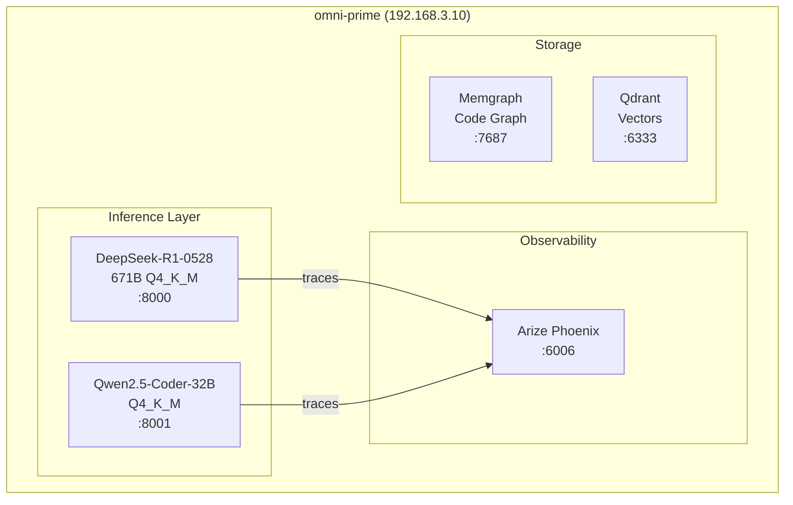

# Protocol OMNI v16.4.32: SOVEREIGN COGNITION

Self-evolving AI infrastructure on bare metal Blackwell silicon.

[](LICENSE)

## Overview

Protocol OMNI v16.4.32 is a self-hosted AI inference stack running on Ubuntu 24.04 with dual NVIDIA Blackwell GPUs (96GB + 32GB). Following the **Concrete Bunker Doctrine**, it uses llama.cpp with native SM120 compilation for maximum stability.

**v16.4.32 (Phase 6)**: Dual-GPU independent workloads, V3.2 MXFP4 migration in progress, repository optimized.



## Quick Start

```bash
# SSH to host
ssh omni@100.94.47.77  # Tailscale
# or ssh omni@192.168.3.10  # LAN

# Services run via systemd (auto-start on boot)
sudo systemctl status llama-deepseek   # DeepSeek-R1 @ :8000
sudo systemctl status llama-qwen-coder # Qwen-Coder @ :8001

# Health checks (host-only; use wget/python inside containers)
curl http://localhost:8000/health   # DeepSeek-R1
curl http://localhost:8001/health   # Qwen-Coder

# MCP Proxy (required for agent tool calls)
cd ~/Protocol_Omni/docker
docker compose -f omni-stack.yaml up -d mcp-proxy
curl http://localhost:8070/health

# GPU status
nvidia-smi --query-gpu=name,memory.used,memory.total --format=csv
```

## Hardware

| Component | Specification |
|-----------|---------------|
| **CPU** | AMD Threadripper PRO 9995WX (96 cores, 192 threads, AVX-512) |
| **RAM** | 384GB DDR5-6000 ECC (NPS=1, tREFI=65535) |
| **GPU 0** | NVIDIA RTX PRO 6000 Blackwell (96GB, SM 12.0, Gen 5 x16) |
| **GPU 1** | NVIDIA RTX 5090 (32GB, SM 12.0, Gen 4 x16) |
| **Storage** | 6TB NVMe Gen5 (2.2TB used, 3.8TB free) |
| **Network** | Ubuntu 24.04 @ 192.168.3.10 / Tailscale 100.94.47.77 |

## Services

| Service | Port | Model | Throughput |
|---------|------|-------|------------|
| **DeepSeek-R1** | 8000 | DeepSeek-R1-0528 Q4_K_M (671B) | **11.79 tok/s** |
| **Qwen-Coder** | 8001 | Qwen2.5-Coder-32B Q4_K_M | **48.9 tok/s** |
| MCP Proxy | 8070 | Security Gateway (Default Deny) | — |
| Arize Phoenix | 6006 | AI Observability (OTEL) | — |
| Qdrant | 6333 | Vector store | — |
| Memgraph | 7687 | Code knowledge graph | — |
| Prometheus | 9090 | Metrics | — |
| Grafana | 3000 | Dashboards | — |

## VRAM Allocation

| GPU | Model | Allocated | Total |
|-----|-------|-----------|-------|
| RTX PRO 6000 | DeepSeek-R1-0528 | 80 GB | 96 GB |
| RTX 5090 | Qwen2.5-Coder-32B | 13 GB | 32 GB |

> **Architecture**: Independent workloads per GPU (NOT tensor-split). PCIe overhead makes tensor-split slower for asymmetric VRAM.

## Project Structure

```
Protocol_Omni/
├── README.md              # This file
├── AGENTS.md              # AI agent operational doctrine (routing document)
├── skills/                # Agent capability library (TDD, Debugging, Planning)
│   ├── systematic-debugging/SKILL.md
│   ├── sentinel-doc-sync/SKILL.md
│   └── test-driven-development/SKILL.md
├── docker/                # Docker Compose stacks
│   └── omni-stack.yaml    # Support services (Phoenix, Qdrant, Memgraph)
├── docs/                  # Documentation
│   ├── architecture/      # Tech stack, lessons learned
│   ├── adr/               # Architecture Decision Records
│   ├── operations/        # Runbooks (RAM tuning, GPU OC)
│   └── research/          # Deep research docs
├── benchmarks/            # Performance baselines
└── tools/                 # Utilities (BIOS analysis)
```

## Documentation

| Category | Document | Description |
|----------|----------|-------------|
| **Start Here** | [AGENTS.md](AGENTS.md) | Operational routing document |
| **Lessons** | [Lessons Learned](docs/architecture/lessons-learned.md) | Topic-organized failures & fixes |
| **ADRs** | [Architecture Decisions](docs/adr/) | Strategic pivots (llama.cpp, Docker Compose) |
| **Operations** | [RAM Tuning](docs/operations/2026-01-30-memory-bandwidth-optimization-6400mhz.md) | DDR5-6400 guide |
| **Research** | [Multi-GPU](docs/research/2026-01-31-dual-gpu-optimization-deep-research.md) | Dual-GPU strategy analysis |

## Key Lessons

| Topic | Lesson |
|-------|--------|
| **GPU OC** | Core OC = 0% gain (memory-bound). Memory +3000 MHz stable. |
| **PCIe** | setpci link retrain fixes speed. VBIOS flash = brick. |
| **Multi-GPU** | Independent workloads > tensor split for asymmetric VRAM |
| **Inference** | llama.cpp only. SGLang/vLLM blocked. |

See [Lessons Learned](docs/architecture/lessons-learned.md) for full details.

## Roadmap

### In Progress

| Task | Status | Details |
|------|--------|---------|
| **DeepSeek V3.2 MXFP4** | ▶️ Downloading | 387GB MXFP4 GGUF → `/nvme/models/` |
| **benchmark-sweep.sh** | ✅ Code complete | GPU parameter sweep tool |

### Planned (P1 - High Priority)

| Task | Target | Issue |
|------|--------|-------|
| V3.2 MXFP4 deployment | 2-3x speedup (Blackwell native MXFP4) | — |
| RAM 6400 MT/s upgrade | +25-35% memory bandwidth | [#8](https://github.com/Bjorgzz/Protocol_Omni/issues/8) |
| Speculative decoding | +25-60% tok/s (DeepSeek MTP) | [#4](https://github.com/Bjorgzz/Protocol_Omni/issues/4) |
| llama.cpp MXFP4 build | b7880+ with SM120 MXFP4 | [#9](https://github.com/Bjorgzz/Protocol_Omni/issues/9) |

### Planned (P2-P3 - Medium/Low Priority)

| Task | Priority | Issue |
|------|----------|-------|
| Mem0 Docker amd64 fix | P2 | [#1](https://github.com/Bjorgzz/Protocol_Omni/issues/1) |
| Linux kernel tunables (HugePages) | P2 | [#5](https://github.com/Bjorgzz/Protocol_Omni/issues/5) |
| Vision model integration | P3 | [#6](https://github.com/Bjorgzz/Protocol_Omni/issues/6) |
| KTransformers re-evaluation | P3 | [#7](https://github.com/Bjorgzz/Protocol_Omni/issues/7) |

### Blocked / Deferred

| Item | Reason | Status |
|------|--------|--------|
| **SGLang** | 642GB > 584GB addressable RAM | [#3](https://github.com/Bjorgzz/Protocol_Omni/issues/3) BLOCKED |
| **KTransformers** | ABI mismatch + sched_ext chain | [#2](https://github.com/Bjorgzz/Protocol_Omni/issues/2) DEFERRED |
| **vLLM** | SM120 (Blackwell) not supported | [#10](https://github.com/Bjorgzz/Protocol_Omni/issues/10) WATCHING |
| **Kimi K2.5 Vision** | llama.cpp #19127 vision blocked | [#11](https://github.com/Bjorgzz/Protocol_Omni/issues/11) WATCHING |

### Memory Layer

| Component | Status | Notes |
|-----------|--------|-------|
| **OpenMemory** | ✅ TESTED | `openmemory-py 1.3.2` — add/search/delete verified |
| Mem0 | ❌ BLOCKED | Docker image arm64 only (F-006) |

### Architecture Decisions

| ADR | Decision | Status |
|-----|----------|--------|
| [ADR-0001](docs/adr/0001-use-llamacpp-as-baseline.md) | llama.cpp over KTransformers | Accepted |
| [ADR-0002](docs/adr/0002-use-docker-compose.md) | Docker Compose over Kubernetes | Accepted |
| [ADR-0004](docs/adr/0004-use-phoenix-for-observability.md) | Arize Phoenix over Langfuse | Accepted |
| [ADR-0005](docs/adr/0005-use-gguf-weights-format.md) | GGUF over HF formats | Accepted |

> **Full tracking**: See [AGENTS.md](AGENTS.md) for operational details and [GitHub Issues](https://github.com/Bjorgzz/Protocol_Omni/issues) for all work items.

## IDE Configuration

```
API Base: http://192.168.3.10:8000/v1
API Key:  sk-local
Model:    deepseek-r1-0528
```

## License

MIT
