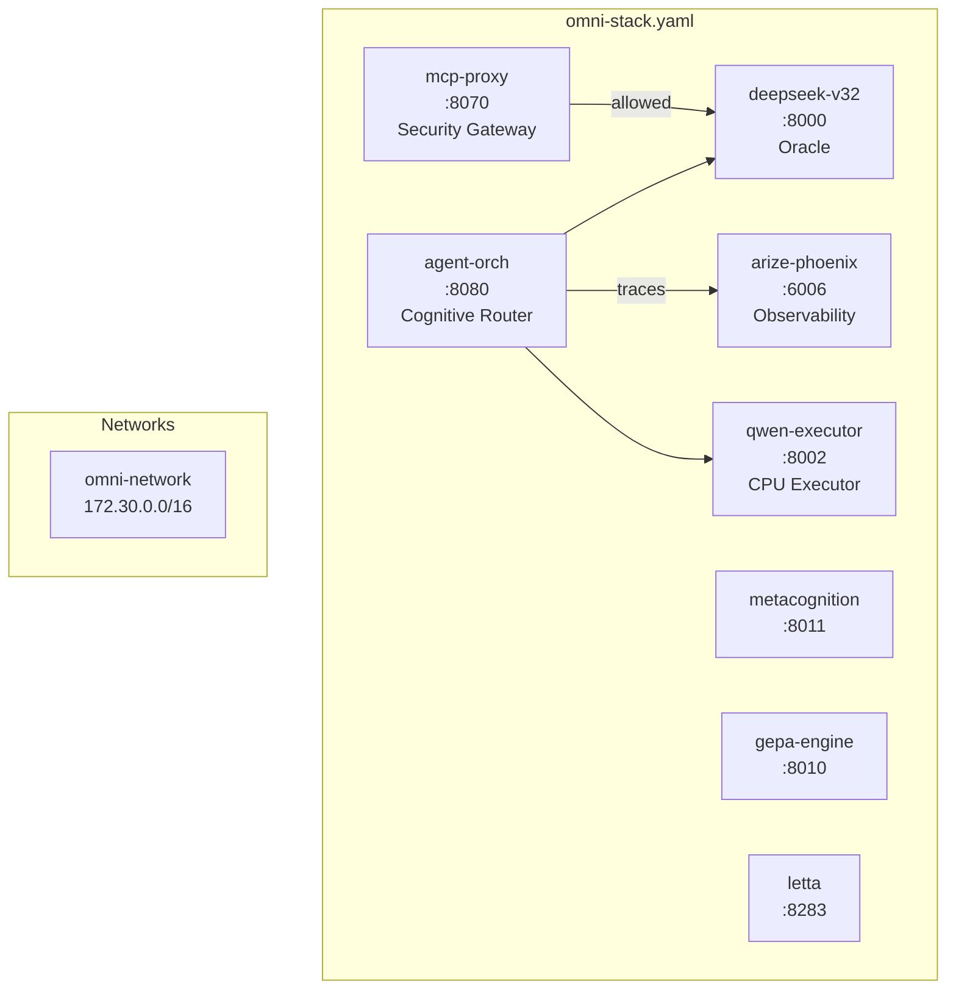

# Docker Compose Stacks

Docker Compose configurations for Protocol OMNI v15.2.

## Architecture



## VRAM Budget

| GPU | Model | Layers | VRAM Used | Utilization |
|-----|-------|--------|-----------|-------------|
| RTX PRO 6000 Blackwell | DeepSeek-V3.2 | 19 | 91 GB | 93% |
| RTX 5090 | DeepSeek-V3.2 | 19 | 26 GB | 81% |
| CPU (Threadripper) | Qwen2.5-Coder-7B | 0 | 6.4 GB RAM | — |

> **Note**: DeepSeek uses all GPU VRAM. Qwen executor runs CPU-only.

## Quick Start

```bash
# Start core stack (DeepSeek + services)
docker compose -f omni-stack.yaml up -d

# Add CPU executor
docker compose -f omni-stack.yaml --profile cpu-executor up -d

# View logs
docker compose -f omni-stack.yaml logs -f deepseek-v32

# Health check
curl http://localhost:8000/health
curl http://localhost:8002/health
```

## Services

### Inference

| Service | Port | Image | Mode | Throughput |
|---------|------|-------|------|------------|
| `deepseek-v32` | 8000 | `omni/llama-server:sm120-cuda13` | GPU (19 layers) | 10.75 tok/s |
| `qwen-executor` | 8002 | `omni/llama-server:sm120-cuda13` | CPU (192 threads) | 16.39 tok/s |

### Orchestration

| Service | Port | Image |
|---------|------|-------|
| `agent-orchestrator` | 8080 | `omni/agent:v15` |
| `mcp-proxy` | 8070 | `omni/mcp-proxy:v15` |
| `metacognition` | 8011 | `omni/metacognition:v15` |
| `gepa-engine` | 8010 | `omni/gepa:v15` |

### Memory

| Service | Port | Image |
|---------|------|-------|
| `letta` | 8283 | `letta/letta:latest` |
| `qdrant` | 6333 | `qdrant/qdrant:latest` |
| `memgraph` | 7687 | `memgraph/memgraph-mage:latest` |

### Observability

| Service | Port | Image |
|---------|------|-------|
| `arize-phoenix` | 6006 | `arizephoenix/phoenix:latest` |
| `prometheus` | 9090 | `prom/prometheus:latest` |
| `grafana` | 3000 | `grafana/grafana:latest` |
| `dcgm-exporter` | 9400 | `nvcr.io/nvidia/k8s/dcgm-exporter:latest` |
| `node-exporter` | 9100 | `prom/node-exporter:latest` |

## Profiles

| Profile | Services | Use Case |
|---------|----------|----------|
| (default) | deepseek-v32, metacognition, gepa, letta, memory, observability | Standard operation |
| `cpu-executor` | + qwen-executor | Enable fast CPU executor |
| `full` | + kimi-k2 | External API models (not recommended) |
| `emergency` | + minimax-failsafe | Failover mode only |

## Building Images

```bash
# Build Blackwell sm_120 inference image
docker build -f Dockerfile.blackwell -t omni/llama-server:sm120-cuda13 .

# Build metacognition
docker build -f ../src/metacognition/Dockerfile -t omni/metacognition:v14 ../src/metacognition

# Build GEPA
docker build -f ../src/gepa/Dockerfile -t omni/gepa:v14 ../src/gepa
```

## Volume Mounts

| Container Path | Host Path | Purpose |
|----------------|-----------|---------|
| `/models` | `/nvme/models` | Model weights (read-only) |
| `/prompts` | `/nvme/prompts` | System prompts (read-only) |
| `/config` | `/nvme/config` | Configuration files |
| `/state` | `/nvme/{service}` | Persistent state |

## Networks

| Network | Subnet | Outbound | Purpose |
|---------|--------|----------|---------|
| `omni-network` | 172.30.0.0/16 | ✅ Yes | Service communication |
| `internal_brain` | 172.31.0.0/16 | ❌ No | Oracle isolation |

## Commands

```bash
# Status
docker compose -f omni-stack.yaml ps

# Logs (follow)
docker compose -f omni-stack.yaml logs -f deepseek-v32

# Restart single service
docker compose -f omni-stack.yaml restart qwen-executor

# Rebuild with new image
docker compose -f omni-stack.yaml up -d --build metacognition

# Stop all
docker compose -f omni-stack.yaml down

# GPU monitoring
nvidia-smi -l 5
```

## Health Checks

```bash
curl http://localhost:8000/health  # DeepSeek-V3.2
curl http://localhost:8002/health  # Qwen Executor
curl http://localhost:8070/health  # MCP Proxy
curl http://localhost:8080/health  # Agent Orchestrator
curl http://localhost:6006/health  # Arize Phoenix
curl http://localhost:8011/health  # Metacognition
curl http://localhost:8010/health  # GEPA
curl http://localhost:8283/health  # Letta
curl http://localhost:6333/health  # Qdrant
```

## Troubleshooting

### CUDA Driver Mismatch

```bash
# Error: "system has unsupported display driver / cuda driver combination"
# Fix: Ensure LD_LIBRARY_PATH prioritizes host driver
docker exec deepseek-v32 ldd /opt/llama.cpp/build/bin/llama-server | grep cuda
# Should show: /usr/lib/x86_64-linux-gnu/libcuda.so.580.95.05
```

### VRAM OOM

```bash
# Error: "cudaMalloc failed: out of memory"
# Fix: Reduce GPU layers
# Current: --n-gpu-layers 19 (safe)
# Maximum tested: 20 (OOM on 5090)
```

### Model Load Time

DeepSeek-V3.2 takes 5-10 minutes to load 298GB from NVMe. Monitor with:

```bash
docker logs -f deepseek-v32
# Wait for: "server is listening on http://0.0.0.0:8000"
```

## Related

- [Dockerfile.blackwell](Dockerfile.blackwell) - sm_120 image build
- [Concrete Bunker Doctrine](../docs/architecture/concrete-bunker-doctrine.md) - Architecture rationale
- [Production Guide](../docs/deployment/production-v15.md) - Full deployment
