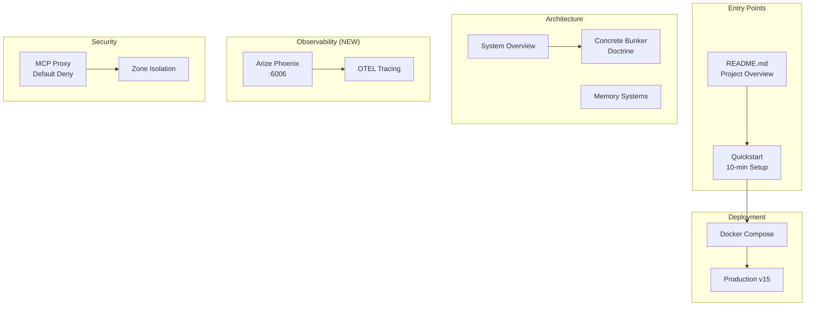
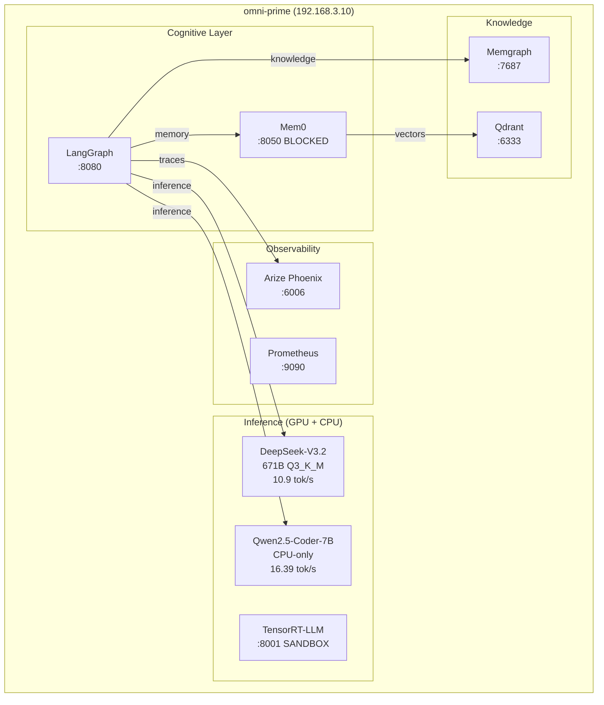
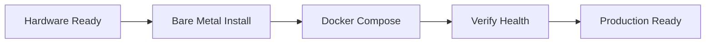

# Protocol OMNI Documentation

> **Version**: v16.2.2 NPS1 OPTIMIZED | **Last Updated**: 2026-01-24

Central navigation hub for Protocol OMNI technical documentation.

## What's New in v16.2.2

| Feature | Status | Description |
|---------|--------|-------------|
| **NPS1 Unified NUMA** | **MANDATORY** | 2.1x performance gain (10.9 tok/s) |
| Agent Orchestration | **LIVE** | Cognitive Trinity on :8000, :8002, :8080 |
| LangGraph Workflow | **LIVE** | DAG-based cognitive routing |
| Mem0 Integration | **BLOCKED** | No linux/amd64 image available |
| Memgraph Activation | **LIVE** | Code knowledge graph with AST indexer |
| TensorRT-LLM Sandbox | **SANDBOX** | NVFP4 inference testing on :8001 |
| 4-Gate Metacognition | **LIVE** | Hallucination, completeness, length, coherence |
| Braintrust | **REMOVED** | Replaced by Arize Phoenix |

### Previous (v15.2)

| Feature | Status | Description |
|---------|--------|-------------|
| MCP Security Proxy | **LIVE** | Default Deny gateway on :8070 |
| SSE Streaming | **LIVE** | Token-by-token response streaming |
| Arize Phoenix | **LIVE** | AI Observability on :6006 |
| OTEL Instrumentation | **LIVE** | Distributed tracing for all nodes |

## Quick Navigation



## By User Persona

| Persona | Start Here | Key Documents |
|---------|------------|---------------|
| **New User** | [Quickstart](deployment/quickstart.md) | Overview, Docker README |
| **DevOps/SRE** | [Production Guide](deployment/production-v15.md) | Commands, Troubleshooting |
| **AI Engineer** | [Concrete Bunker Doctrine](architecture/concrete-bunker-doctrine.md) | Architecture, Memory Systems |
| **Contributor** | [Development Setup](development/setup.md) | Contributing Guide |

---

## Architecture

System design and key decisions.

| Document | Description |
|----------|-------------|
| [Overview](architecture/overview.md) | Full system architecture, layers |
| [Concrete Bunker Doctrine](architecture/concrete-bunker-doctrine.md) | Why llama.cpp, not KTransformers |
| [KTransformers Evaluation](architecture/ktransformers-evaluation.md) | **ABANDONED**: KT evaluation (sm_120 issues) |
| [Phase 2 ik_llama Evaluation](architecture/phase2-ik-llama-evaluation.md) | **FAILED**: ik_llama.cpp vs llama.cpp |
| [Memory Systems](architecture/memory-systems.md) | Letta, Qdrant, Memgraph |
| [Zone Security](architecture/zone-security.md) | Zone A/B isolation model |
| [Phase 4: Sovereign Cognition](architecture/phase4-sovereign-cognition.md) | **IMPLEMENTED**: LangGraph + Mem0 + Memgraph |
| [Lessons Learned Registry](architecture/lessons-learned.md) | **CRITICAL**: Failures, pivots, anti-patterns for agents |

### Roadmap

| Phase | Status | Description |
|-------|--------|-------------|
| Phase 1: Bare Metal | **COMPLETED** | v13-v15.0 migration |
| Phase 2: ik_llama.cpp | **FAILED** | 40% regression, documented |
| Phase 3: Observability | **LIVE** | Arize Phoenix + OTEL |
| Phase 4: Sovereign Cognition | **IMPLEMENTED** | LangGraph + Mem0 + Memgraph |

### Current Architecture (v16.2.2)



---

## API Reference

| Document | Description |
|----------|-------------|
| [Inference API](api/README.md) | OpenAI-compatible endpoints |

### Quick API Reference

```bash
# Base URL
http://192.168.3.10:8000/v1

# Authentication
API Key: sk-local

# Models
- deepseek-v3.2 (Oracle, 671B)
- qwen-executor (Fast, 7B CPU)
```

---

## Deployment

| Document | Description |
|----------|-------------|
| [Quickstart](deployment/quickstart.md) | Get running in 10 minutes |
| [Production v15](deployment/production-v15.md) | Full production deployment |
| [k3s Production](deployment/k3s-production.md) | Kubernetes deployment |
| [Bare Metal](deployment/bare-metal.md) | Ubuntu 24.04 installation |

### Deployment Flow



---

## Operations

| Document | Description |
|----------|-------------|
| [Commands](operations/commands.md) | CLI reference |
| [Monitoring](operations/monitoring.md) | Prometheus, GPU metrics |
| [Troubleshooting](operations/troubleshooting.md) | Known issues |

### Essential Commands

```bash
# Check status
docker compose -f docker/omni-stack.yaml ps

# View logs
docker compose -f docker/omni-stack.yaml logs -f deepseek-v32

# Health check
curl http://localhost:8000/health

# GPU status
nvidia-smi
```

---

## Development

| Document | Description |
|----------|-------------|
| [Setup](development/setup.md) | Local development |
| [Contributing](../CONTRIBUTING.md) | Contribution guidelines |

```bash
pip install -e ".[dev]"
pytest
ruff check src/
```

---

## Component Documentation

| Component | README | Description |
|-----------|--------|-------------|
| **Docker** | [docker/README.md](../docker/README.md) | Compose stacks, Dockerfile.blackwell |
| **Source** | [src/README.md](../src/README.md) | Python modules |

---

## Archive

Legacy documentation moved to [`archive/historical-docs`](https://github.com/Bjorgzz/Protocol_Omni/tree/archive/historical-docs/docs/_archive) branch.

| Document | Notes |
|----------|-------|
| PROTOCOL_OMNI_V14.md | Superseded by v15.0 |
| OMNI_WORKFLOW_v9.md | Proxmox-based (obsolete) |
| ai-base-research-update.md | Historical research (6.4MB) |
| prometheus-stack-audit.md | Observability audit (3.3MB) |

---

## Quick Links

- **Health Check**: `curl http://192.168.3.10:8000/health`
- **GPU Status**: `ssh omni@192.168.3.10 nvidia-smi`
- **Logs**: `docker compose -f omni-stack.yaml logs -f deepseek-v32`
