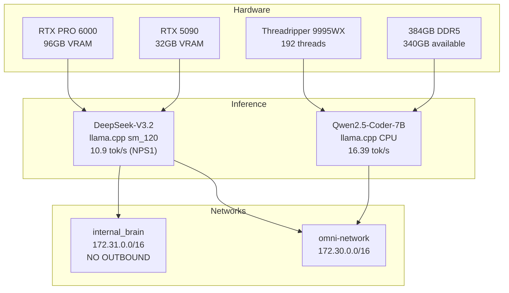

# Concrete Bunker Doctrine

> **Date**: 2026-01-22  
> **Status**: Active  
> **Supersedes**: Original KTransformers deployment plan

## Executive Summary

The **Concrete Bunker Doctrine** is Protocol OMNI's architectural pivot from the original KTransformers-based deployment to a simpler, more stable llama.cpp stack. This decision was made after KTransformers failed on Blackwell sm_120 silicon.

**Mantra**: *"Do not let Perfect kill Alive. It is a Ferrari that doesn't start."*

## Problem Statement

### Original Plan (Failed)

The original Protocol OMNI v15.0 design specified:

| Component | Role | Engine | Expected Throughput |
|-----------|------|--------|---------------------|
| DeepSeek-V3.2 | Oracle | KTransformers | 20+ tok/s |
| GLM-4.7 | Executor | KTransformers | 40+ tok/s |
| MiniMax M2.1 | Failsafe | vLLM | 50+ tok/s |
| Kimi K2 | Tool Heavy | API | — |

**What went wrong**:

1. **KTransformers sm_120 incompatibility**: The `approachingai/ktransformers:v0.4.3` image is compiled for sm_75/86/89. Blackwell GPUs require sm_120.
   ```
   RuntimeError: CUDA error: no kernel image is available for execution on device
   ```

2. **PyTorch kernel gap**: PyTorch's CUDA kernels in KTransformers lack sm_120 support.

3. **Disk space exhaustion**: The 21GB KTransformers image exceeded the 98GB root partition at 100% usage.

4. **DeepGEMM JIT failure**: GPU-based DeepGEMM JIT compilation crashes on sm_120.

### Failed Recovery Attempts

| Attempt | Outcome |
|---------|---------|
| Pull newer KTransformers image | Disk full |
| Build KTransformers from source | PyTorch lacks sm_120 |
| Use vLLM for DeepSeek | MoE model not supported |
| Use SGLang | Same sm_120 kernel gap |

## Solution: llama.cpp with sm_120

**Core insight**: llama.cpp compiles CUDA kernels from source. We can explicitly target sm_120.

### Implementation

```dockerfile
# docker/Dockerfile.blackwell
RUN cmake -B build \
    -DGGML_CUDA=ON \
    -DCMAKE_CUDA_ARCHITECTURES="120" \
    -DGGML_CUDA_FORCE_DMMV=ON \
    -DCMAKE_BUILD_TYPE=Release \
    && cmake --build build --config Release -j $(nproc)
```

### Verification

```bash
cuobjdump build/bin/libggml-cuda.so 2>&1 | grep "sm_120"
# Must show sm_120 kernels present
```

### Driver Compatibility Fix

The container's CUDA compat library conflicted with the host Blackwell driver:

```bash
# Before fix (BROKEN):
libcuda.so.1 => /usr/local/cuda-13.0/compat/libcuda.so.1

# After fix (WORKING):
libcuda.so.1 => /usr/lib/x86_64-linux-gnu/libcuda.so.580.95.05
```

**Solution**: Prepend host driver path:

```dockerfile
ENV LD_LIBRARY_PATH=/usr/lib/x86_64-linux-gnu:/usr/local/lib:/usr/local/cuda/lib64:$LD_LIBRARY_PATH
```

## New Architecture



### Stack Comparison

| Metric | Original Plan | Concrete Bunker |
|--------|---------------|-----------------|
| Oracle Engine | KTransformers | llama.cpp |
| Oracle Throughput | 20+ tok/s (target) | 10.9 tok/s (NPS1) |
| Executor Model | GLM-4.7 (GPU) | Qwen2.5-Coder-7B (CPU) |
| Executor Throughput | 40+ tok/s (target) | 16.39 tok/s (actual) |
| Total Models | 4 | 2 |
| VRAM Budget | 128GB shared | 117GB Oracle only |
| Stability | ❌ Broken | ✅ Stable |

## Three Directives

### 1. FILL THE VOID

**Problem**: 340GB RAM sitting unused while GPUs are maxed.

**Solution**: Deploy CPU-only executor using Threadripper's 192 AVX-512 threads.

**Implementation**:
```yaml
qwen-executor:
  environment:
    CUDA_VISIBLE_DEVICES: ""  # Disable GPU
  command:
    - --threads 192
    - --n-gpu-layers 0
    - --model /models/qwen2.5-coder-7b/Qwen2.5-Coder-7B-Instruct-Q4_K_M.gguf
```

**Benchmark**:
- Prompt eval: 172 tok/s
- Generation: 16.39 tok/s
- Memory: 6.4 GB

### 2. NETWORK ISOLATION

**Problem**: Oracle has no network isolation. Can make outbound calls directly.

**Solution**: Create internal network with `internal: true` (no internet access).

**Implementation**:
```yaml
networks:
  internal_brain:
    driver: bridge
    internal: true
    ipam:
      config:
        - subnet: 172.31.0.0/16

services:
  deepseek-v32:
    networks:
      - omni-network
      - internal_brain
```

**Effect**: DeepSeek can only communicate within Docker networks. No direct internet access.

### 3. WATCH THE GAP

**Problem**: 7GB VRAM headroom is thin. Long context (>8192 tokens) may cause OOM.

**Monitoring**:
```bash
nvidia-smi --query-gpu=memory.used,memory.total --format=csv -l 5
```

**Contingency**: If OOM occurs during long context:
1. Enable KV cache offloading to system RAM
2. Reduce `--ctx-size` from 8192 to 4096
3. Use CPU executor for long-context tasks

## Trade-offs Accepted

| Lost | Gained |
|------|--------|
| 20+ tok/s throughput | Stable inference |
| Speculative decoding | Reproducible builds |
| DeepGEMM optimizations | sm_120 native support |
| 4-model routing | Simplified 2-model stack |
| MoE expert offloading | Direct VRAM allocation |

## Commits

| Hash | Description |
|------|-------------|
| `fe9ebe2` | feat(blackwell): formalize sm_120 deployment + VRAM tuning |
| `1d95445` | fix(blackwell): address code review findings |
| `a419818` | feat(bunker): Concrete Bunker Doctrine - CPU executor + network isolation |

## Related Documents

- [Dockerfile.blackwell](../../docker/Dockerfile.blackwell) - Golden Image recipe
- [omni-stack.yaml](../../docker/omni-stack.yaml) - Service definitions
- [Architecture Overview](overview.md) - System design
