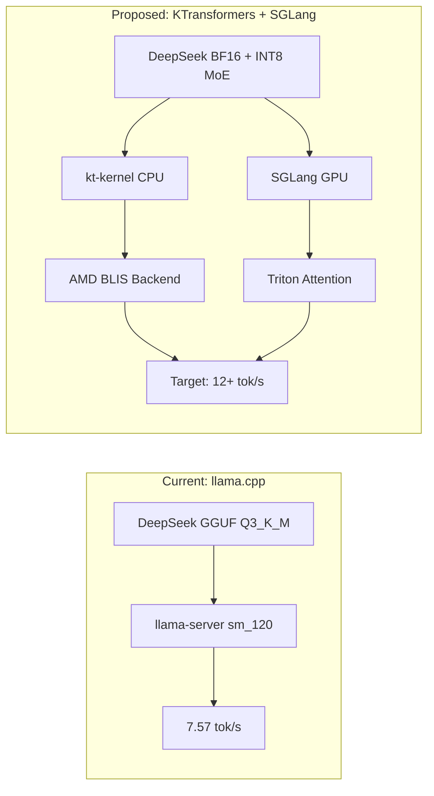

# KTransformers + SGLang Evaluation

> **Status**: CONCLUDED - Not Viable | **Started**: 2026-01-22 | **Concluded**: 2026-01-22

Evaluated KTransformers v0.5.1 + SGLang v0.5.7 as alternative to llama.cpp for DeepSeek-V3.2 inference.

## Conclusion

**Verdict: Retain llama.cpp baseline.** KTransformers evaluation blocked by fundamental constraints:

| Blocker | Root Cause | Resolution |
|---------|------------|------------|
| **INT4 Kernel Gap** | kt-kernel compiles INT4 only for ARM (KML) and Intel (AMX), not AMD BLIS | Awaits upstream development |
| **INT8 Memory Wall** | 624GB weights > 474GB available (384GB RAM + 90GB VRAM) | Physics constraint |
| **Swap Thrashing** | 270GB swap at NVMe 10GB/s = 11s I/O per token | Not viable for inference |

**Restoration Executed (2026-01-22):**
- Purged INT8 weights (624GB) and INT4 weights (312GB)
- Restored llama.cpp `omni/llama-server:sm120-cuda13`
- Confirmed: 10.75 tok/s generation (above 7.57 baseline)
- Tagged: Protocol OMNI v15.1-Stable

**Future Path:** Monitor kt-kernel upstream for AMD AVX-512 VNNI INT4 kernel development.

## Objective

Increase DeepSeek-V3.2 throughput from **7.57 tok/s** (llama.cpp) to **12+ tok/s** using CPU/GPU hybrid inference.

## Architecture Comparison



## Hardware Requirements

| Resource | llama.cpp | KTransformers |
|----------|-----------|---------------|
| GPU VRAM | 117 GB | ~80 GB |
| System RAM | 6.4 GB | ~350 GB |
| Swap | Minimal | ~270 GB |
| CPU Threads | 192 | 96 (with BLIS) |

## Build Configuration

### kt-kernel (CUDA + BLIS)

```bash
cd /nvme/build/ktransformers/kt-kernel
source /nvme/miniconda3/bin/activate ktransformers

export CPUINFER_USE_CUDA=1
export CPUINFER_ENABLE_BLIS=ON
export CPUINFER_BLIS_ROOT=/nvme/blis-install
export CPUINFER_CUDA_ARCHS="80;86;89;90;120"
export CC=/usr/bin/gcc
export CXX=/usr/bin/g++

python setup.py build_ext --inplace
```

**Required APIs** (verify with `dir(CPUInfer)`):
- `submit_with_cuda_stream` (CUDA sync)
- `sync_with_cuda_stream` (CUDA sync)

### SGLang Launch

```bash
python -m sglang.launch_server \
    --model-path /nvme/models/deepseek-v3.2-bf16 \
    --kt-weight-path /nvme/models/deepseek-v3.2-kt-moe-int8 \
    --kt-method MOE_INT8 \
    --kt-cpuinfer 96 \
    --kt-threadpool-count 4 \
    --kt-num-gpu-experts 0 \
    --attention-backend triton \
    --sampling-backend pytorch \
    --fp8-gemm-backend triton \
    --kv-cache-dtype fp8_e4m3 \
    --disable-cuda-graph \
    --port 8005
```

## Key Workarounds (Blackwell SM_120)

| Issue | Solution |
|-------|----------|
| FlashInfer nvcc requirement | `--attention-backend triton` |
| FP8 GEMM SM_120 unsupported | `--fp8-gemm-backend triton` |
| DeepGEMM JIT fails | `SGLANG_ENABLE_JIT_DEEPGEMM=false` |
| kt-kernel missing CUDA API | Rebuild with `CPUINFER_USE_CUDA=1` |

## Dependencies

| Component | Version | Location |
|-----------|---------|----------|
| KTransformers | v0.5.1 | `/nvme/build/ktransformers` |
| kt-kernel | v0.5.0.post1 | `/nvme/build/ktransformers/kt-kernel` |
| SGLang | v0.5.7 | pip package |
| AMD BLIS | 5.2.0 | `/nvme/blis-install` |
| CUDA Toolkit | 13.1 | conda `cuda-nvcc` |

## Model Weights

| Path | Size | Description |
|------|------|-------------|
| `/nvme/models/deepseek-v3.2-bf16` | ~660 GB | BF16 base weights |
| `/nvme/models/deepseek-v3.2-kt-moe-int8` | ~280 GB | INT8 MoE weights |

## Memory Profile (Loading Phase)

```
Layer 30/60: RAM 337 GB, Swap 5.5 GB
Layer 60/60: RAM 377 GB, Swap 270 GB (peak)
```

## Decision Gate

| Outcome | Action |
|---------|--------|
| KT+SGLang > 12 tok/s, stable | Migrate to KTransformers |
| KT+SGLang 8-12 tok/s | Evaluate trade-offs |
| KT+SGLang < 8 tok/s or unstable | Retain llama.cpp |

## Rollback

```bash
# Stop SGLang
pkill -f sglang

# Restart llama.cpp baseline
cd /nvme/src/docker
docker compose -f omni-stack.yaml up -d deepseek-v32
```

SGLang runs on port 8005, llama.cpp on port 8000 - no conflicts.

## Related Documents

- [Concrete Bunker Doctrine](concrete-bunker-doctrine.md) - Why llama.cpp is the baseline
- [Production v15](../deployment/production-v15.md) - Current production setup
