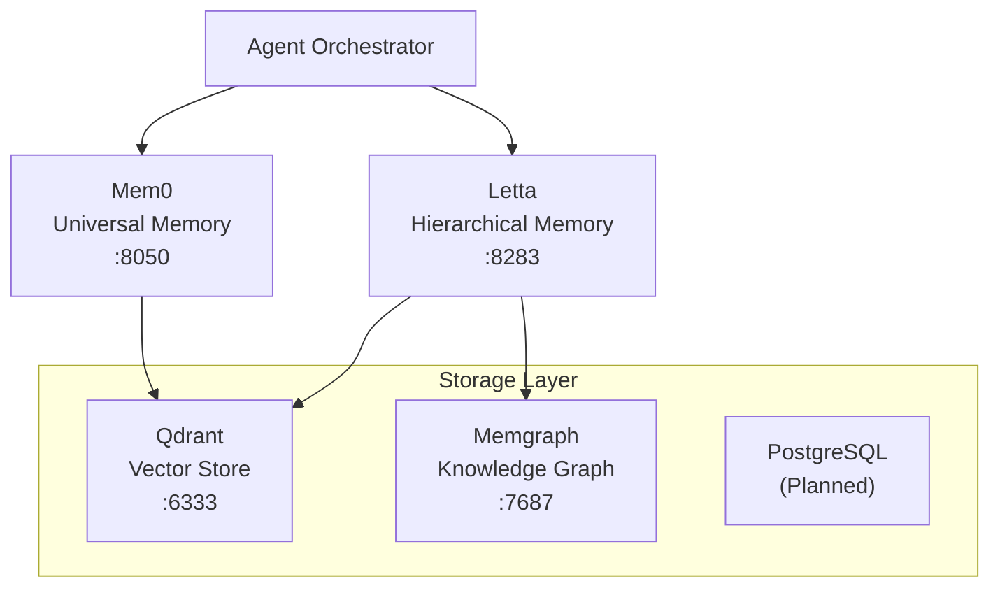
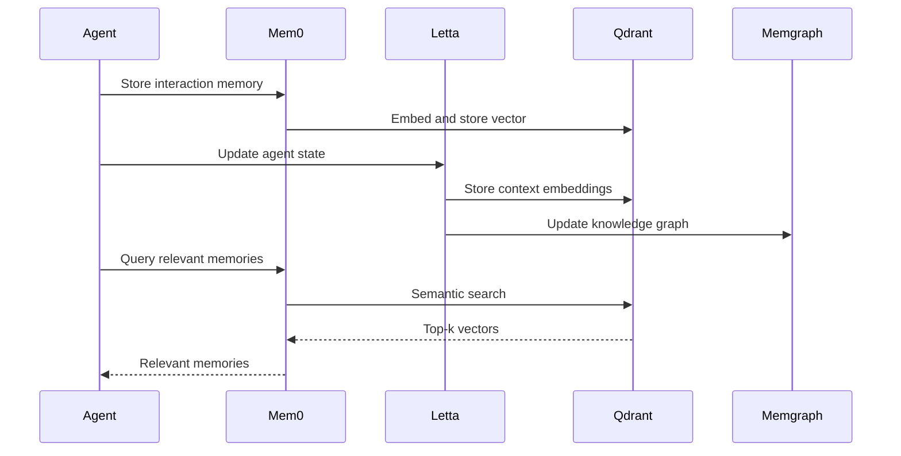

# Memory Systems Architecture

> Mem0 + Letta + Qdrant + Memgraph = Multi-layer memory

## Overview

Protocol OMNI v15.0 uses a multi-layer memory architecture optimized for different access patterns.



## Memory Stack

| Component | Port | Purpose | Latency |
|-----------|------|---------|---------|
| **Mem0** | 8050 | Universal memory layer | ~10ms |
| **Letta** | 8283 | Hierarchical self-improvement | ~50ms |
| **Qdrant** | 6333 | Vector embeddings | ~5ms |
| **Memgraph** | 7687 | Code knowledge graph | <5ms |

## Mem0: Universal Memory

Best LOCOMO benchmark performance for agent memory.

```bash
# Health check
curl http://localhost:8050/health

# Add memory
curl -X POST http://localhost:8050/v1/memories \
  -H "Content-Type: application/json" \
  -d '{"content": "User prefers Python over JavaScript", "user_id": "user-1"}'

# Retrieve memories
curl http://localhost:8050/v1/memories?user_id=user-1
```

## Letta: Hierarchical Memory

Agent framework with built-in self-improvement and persistent memory.

```bash
# Health check
curl http://localhost:8283/v1/agents

# Create agent
curl -X POST http://localhost:8283/v1/agents \
  -H "Content-Type: application/json" \
  -d '{"name": "coder", "system_prompt": "You are a helpful coding assistant"}'
```

**Self-Improvement**: Letta replaces the theoretical Darwin Gödel Machine with production-proven self-modification.

## Qdrant: Vector Store

Hybrid sparse+dense search with payload indexing.

```bash
# Health check
curl http://localhost:6333/health

# List collections
curl http://localhost:6333/collections

# Create collection
curl -X PUT http://localhost:6333/collections/code_snippets \
  -H "Content-Type: application/json" \
  -d '{"vectors": {"size": 1536, "distance": "Cosine"}}'
```

**Security Note**: Vector DB poisoning has 80% success rate. Use anomaly detection on embedding distributions.

## Memgraph: Knowledge Graph

In-memory graph database for code relationships.

```bash
# Access via mgconsole
docker exec -it memgraph mgconsole

# Example query
MATCH (f:Function)-[:CALLS]->(g:Function) RETURN f.name, g.name LIMIT 10;
```

## Data Flow



## Configuration

### Docker Compose

```yaml
services:
  mem0:
    image: mem0ai/mem0:latest
    ports:
      - "8050:8050"
    volumes:
      - /nvme/mem0:/data

  letta:
    image: letta/letta:latest
    ports:
      - "8283:8283"
    environment:
      - LETTA_LLM_ENDPOINT=http://192.168.3.10:8000/v1
    volumes:
      - /nvme/letta:/data

  qdrant:
    image: qdrant/qdrant:latest
    ports:
      - "6333:6333"
    volumes:
      - /nvme/qdrant:/qdrant/storage

  memgraph:
    image: memgraph/memgraph:latest
    ports:
      - "7687:7687"
    volumes:
      - /nvme/memgraph:/var/lib/memgraph
```

## Best Practices

### Memory Separation

| Memory Type | Store In | Example |
|-------------|----------|---------|
| User preferences | Mem0 | "Prefers dark mode" |
| Conversation context | Letta | Session state |
| Code embeddings | Qdrant | Function signatures |
| Code relationships | Memgraph | Call graphs |

### Security

- Never store API keys or secrets in memory systems
- Validate embeddings before storage (anomaly detection)
- Separate user input from retrieved context in prompts

## Related Documentation

- [Architecture Overview](overview.md) - Full system architecture
- [Zone Security](zone-security.md) - Security isolation
- [Troubleshooting](../operations/troubleshooting.md) - Common issues
