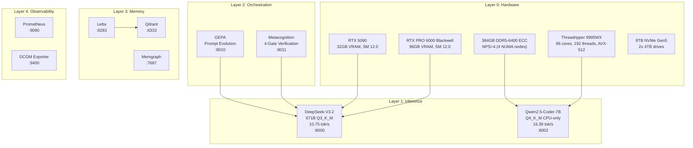
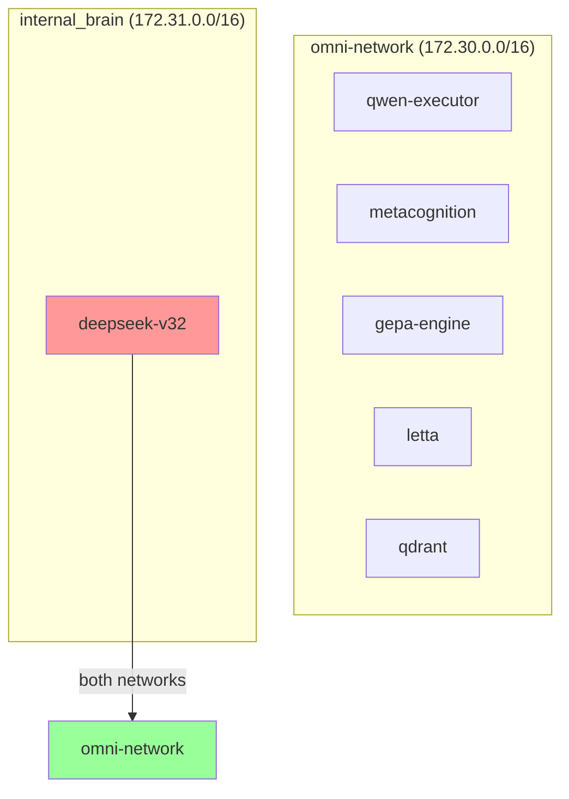

# Protocol OMNI v15.2 Architecture

> Self-evolving AI infrastructure on bare metal Blackwell silicon

## System Overview



## Hardware Specifications

| Component | Specification | Notes |
|-----------|---------------|-------|
| **CPU** | AMD Threadripper PRO 9995WX | 96 cores, 192 threads, Zen5, AVX-512 |
| **RAM** | 384GB DDR5-6400 ECC | NPS=4 (4 NUMA nodes × 96GB) |
| **GPU 0** | RTX PRO 6000 Blackwell | 96GB VRAM, SM 12.0 |
| **GPU 1** | RTX 5090 | 32GB VRAM, SM 12.0 |
| **Storage** | 2× 4TB NVMe Gen5 | Crucial + WD_BLACK |
| **Network** | Ubuntu 24.04 @ 192.168.3.10 | Bare metal |

## Model Configuration

### DeepSeek-V3.2 (Oracle)

| Parameter | Value | Rationale |
|-----------|-------|-----------|
| Quantization | Q3_K_M | Balance of quality vs memory |
| GPU Layers | 19 | 93% Blackwell, 81% 5090 utilization |
| Context Size | 8192 | Leaves 7GB VRAM headroom |
| Tensor Split | 75,25 | Proportional to VRAM ratio |

### Qwen2.5-Coder-7B (Executor)

| Parameter | Value | Rationale |
|-----------|-------|-----------|
| Quantization | Q4_K_M | Better quality for code tasks |
| GPU Layers | 0 | CPU-only, all VRAM for Oracle |
| Threads | 192 | Full Threadripper utilization |
| Context Size | 16384 | Larger context for code |

## Model Routing

```
Request Type → Model Selection
─────────────────────────────────────
COMPLEX (architecture, multi-step)  → DeepSeek-V3.2 (:8000)
ROUTINE (coding, simple tasks)      → Qwen2.5-Coder-7B (:8002)

Failover: DeepSeek → Qwen → External API
```

## Network Architecture



| Network | Subnet | Internet Access | Purpose |
|---------|--------|-----------------|---------|
| `omni-network` | 172.30.0.0/16 | ✅ Yes | Service communication |
| `internal_brain` | 172.31.0.0/16 | ❌ No | Oracle isolation |

## Key Services

| Service | Port | Purpose | Engine |
|---------|------|---------|--------|
| DeepSeek-V3.2 | 8000 | Primary Oracle | llama.cpp sm_120 |
| Qwen Executor | 8002 | Fast Executor | llama.cpp CPU |
| Metacognition | 8011 | 4-gate verification | Python/FastAPI |
| GEPA | 8010 | Prompt evolution | Python/FastAPI |
| Letta | 8283 | Memory layer | letta/letta |
| Qdrant | 6333 | Vector store | qdrant/qdrant |
| Memgraph | 7687 | Knowledge graph | memgraph |
| Prometheus | 9090 | Metrics | prom/prometheus |

## SM 12.0 Constraints (Blackwell)

| Constraint | Solution |
|------------|----------|
| No pre-built sm_120 images | Custom `Dockerfile.blackwell` with `CMAKE_CUDA_ARCHITECTURES=120` |
| CUDA compat driver conflict | `LD_LIBRARY_PATH=/usr/lib/x86_64-linux-gnu:...` |
| KTransformers broken | Use llama.cpp (see [Concrete Bunker Doctrine](concrete-bunker-doctrine.md)) |

## NUMA Configuration

```bash
# Verify NPS=4 in BIOS
numactl -H
# Should show 4 nodes with ~96GB each
```

> **Warning**: Never use `--membind=0`. This limits RAM to 96GB (single NUMA node), causing OOM for 200GB+ payloads.

## Related Documentation

- [Concrete Bunker Doctrine](concrete-bunker-doctrine.md) - Why llama.cpp, not KTransformers
- [Memory Systems](memory-systems.md) - Letta, Qdrant, Memgraph integration
- [Phase 4: Sovereign Cognition](phase4-sovereign-cognition.md) - Mem0 + LangGraph upgrade
- [Docker README](../../docker/README.md) - Service configuration
