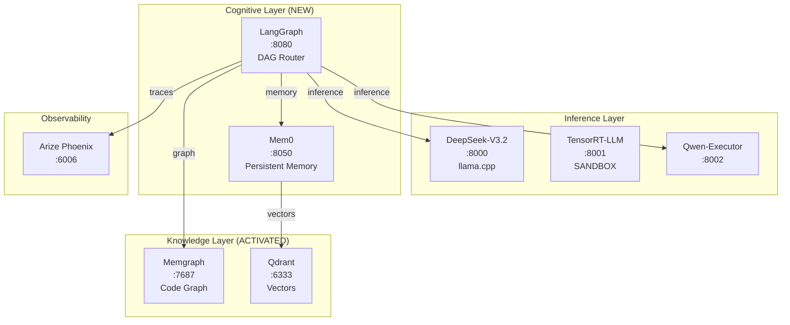
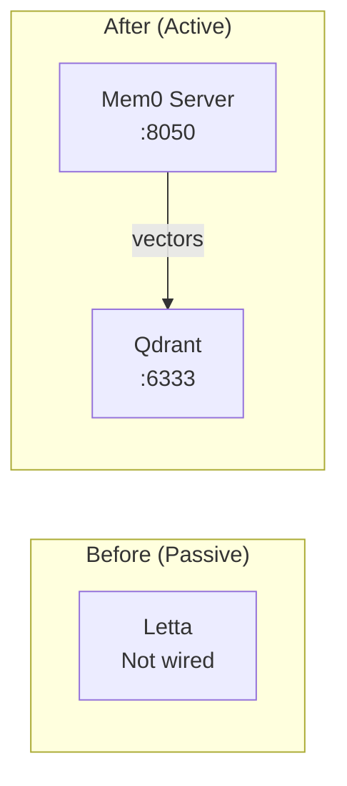
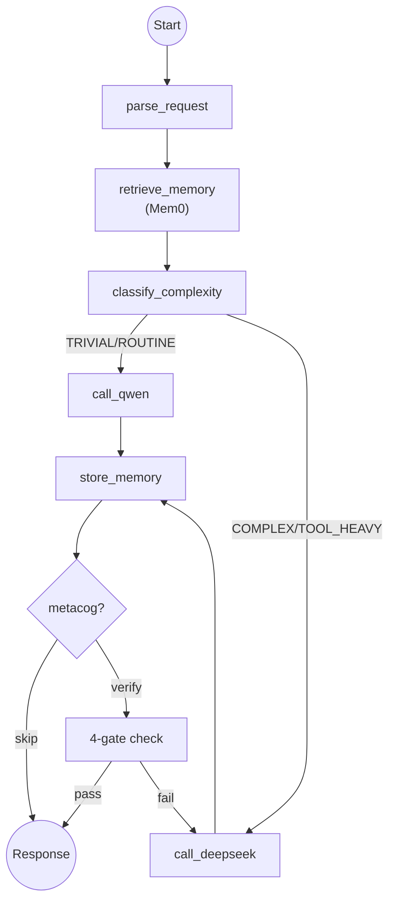
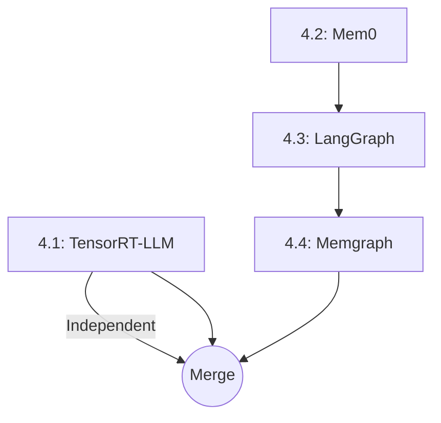

# Phase 4: SOVEREIGN COGNITION

> **Status**: IMPLEMENTED | **Version**: v16.0 | **Predecessor**: v15.2.2

Upgraded Protocol OMNI from passive infrastructure to active cognitive system with persistent memory, graph-based routing, and code knowledge graph.

## Architecture Vision



## Phase 4.1: TensorRT-LLM Sandbox

**Objective**: Test TensorRT-LLM with DeepSeek-V3.2-NVFP4 on consumer Blackwell (sm_120).

| Parameter | Current | Target |
|-----------|---------|--------|
| Engine | llama.cpp | TensorRT-LLM |
| Quantization | Q3_K_M | NVFP4 |
| Throughput | 10.75 tok/s | 20-30 tok/s |
| Risk | None | Moderate (sandbox) |

### Constraints

- sm_120 (consumer Blackwell) not officially tested by NVIDIA
- NVFP4 requires Blackwell-specific kernels
- Sandbox profile only - no production impact

### Go/No-Go Criteria

| Outcome | Action |
|---------|--------|
| ≥15 tok/s, stable | Promote to production on :8000 |
| <15 tok/s OR unstable | Document, keep llama.cpp |

## Phase 4.2: Mem0 Integration

**Objective**: Replace passive Letta with Mem0 for production-grade persistent memory.

### Why Mem0?

| Metric | Letta | Mem0 | Improvement |
|--------|-------|------|-------------|
| Accuracy | Baseline | +26% | Benchmark results |
| Latency | Baseline | -91% | Production-ready |
| API | Complex | Simple | REST + SDK |

### Architecture



### Integration Points

| Hook | Location | Purpose |
|------|----------|---------|
| Pre-inference | Before model call | Retrieve relevant memories |
| Post-inference | After response | Store interaction as memory |
| Scope | COMPLEX/TOOL_HEAVY only | Skip TRIVIAL tasks |

## Phase 4.3: LangGraph Migration

**Objective**: Migrate from custom `CognitiveRouter` to LangGraph for DAG-based control.

### Current vs Target

| Aspect | Custom Router | LangGraph |
|--------|---------------|-----------|
| Control Flow | If/else | Directed Graph |
| Observability | Manual OTEL | Native tracing |
| Conditional Logic | Hardcoded | Edge conditions |
| Retry/Fallback | Manual | Built-in |

### Graph Topology



### Node Implementations

| Node | File | Purpose |
|------|------|---------|
| `parse_request` | `nodes/parsing.py` | Validate input, create AgentRequest |
| `retrieve_memory` | `nodes/memory.py` | Mem0 lookup |
| `classify_complexity` | `nodes/classification.py` | Sovereign Vocabulary + heuristics |
| `call_model` | `nodes/inference.py` | HTTP client to llama.cpp |
| `store_memory` | `nodes/memory.py` | Mem0 persist |
| `metacog_verify` | `nodes/metacognition.py` | 4-gate verification |

## Phase 4.4: Memgraph Activation

**Objective**: Wire Memgraph into the cognitive loop for code context.

### Graph Schema

```cypher
// Node types
CREATE (:File {path: string, language: string})
CREATE (:Class {name: string, docstring: string})
CREATE (:Function {name: string, signature: string})
CREATE (:Import {module: string})

// Edge types
CREATE ()-[:CONTAINS]->()
CREATE ()-[:CALLS]->()
CREATE ()-[:IMPORTS]->()
CREATE ()-[:INHERITS]->()
```

### Query Examples

```cypher
// Find all callers of a function
MATCH (caller:Function)-[:CALLS]->(target:Function {name: $name})
RETURN caller.name, caller.signature

// Get file dependencies
MATCH (f:File)-[:IMPORTS]->(m:Import)
WHERE f.path = $path
RETURN m.module

// Trace class hierarchy
MATCH (child:Class)-[:INHERITS*]->(parent:Class)
WHERE child.name = $class
RETURN parent.name
```

### Integration

| Hook | Location | Query |
|------|----------|-------|
| Code-related prompts | Before inference | `find_references(symbol)` |
| TOOL_HEAVY tasks | Before inference | `get_dependencies(file)` |

## Execution Order



| Phase | Depends On | Parallelizable |
|-------|------------|----------------|
| 4.1 TensorRT-LLM | None | Yes |
| 4.2 Mem0 | None | Yes |
| 4.3 LangGraph | 4.2 | No |
| 4.4 Memgraph | 4.3 | No |

## New Services

| Service | Port | Image | Purpose |
|---------|------|-------|---------|
| Mem0 | 8050 | `mem0ai/mem0:latest` | Persistent memory |
| TensorRT-LLM | 8001 | `omni/trt-sandbox:sm120` | Inference sandbox |

## New Files

| File | Purpose |
|------|---------|
| `src/agent/graph.py` | LangGraph workflow |
| `src/agent/nodes/*.py` | Node implementations |
| `src/memory/mem0_client.py` | Mem0 API wrapper |
| `src/knowledge/memgraph_client.py` | Cypher query wrapper |
| `docker/Dockerfile.trt-sandbox` | TensorRT-LLM build |
| `scripts/index_code.py` | AST → Memgraph indexer |

## Risk Mitigation

| Risk | Mitigation |
|------|------------|
| TensorRT-LLM sm_120 fails | Sandbox profile, no production impact |
| Mem0 regression | Benchmark before deprecating Letta |
| LangGraph learning curve | Keep `router_legacy.py` for rollback |
| Memgraph OOM | 16GB limit configured |

## Related Documentation

- [Concrete Bunker Doctrine](concrete-bunker-doctrine.md) - Why llama.cpp
- [Memory Systems](memory-systems.md) - Letta, Qdrant, Memgraph
- [Overview](overview.md) - Current v15.2 architecture
