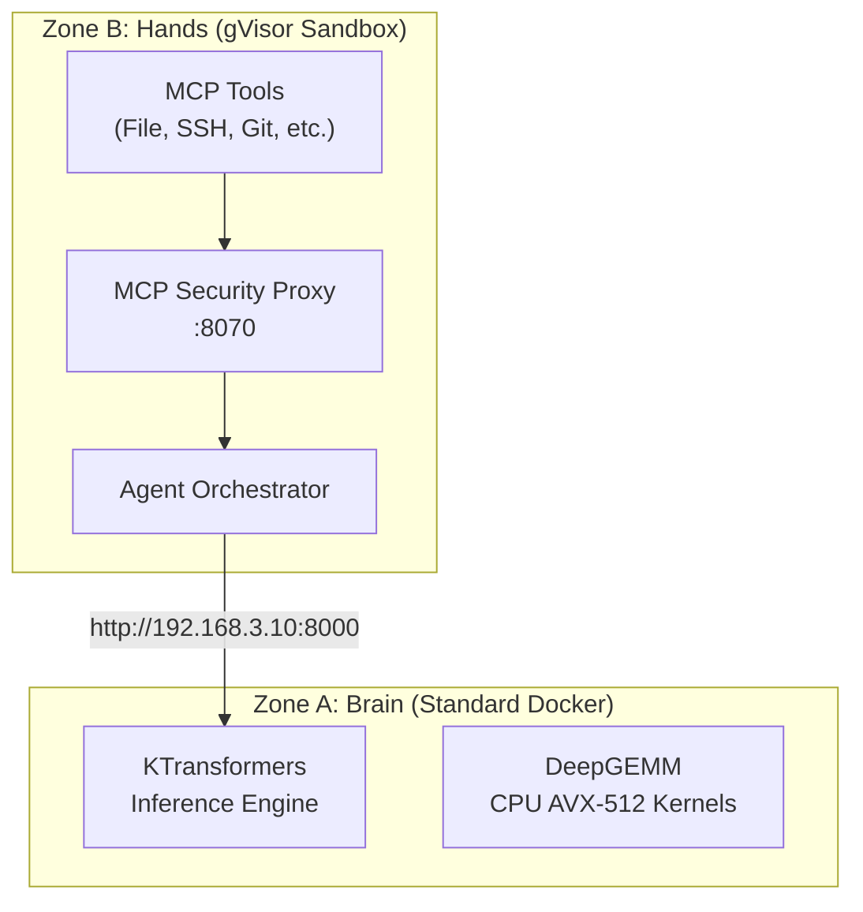

# Zone A/B Security Architecture

> v15.0 SOVEREIGN SPLIT: Balancing performance and security

## Overview

Protocol OMNI v15.0 implements a split-runtime architecture that separates performance-critical inference (raw metal) from security-critical agents (sandboxed).



## Zone Comparison

| Property | Zone A (Brain) | Zone B (Hands) |
|----------|----------------|----------------|
| **Runtime** | Standard Docker | gVisor (runsc) |
| **Network** | `hostNetwork: true` | CNI bridge |
| **Privileged** | Yes | No |
| **Components** | KTransformers, DeepGEMM | Agents, MCP Tools, Security Proxy |
| **Purpose** | Raw performance | Security isolation |

## Why Split Architecture?

### Zone A Needs Raw Metal

- **AVX-512**: CPU kernels require direct access to vector instructions
- **GPU DMA**: Direct memory access to NVIDIA devices
- **gVisor Overhead**: Syscall interception adds ~75% overhead to inference

### Zone B Needs Isolation

- **MCP Attack Surface**: 600+ MCP servers = large attack surface
- **Sandboxing**: If MCP tool is compromised, it's trapped in gVisor
- **Minimal Permissions**: No access to GPU, models, or host kernel

## Security Boundaries

A compromised agent in Zone B **cannot**:

- Access `/dev/nvidia*` devices
- Read `/nvme/models/` directory
- Execute arbitrary code on host kernel
- Communicate with Zone A except via validated HTTP API

## Network Configuration

### The Problem

Zone A (hostNetwork) and Zone B (gVisor CNI bridge) cannot communicate via `localhost`.

**Symptom**:
```
ConnectionRefusedError: [Errno 111] Connection refused to http://localhost:8000
```

**Root Cause**: Inside gVisor, `localhost` resolves to the container's loopback, not the host.

### The Solution

**Zone A** - Bind to all interfaces:
```bash
numactl --cpunodebind=0 --interleave=all \
python3 -m ktransformers.server.main \
  --host 0.0.0.0 \
  --port 8000
```

**Zone B** - Target host IP:
```yaml
env:
- name: INFERENCE_ENDPOINT
  value: "http://192.168.3.10:8000"  # NOT localhost
```

### Verification

```bash
# From Zone B container
kubectl exec -n agents agent-orchestrator -- curl http://192.168.3.10:8000/health
# Expected: 200 OK
```

## MCP Security (Q1 2026 Vulnerabilities)

### Attack Vectors

| Vector | Description | Mitigation |
|--------|-------------|------------|
| **Conversation Hijacking** | MCP Sampling injects persistent instructions | Zone B isolation |
| **Covert Tool Invocation** | Unauthorized file/network operations | Security proxy |
| **Vector DB Poisoning** | 80% success rate embedding malicious instructions | Anomaly detection |

### Required Mitigations

- [ ] MCP Security Proxy (:8070) with input validation in Zone B
- [ ] Allowlist approved MCP servers only
- [ ] Never embed API keys in system prompts
- [ ] Anomaly detection on embedding distributions
- [ ] Separate user input from retrieved context

## k3s Pod Configuration

### Zone A Pod

```yaml
apiVersion: v1
kind: Pod
metadata:
  name: inference-engine
  labels:
    zone: brain
spec:
  restartPolicy: OnFailure  # Prevent Blackwell reset loops
  hostNetwork: true
  
  containers:
  - name: ktransformers
    securityContext:
      privileged: true
    
    resources:
      limits:
        nvidia.com/gpu: 2  # Both GPUs
    
    env:
    - name: ENABLE_DEEPGEMM
      value: "1"
    - name: SGLANG_ENABLE_JIT_DEEPGEMM
      value: "0"
```

### Zone B Pod

```yaml
apiVersion: v1
kind: Pod
metadata:
  name: agent-orchestrator
  labels:
    zone: hands
spec:
  runtimeClassName: gvisor  # Sandboxed
  
  containers:
  - name: agent
    securityContext:
      privileged: false
      capabilities:
        drop: ["ALL"]
    
    env:
    - name: INFERENCE_ENDPOINT
      value: "http://192.168.3.10:8000"
```

## Blackwell Reset Bug Mitigation

Consumer Blackwell GPUs (SM 12.0) have a Function Level Reset (FLR) failure mode. After 2-3 container restart cycles, the GPU freezes the entire host.

### k3s Configuration

```yaml
restartPolicy: OnFailure  # NOT Always

startupProbe:
  initialDelaySeconds: 300  # 5 min for 281GB model load
  failureThreshold: 40      # 25 min total tolerance

livenessProbe:
  initialDelaySeconds: 600  # 10 min after startup
  failureThreshold: 10      # 10 min before restart
```

### Monitoring Alert

```yaml
- alert: BlackwellResetLoopRisk
  expr: increase(kube_pod_container_status_restarts_total{container="ktransformers"}[10m]) > 2
  annotations:
    action: "kubectl scale deployment inference-engine --replicas=0"
```

## Related Documentation

- [Architecture Overview](overview.md) - Full system architecture
- [Troubleshooting](../operations/troubleshooting.md) - Common issues
- [k3s Production](../deployment/k3s-production.md) - Production deployment
