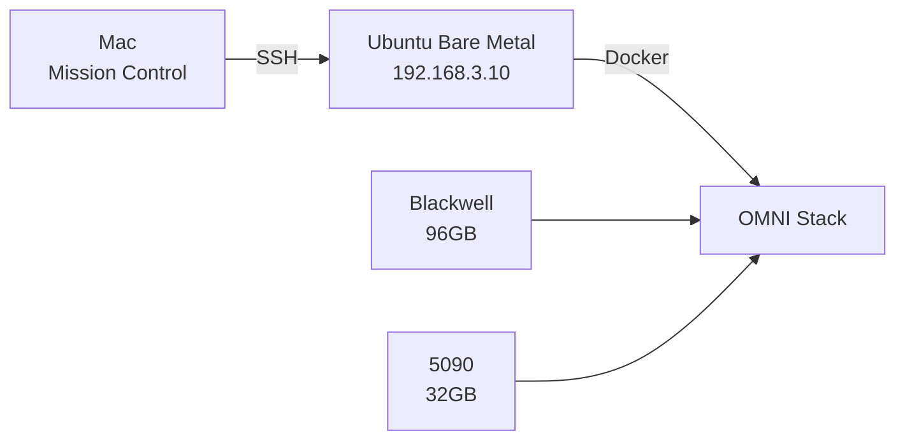

# Operation Defrag: AGENTS.md Refactor Implementation Plan

> **For Claude:** REQUIRED SUB-SKILL: Use superpowers:executing-plans to implement this plan task-by-task.

**Goal:** Transform AGENTS.md from a 1011-line monolith into a slim Context Index (~200 lines) with usage triggers, migrating details to dedicated docs.

**Architecture:** Extract detailed content to specialized docs, create a "When to Read" routing table in AGENTS.md that acts as a context index for AI agents.

**Tech Stack:** Markdown, existing docs structure

---

## Pre-Flight Assessment

### Current AGENTS.md Structure (1011 lines)

| Section | Lines | Verdict |
|---------|-------|---------|
| Agent Behavioral Protocols | 1-97 | **KEEP** (essential directives) |
| Quick Commands Reference | 99-118 | **MOVE** → `docs/operations/commands.md` |
| System Overview Mermaid | 120-131 | **KEEP** (high-level visual) |
| Cognitive Operating System | 134-237 | **SLIM** (keep MCP list, move details) |
| Hardware Reality | 240-308 | **MOVE** → `docs/architecture/tech_stack.md` |
| Infrastructure Map | 310-440 | **MOVE** details, keep ASCII diagram |
| Active Operations + Roadmap | 444-786 | **MOVE** → `docs/project_roadmap.md` |
| Zone Security + Blackwell Reset | 788-814 | **MOVE** → existing zone-security.md |
| Mandate | 818-832 | **KEEP** (core directives) |
| Reference Documentation | 835-878 | **ENHANCE** (add usage triggers) |
| Development Hints | 882-988 | **MOVE** → `docs/development/setup.md` |
| Post-Session Curation | 991-1011 | **KEEP** (essential) |

### Target AGENTS.md Structure (~200 lines)

```
# Protocol OMNI (v16.3.4)

## Status (5 lines)
## Primary Directives (20 lines)  
## The Map (Context Index) (100 lines)
## Quick Reference (30 lines)
## Post-Session Protocol (15 lines)
```

---

## Task 1: Create Tech Stack Document

**Files:**
- Create: `docs/architecture/tech_stack.md`

**Step 1: Create tech_stack.md with hardware and software specs**

Create file with content from AGENTS.md lines 240-308 (Hardware Reality) plus version tables from lines 363-411 (Stack Assessment).

**Step 2: Verify file structure**

Run: `head -30 docs/architecture/tech_stack.md`
Expected: Header with Hardware Reality section

**Step 3: Commit**

```bash
git add docs/architecture/tech_stack.md
git commit -m "docs: extract tech stack to dedicated document"
```

---

## Task 2: Update Project Roadmap Document

**Files:**
- Modify: `docs/roadmap_phase_4_5.md` (rename to `docs/project_roadmap.md`)
- Source: AGENTS.md lines 444-786 (Active Operations, Roadmap, v16.x Implementation details)

**Step 1: Rename roadmap file**

```bash
git mv docs/roadmap_phase_4_5.md docs/project_roadmap.md
```

**Step 2: Append implementation history from AGENTS.md**

Add v16.1-v16.3 implementation details, active background tasks, resumption commands.

**Step 3: Commit**

```bash
git add docs/project_roadmap.md
git commit -m "docs: consolidate roadmap with implementation history"
```

---

## Task 3: Update Existing Docs

**Files:**
- Modify: `docs/operations/commands.md` (append Quick Commands)
- Modify: `docs/development/setup.md` (append Development Hints)
- Modify: `docs/architecture/zone-security.md` (append Blackwell Reset)

**Step 1: Append Quick Commands to commands.md**

Add the quick commands table from AGENTS.md lines 99-118.

**Step 2: Append Development Hints to setup.md**

Add development hints from AGENTS.md lines 882-988.

**Step 3: Append Blackwell Reset to zone-security.md**

Add Blackwell Reset mitigation from AGENTS.md lines 805-814.

**Step 4: Commit**

```bash
git add docs/operations/commands.md docs/development/setup.md docs/architecture/zone-security.md
git commit -m "docs: distribute AGENTS.md details to specialized docs"
```

---

## Task 4: Archive Unused Scripts

**Files:**
- Move: `scripts/consciousness_loop.sh` → `scripts/_archive/`
- Move: `scripts/generate_status.py` → `scripts/_archive/`

**Step 1: Move deprecated scripts**

```bash
mv scripts/consciousness_loop.sh scripts/_archive/
mv scripts/generate_status.py scripts/_archive/
```

**Step 2: Verify archive**

```bash
ls scripts/_archive/
```
Expected: `test_agent_connection.py`, `consciousness_loop.sh`, `generate_status.py`

**Step 3: Commit**

```bash
git add scripts/_archive/ scripts/
git commit -m "chore: archive deprecated scripts"
```

---

## Task 5: Rewrite AGENTS.md as Context Index

**Files:**
- Modify: `AGENTS.md`

**Step 1: Create new AGENTS.md structure**

Replace entire file with slim context index format:

```markdown
# Protocol OMNI (v16.3.4)

> **Last Updated**: 2026-01-25 | **Version**: v16.3.4 OPERATION DEFRAG

## Status

**Phase**: 4.6 (Speed Demon - MXFP4 Benchmark)  
**Critical Alert**: None  
**Active Task**: MXFP4 download @ 57MB/s (screen: `mxfp4_turbo`)

---

## Primary Directives (No-Go Zones)

| Directive | Why | Reference |
|-----------|-----|-----------|
| **Concrete Bunker** | Use llama.cpp, NOT vLLM/KTransformers/SGLang | [Lessons Learned](docs/architecture/lessons-learned.md) |
| **NPS1 BIOS** | Unified NUMA required for 671B inference | [Tech Stack](docs/architecture/tech_stack.md) |
| **Bare Metal Build** | Docker VMM disabled = 300% perf regression | [Lessons Learned](docs/architecture/lessons-learned.md#f-003) |
| **MCP Proxy** | All tool calls via :8070 (Default Deny) | [Security](docs/security/overview.md) |
| **5-Minute Rule** | 671B timeout = 300s | [Troubleshooting](docs/operations/troubleshooting.md) |

---

## The Map (Context Index)

### When to Read Which Document

| Trigger | Document | Contains |
|---------|----------|----------|
| **Before architectural changes** | [Lessons Learned](docs/architecture/lessons-learned.md) | Failed paths, anti-patterns |
| **Before suggesting alt engines** | [Lessons Learned](docs/architecture/lessons-learned.md) | KTransformers, vLLM, SGLang failures |
| **Hardware specs needed** | [Tech Stack](docs/architecture/tech_stack.md) | GPU UUIDs, BIOS settings, driver versions |
| **Service ports/endpoints** | [Commands](docs/operations/commands.md) | Port mappings, health checks |
| **Container issues** | [Troubleshooting](docs/operations/troubleshooting.md) | Common fixes |
| **Roadmap/priorities** | [Project Roadmap](docs/project_roadmap.md) | Phase status, P1-P4 tasks |
| **Adding new code** | [Development Setup](docs/development/setup.md) | Rebuild commands, OTEL instrumentation |
| **MCP tool permissions** | [Security Overview](docs/security/overview.md) | Allowlist, rate limits |
| **GPU isolation** | [Zone Security](docs/architecture/zone-security.md) | Zone A/B split, Blackwell reset bug |
| **Memory systems** | [Memory Systems](docs/architecture/memory-systems.md) | Mem0, Qdrant, Memgraph |

### Key Files Index

| File | Usage Trigger | Purpose |
|------|---------------|---------|
| `docker/omni-stack.yaml` | [READ FOR INFRA] | Port mappings, service definitions |
| `src/agent/nodes/` | [READ FOR COGNITION] | Classification, inference, memory logic |
| `src/agent/graph.py` | [READ FOR ROUTING] | LangGraph DAG structure |
| `src/mcp_proxy/` | [READ FOR SECURITY] | MCP gateway, allowlist |
| `config/mcp-allowlist.yaml` | [READ FOR PERMISSIONS] | Tool rate limits |
| `scripts/benchmark_dragrace.py` | [READ FOR PERF] | Benchmark procedure |

### Key Directories Index

| Path | Contents |
|------|----------|
| `/nvme/models/` | Model weights (DeepSeek-V3.2, Qwen2.5-Coder-7B) |
| `/nvme/prompts/` | System prompts |
| `~/Protocol_Omni/docker/` | Docker Compose stacks |
| `~/Protocol_Omni/src/` | Python source |
| `~/Protocol_Omni/config/` | Stack configuration |

---

## MCP Toolchain

| Tool | Use Case |
|------|----------|
| `mcp_ssh-mcp` | Remote execution on `192.168.3.10` |
| `mcp_github` | GitHub operations |
| `mcp_serena` | Code navigation |
| `mcp_redfish` | BMC access (`192.168.3.202`) |
| `mcp_context7` | Library docs |
| `mcp_agent-browser` | Browser automation |
| `mcp_chrome-devtools` | DevTools automation |

---

## System Overview



**Credentials:**
- Host: `omni@192.168.3.10` (pass: `135610aa`)
- BMC: `admin@192.168.3.202` (pass: `Aa135610`)

---

## Post-Session Protocol (MANDATORY)

Before declaring "done" or asking "what's next?":

```bash
# 1. Curate state to ByteRover
brv curate "<What changed>" --files <path>

# 2. Regenerate agent context (if significant)
# /init

# 3. Consolidate docs (if docs changed)
# /doc-refactor
```

**Output when syncing**: `🔄 Architecting Memory... [Syncing ByteRover & Docs]`

---

*This is a routing document. Details live in `docs/`. Use The Map above.*
```

**Step 2: Verify line count**

```bash
wc -l AGENTS.md
```
Expected: ~150-200 lines

**Step 3: Commit**

```bash
git add AGENTS.md
git commit -m "refactor: AGENTS.md → slim Context Index (Operation Defrag)"
```

---

## Task 6: Verify memory-sync Skill Compatibility

**Files:**
- Check: `~/.verdent/skills/memory-sync/skill.md`

**Step 1: Verify skill doesn't reference specific headers**

The memory-sync skill only references:
- `brv commit` (CLI command, unaffected)
- `/init` (slash command, unaffected)
- `/doc-refactor` (slash command, unaffected)

No AGENTS.md header dependencies. **No changes needed.**

**Step 2: Done**

---

## Verification Checklist

| Check | Command | Expected |
|-------|---------|----------|
| AGENTS.md line count | `wc -l AGENTS.md` | <250 lines |
| Tech stack doc exists | `test -f docs/architecture/tech_stack.md` | Success |
| Scripts archived | `ls scripts/_archive/ | wc -l` | ≥3 |
| No broken links | Manual review of The Map | All links valid |

---

## Rollback

If issues arise, git history preserves the original:

```bash
git checkout HEAD~1 -- AGENTS.md
```
