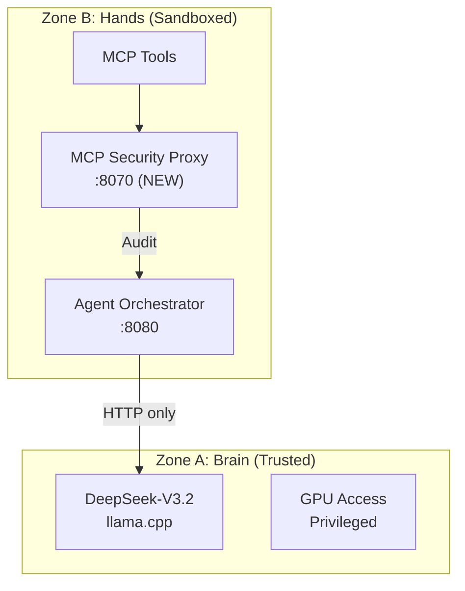
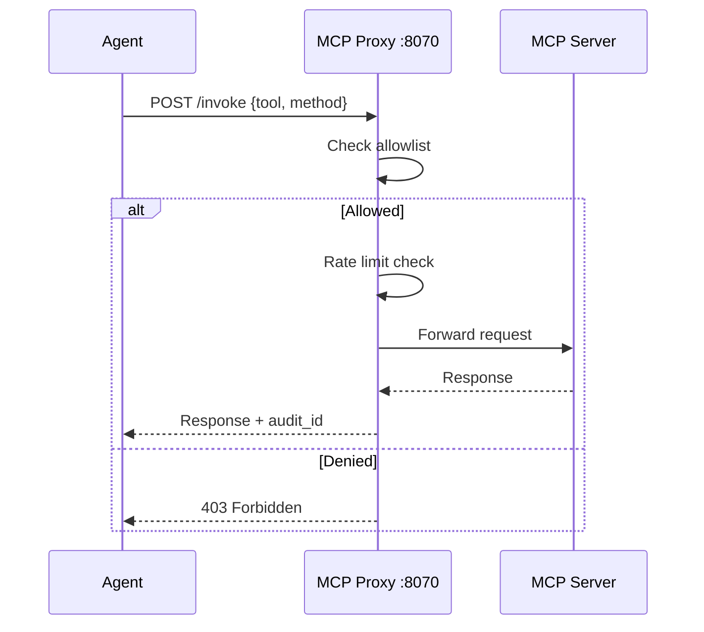

# Security Overview

Security architecture and best practices for Protocol OMNI v15.1.

## Zone Architecture

Protocol OMNI implements a split-runtime architecture separating inference (trusted) from agents (untrusted).



### Zone A (Brain)

| Property | Value |
|----------|-------|
| **Runtime** | Standard Docker |
| **Network** | internal_brain (isolated) |
| **Privileged** | Yes (GPU access) |
| **Components** | llama.cpp, DeepSeek-V3.2 |

Zone A runs the inference engine with full hardware access for performance.

### Zone B (Hands)

| Property | Value |
|----------|-------|
| **Runtime** | Standard Docker |
| **Network** | omni-network |
| **Privileged** | No |
| **Components** | Agents, MCP Proxy, Orchestrator |

Zone B runs sandboxed. Components cannot:
- Access `/dev/nvidia*` devices directly
- Read `/nvme/models/` directory
- Execute code on host kernel
- Communicate with Zone A except via HTTP

See [Zone Security](../architecture/zone-security.md) for detailed architecture.

## MCP Security Proxy (v15.1 - DEPLOYED)

The MCP Security Proxy is the **only** gateway for external tool access. All MCP tool invocations MUST route through `:8070`.

### Architecture



### Configuration

```yaml
# config/mcp-allowlist.yaml
version: "1.0"
policy: deny  # DEFAULT DENY

allowed_tools:
  mcp_ssh-mcp:
    methods: [ssh_connect, ssh_execute, ssh_disconnect]
    rate_limit: 10/min
    audit: true
    
  mcp_context7:
    methods: [*]
    rate_limit: 30/min
    audit: false  # Read-only, low risk
    
  mcp_github:
    methods: [search_code, get_file_contents, list_commits]
    rate_limit: 20/min
    audit: true

denied_tools:
  - mcp_filesystem  # Use SSH instead
  - mcp_shell       # Direct shell forbidden
  - mcp_exec        # Direct execution forbidden
```

### Verification Commands

```bash
# Health check
curl http://localhost:8070/health
# {"status":"ok","policy":"deny"}

# Test deny (should return 403)
curl -X POST localhost:8070/invoke \
  -H "Content-Type: application/json" \
  -d '{"tool":"mcp_shell","method":"execute"}'

# Test allow (should return 200)
curl -X POST localhost:8070/invoke \
  -H "Content-Type: application/json" \
  -d '{"tool":"mcp_context7","method":"query"}'

# Check metrics
curl localhost:8070/metrics | grep mcp
```

### Prometheus Metrics

| Metric | Type | Description |
|--------|------|-------------|
| `mcp_invocations_total` | Counter | Total invocations by tool/method/status |
| `mcp_denied_total` | Counter | Denied invocations by reason |
| `mcp_invocation_duration_seconds` | Histogram | Latency distribution |

### Attack Vectors Mitigated

| Vector | Risk | Mitigation |
|--------|------|------------|
| **Conversation Hijacking** | MCP Sampling injects instructions | Sampling disabled |
| **Covert Tool Invocation** | Unauthorized file/network ops | Default Deny + Audit |
| **Rate Limit Bypass** | Runaway agent loops | Per-tool rate limits |
| **Privilege Escalation** | Shell/exec access | Explicit deny list |

### Security Status (v15.1)

- [x] MCP Security Proxy deployed on :8070
- [x] Default Deny policy enforced
- [x] 7 tools explicitly permitted
- [x] Prometheus metrics flowing
- [x] Audit logging enabled for high-risk tools
- [ ] Anomaly detection on embedding distributions (Phase 2)
- [ ] Separate user input from retrieved context (Phase 2)

## Credential Management

### Storage

Credentials are stored securely outside the repository. Access via:

1. **Environment Variables**: For container runtime
2. **Kubernetes Secrets**: For k8s deployments
3. **Vault**: For production secrets management

### Never Commit

- API keys or tokens
- Passwords or passphrases
- Private SSH keys
- Database credentials

### Example `.env.example`

```bash
# Copy to .env and fill in values
GRAFANA_ADMIN_PASSWORD=
POSTGRES_PASSWORD=
KIMI_API_KEY=
QWEN_API_KEY=
```

## Network Security

### Zone Communication

```
Zone B → Zone A: HTTP only (port 8000)
Zone A → Zone B: Not allowed
External → Zone A: Blocked (no ingress)
External → Zone B: Blocked (no ingress)
```

### Firewall Rules (k8s NetworkPolicy)

```yaml
apiVersion: networking.k8s.io/v1
kind: NetworkPolicy
metadata:
  name: zone-b-egress
  namespace: agents
spec:
  podSelector: {}
  policyTypes:
  - Egress
  egress:
  - to:
    - ipBlock:
        cidr: 192.168.3.10/32
    ports:
    - port: 8000
      protocol: TCP
```

## Blackwell GPU Security

Consumer Blackwell GPUs have a reset bug requiring careful container management:

| Setting | Value | Reason |
|---------|-------|--------|
| restartPolicy | OnFailure | Prevent reset loops |
| startupProbe | 25min | Allow model load time |
| livenessProbe | 10min | Generous failure tolerance |

See [Blackwell Mitigation](../architecture/zone-security.md#blackwell-reset-bug) for details.

## Audit Logging

### What to Log

- All MCP tool invocations
- Zone B → Zone A requests
- Authentication attempts
- Model inference requests (sample)

### Where

- OTEL Collector → Arize Phoenix
- Prometheus metrics
- Container logs (structured JSON)

## Incident Response

### GPU Freeze (Blackwell Reset)

```bash
# Immediate: Scale down to prevent loops
kubectl scale deployment inference-engine --replicas=0

# Wait 30 seconds for GPU reset
sleep 30

# Restart
kubectl scale deployment inference-engine --replicas=1
```

### Suspected Compromise

1. Isolate Zone B: `kubectl scale -n agents --replicas=0 --all`
2. Preserve logs: `kubectl logs -n agents --all-containers`
3. Check MCP audit: Review Arize Phoenix traces
4. Rotate credentials if needed

## Related Documentation

- [Zone Security Architecture](../architecture/zone-security.md)
- [Monitoring](../operations/monitoring.md)
- [Troubleshooting](../operations/troubleshooting.md)
