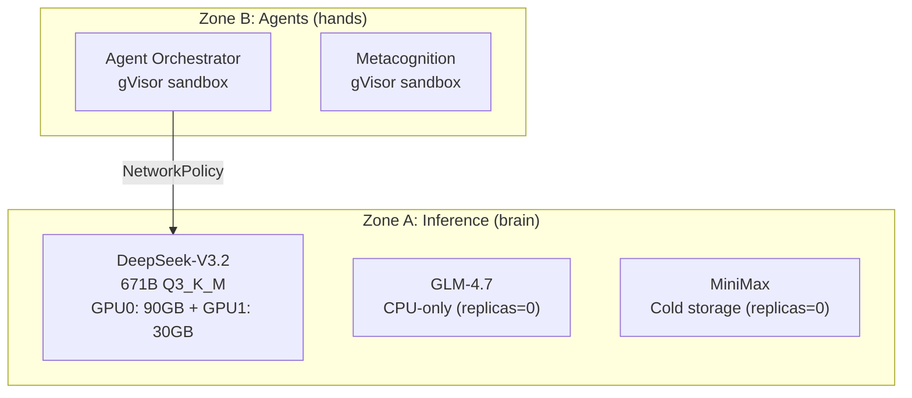

# Kubernetes Manifests

Production Kubernetes manifests for Protocol OMNI v15.0.

> **Note**: For development, use Docker Compose (`docker/omni-stack.yaml`). Kubernetes is for production Zone A/B isolation with k3s.

## Architecture



## VRAM Constraints

> **CRITICAL**: DeepSeek-V3.2 consumes 100% of available VRAM:
> - GPU0 (96GB): 90GB allocated
> - GPU1 (32GB): 30GB allocated
>
> GLM and MiniMax are set to `replicas=0` by default.

## Manifests

| File | Purpose | Namespace |
|------|---------|-----------|
| `zone-a-inference.yaml` | DeepSeek-V3.2, GLM, MiniMax deployments | `inference` |
| `zone-b-agents.yaml` | Agent Orchestrator, Metacognition (gVisor) | `agents` |
| `network-policy.yaml` | Zone B → Zone A egress restrictions | `agents`, `inference` |
| `prometheus-alerts.yaml` | Critical alerts (Blackwell reset, OOM, etc.) | `monitoring` |

## Zone Separation

### Zone A (Brain)
- **Namespace**: `inference`
- **Runtime**: Standard containerd
- **Network**: hostNetwork for direct GPU access
- **Security**: Full hardware access, trusted workloads only

### Zone B (Hands)
- **Namespace**: `agents`
- **Runtime**: gVisor (`runtimeClassName: gvisor`)
- **Network**: Restricted egress via NetworkPolicy
- **Security**: Sandboxed execution, drop all capabilities

## Deployment

### Prerequisites

1. Ubuntu 24.04 bare metal with k3s installed
2. NVIDIA drivers 580.x and nvidia-container-toolkit
3. Local storage directories:
   ```bash
   sudo mkdir -p /nvme/models /nvme/prompts
   ```

### Install k3s

```bash
# Install k3s
curl -sfL https://get.k3s.io | sh -

# Configure NVIDIA runtime for k3s (uses k3s containerd config template)
sudo nvidia-ctk runtime configure --runtime=containerd --config=/var/lib/rancher/k3s/agent/etc/containerd/config.toml.tmpl
sudo systemctl restart k3s
```

### Create Namespaces

```bash
# Create required namespaces
kubectl create namespace inference
kubectl create namespace agents
kubectl create namespace monitoring
```

### Create Model Storage PV/PVC

> **Note**: These values match `zone-a-inference.yaml` expectations. Adjust `storage` if your model directory differs.

```bash
# Create PVs and PVCs for model and prompt storage
cat <<EOF | kubectl apply -f -
apiVersion: v1
kind: PersistentVolume
metadata:
  name: models-pv
spec:
  capacity:
    storage: 500Gi
  accessModes:
    - ReadOnlyMany
  persistentVolumeReclaimPolicy: Retain
  hostPath:
    path: /nvme/models
    type: Directory
---
apiVersion: v1
kind: PersistentVolumeClaim
metadata:
  name: models-pvc
  namespace: inference
spec:
  accessModes:
    - ReadOnlyMany
  resources:
    requests:
      storage: 500Gi
  volumeName: models-pv
  storageClassName: ""
---
apiVersion: v1
kind: PersistentVolume
metadata:
  name: prompts-pv
spec:
  capacity:
    storage: 1Gi
  accessModes:
    - ReadOnlyMany
  persistentVolumeReclaimPolicy: Retain
  hostPath:
    path: /nvme/prompts
    type: Directory
---
apiVersion: v1
kind: PersistentVolumeClaim
metadata:
  name: prompts-pvc
  namespace: inference
spec:
  accessModes:
    - ReadOnlyMany
  resources:
    requests:
      storage: 1Gi
  volumeName: prompts-pv
  storageClassName: ""
EOF

# Verify
kubectl get pv,pvc -n inference
```

### Deploy Zone A (Inference)

```bash
kubectl apply -f zone-a-inference.yaml

# Wait for model load (5-10 minutes for 281GB)
kubectl logs -n inference deploy/deepseek-v32 -f

# Verify health
curl http://localhost:8000/health
```

### Deploy Zone B (Agents)

```bash
kubectl apply -f zone-b-agents.yaml
kubectl apply -f network-policy.yaml

# Verify gVisor isolation
kubectl exec -n agents deploy/agent-orchestrator -- cat /proc/version
```

### Deploy Alerts

```bash
kubectl apply -f prometheus-alerts.yaml
```

## Key Configuration

### Blackwell GPU Stability

The RTX 5090 has a known FLR (Function Level Reset) bug. Mitigations:

```yaml
startupProbe:
  initialDelaySeconds: 300  # 5 min initial wait
  failureThreshold: 40      # 25 min total tolerance
livenessProbe:
  initialDelaySeconds: 600  # 10 min grace
  failureThreshold: 10      # 10 min tolerance
```

### Memory Limits

```yaml
resources:
  limits:
    memory: "280Gi"
  requests:
    memory: "280Gi"  # requests == limits for Guaranteed QoS
```

## Troubleshooting

### Pod Stuck in Pending

```bash
# Check for taint issues
kubectl describe node | grep Taints

# Remove control-plane taint for single-node
kubectl taint nodes $(hostname) node-role.kubernetes.io/control-plane:NoSchedule-
```

### GPU Not Visible

```bash
# Check NVIDIA device plugin
kubectl get pods -n kube-system | grep nvidia

# Verify GPU allocation
kubectl describe node | grep nvidia.com/gpu

# Test GPU access (explicit GPU resource request)
kubectl run gpu-test --rm -it --restart=Never --image=nvidia/cuda:13.0.1-base-ubi9 --overrides='{"spec":{"containers":[{"name":"gpu-test","image":"nvidia/cuda:13.0.1-base-ubi9","resources":{"limits":{"nvidia.com/gpu":"1"}}}]}}' -- nvidia-smi
```

## Scaling

### Enable GLM (CPU-only)

Only if DeepSeek is stopped:

```bash
kubectl scale deploy/glm-executor -n inference --replicas=1
```

### Enable MiniMax (Emergency Failover)

```bash
kubectl scale deploy/deepseek-v32 -n inference --replicas=0
kubectl scale deploy/minimax-failsafe -n inference --replicas=1
```

## Related Documentation

- [k3s Production Guide](../docs/deployment/k3s-production.md)
- [Docker Compose](../docker/README.md) - Development alternative
- [Zone Security](../docs/architecture/zone-security.md)
