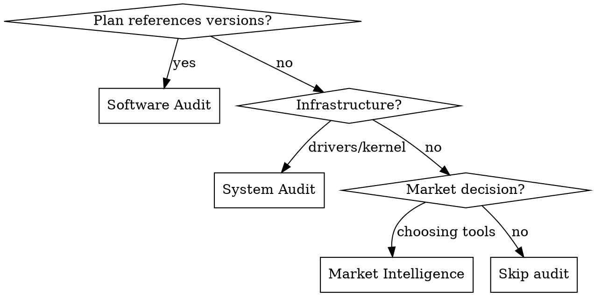
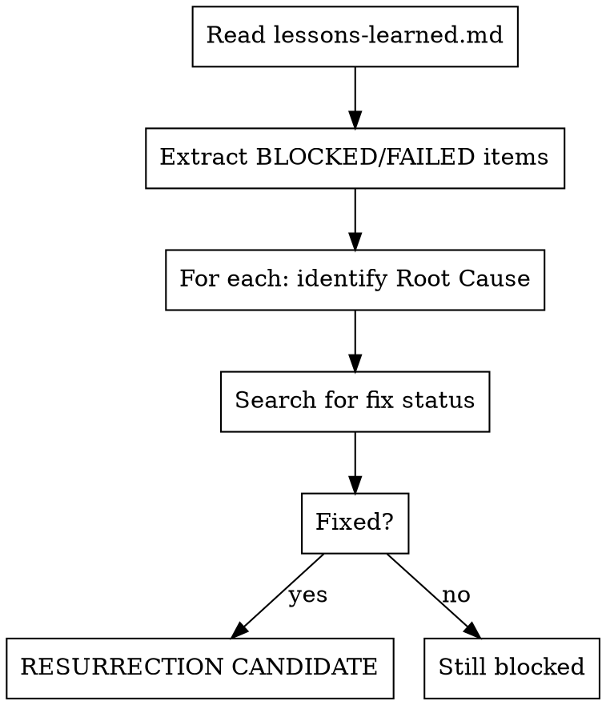

# Sentinel Audit (v2.1 - Recidivism Protocol)

## Overview

**Multi-layer audit of technical stack against real-world 2026 releases and market intelligence.**

Core principle: Plans and infrastructure age rapidly. Signal Vector to primary sources (release notes, driver pages, Reddit, GitHub trending) before implementing stale patterns or missing paradigm shifts.

## Prerequisites

One of these MCP/tools MUST be available:
- `mcp_agent-browser` - headless Chromium automation
- `web_search` - built-in search tool
- `web_fetch` - URL fetching

If none available, STOP and inform user.

## When to Use



**Triggers:**
- Reviewing AGENTS.md or architecture docs
- Plan includes library versions
- Pre-implementation review of specs
- Upgrading from older documentation
- Before suggesting inference engines, tools, or alternatives
- Quarterly infrastructure health check
- **NEW (v2.1):** Checking if previously-blocked technologies are now viable
- **NEW (v2.1):** After major driver/SDK updates that may unblock dependencies

**Skip when:**
- Writing new plans (audit after draft)
- User explicitly says versions are current

---

## Layer 1: Software Audit (Original)

### Step 1: Extract Stack

| Library | Version in Plan | Category |
|---------|-----------------|----------|
| LangGraph | v1.0.6 | Orchestration |
| Mem0 | 1.0.2 | Memory |
| llama.cpp | sm120 | Inference |

### Step 2: Signal Vectoring

For EACH library, search in order:

1. `"[Library] latest release" site:github.com OR site:pypi.org`
2. `"[Library] breaking changes 2026" OR migration guide`
3. `"[Library] deprecated" site:github.com/issues`

**High-Signal Sources:**
- GitHub Releases / Changelogs
- PyPI / npm / crates.io version pages
- Official migration guides

**Reject (Low-Signal):**
- Generic blog posts, "Top 10" listicles
- StackOverflow answers >6 months old
- Medium articles without code

### Step 3: Gap Analysis

| Library | Plan | Current | Gap |
|---------|------|---------|-----|
| LangGraph | 1.0.6 | 1.0.7 | MINOR |
| Mem0 | 1.0.2 | 1.0.5 | MINOR |

**Flags:** `DEPRECATED`, `MAJOR`, `MINOR`, `PIN`

---

## Layer 2: System Audit (NEW)

**Scope:** Host drivers, kernel, critical binaries.

### Targets

| Component | Check Command | Source URL |
|-----------|---------------|------------|
| NVIDIA Driver | `nvidia-smi` | nvidia.com/download/driverResults.aspx |
| CUDA Toolkit | `nvcc --version` | developer.nvidia.com/cuda-downloads |
| Kernel | `uname -r` | kernel.org |
| Docker | `docker --version` | github.com/moby/moby/releases |
| llama.cpp | `git log -1 --format=%H` | github.com/ggml-org/llama.cpp/releases |

### Procedure

1. **Query host** via `mcp_ssh-mcp` or locally:
   ```bash
   nvidia-smi --query-gpu=driver_version --format=csv,noheader
   ```

2. **Search latest** from NVIDIA:
   ```
   "NVIDIA driver" "Linux x64" "latest" site:nvidia.com 2026
   ```

3. **Gap Analysis:**
   | Component | Installed | Latest | Gap |
   |-----------|-----------|--------|-----|
   | NVIDIA Driver | 570.133.07 | 580.x | MAJOR |

---

## Layer 3: Strategic Audit (NEW - Market Intelligence)

**Purpose:** Unbiased scan for paradigm shifts and superior alternatives.

### Intelligence Protocol (MANDATORY)

For each component category, execute these searches:

#### Reddit LocalLLaMA (Primary Signal)
```
site:reddit.com/r/LocalLLaMA "best [component] 2026"
site:reddit.com/r/LocalLLaMA "[component] vs" 2026
```

#### GitHub Trending
```
site:github.com/trending "[component]" stars:>500
```

#### HuggingFace Leaderboards
```
site:huggingface.co/spaces "[leaderboard]" [component]
```

### Paradigm Shift Detection

**Flag as PARADIGM SHIFT if:**
- New tool gained >1k GitHub stars in <30 days
- Major player (NVIDIA, Microsoft, Google) released new framework
- Community consensus shifted (3+ Reddit threads agreeing)
- Existing tool entered maintenance mode

### Market Scan Categories

| Category | Search Pattern |
|----------|----------------|
| Inference Engines | `"best inference engine" [GPU arch] 2026 site:reddit.com/r/LocalLLaMA` |
| TTS/Voice | `"state of the art TTS" "open source" 2026 site:reddit.com` |
| Orchestration | `"LangGraph vs" OR "CrewAI vs" 2026` |
| Memory Systems | `"Memgraph alternatives" OR "graph database" 2026` |
| Observability | `"Arize Phoenix vs" OR "LLM observability" 2026` |

### Output Format

```markdown
## Market Intelligence Report

### [Component Category]

**Current:** [Your tool]
**Top Alternatives Found:**

| Tool | Stars | Activity | Verdict |
|------|-------|----------|---------|
| Tool A | 15k | 500 commits/month | Evaluate |
| Tool B | 8k | Maintenance mode | Skip |

**Reddit Consensus:** [Summary of community opinion]
**Paradigm Shift?:** [Yes/No + reasoning]
```

---

## Layer 4: Cold Case Review (Recidivism Protocol)

**Purpose:** Determine if previously-blocked technologies are now viable due to upstream fixes.

### Mandatory Input Source

**MUST READ FIRST:** `docs/architecture/lessons-learned.md` (or equivalent failure registry)

This file contains the Failure Registry with:
- Failure IDs (F-001, F-002, etc.)
- Root causes (kernel gaps, architecture mismatches, etc.)
- Related GitHub issues

### Procedure



### Step 1: Extract Cold Cases

Parse `lessons-learned.md` for items with:
- `Severity: BLOCKING`
- `Status: BLOCKED`
- `FAILED` in title

Build extraction table:

| ID | Technology | Root Cause | Issue Link |
|----|------------|------------|------------|
| F-001 | KTransformers | sm_120 kernels missing | - |
| F-001 | vLLM | FP8 GEMM kernel fails | #26211 |
| F-001 | SGLang | RMSNorm kernel issues | #9542 |
| F-008 | MXFP4 | deepseek3_2 arch unsupported | #16331 |

### Step 2: Search for Resurrection

For EACH cold case, execute targeted searches:

**Changelog Search:**
```
"[Technology] changelog January 2026"
"[Technology] release notes 2026"
site:github.com/[org]/[repo]/releases "[Root Cause keyword]"
```

**Fix-Specific Search:**
```
"[Technology] [Root Cause] fixed"
"[Technology] sm120 support" OR "[Technology] Blackwell support"
site:github.com/[org]/[repo]/issues/[ID] 
```

**Reddit Pulse:**
```
site:reddit.com/r/LocalLLaMA "[Technology]" "Blackwell" 2026
```

### Step 3: Verdict Matrix

| ID | Technology | Root Cause | Fix Status | Verdict |
|----|------------|------------|------------|---------|
| F-001 | KTransformers | sm_120 kernels | Upstream PR merged | RESURRECTION CANDIDATE |
| F-001 | vLLM | FP8 GEMM | Issue open, no fix | STILL BLOCKED |

**Verdict Flags:**
- `RESURRECTION CANDIDATE` - Fix confirmed, re-evaluate
- `STILL BLOCKED` - No fix found
- `PARTIAL FIX` - Some progress, monitor
- `DEPRECATED` - Technology abandoned upstream

### Output Format

```markdown
## Cold Case Review Report

**Date:** [YYYY-MM-DD]
**Source:** docs/architecture/lessons-learned.md

### Resurrection Candidates

| Technology | Original Blocker | Fix Found | Action |
|------------|------------------|-----------|--------|
| [Tool] | [Root cause] | [PR/Release] | Re-evaluate |

### Still Blocked

| Technology | Original Blocker | Status | Re-check Date |
|------------|------------------|--------|---------------|
| [Tool] | [Root cause] | Open issue #X | Q2 2026 |

### Recommendations
[Prioritized re-evaluation queue]
```

---

## Quick Reference

| Layer | Scope | Key Sources |
|-------|-------|-------------|
| Software | Libraries, APIs | PyPI, npm, GitHub Releases |
| System | Drivers, Kernel, Binaries | nvidia.com, kernel.org |
| Strategic | Market alternatives | Reddit LocalLLaMA, GitHub Trending, HF Leaderboards |
| Cold Case | Previously-blocked tech | lessons-learned.md, GitHub Issues, Release Notes |

## Common Mistakes

| Mistake | Fix |
|---------|-----|
| Assuming current tool is best | Run unbiased market scan FIRST |
| Trusting blog post dates | Check actual release dates |
| Missing driver updates | Query host before audit |
| Ignoring Reddit consensus | r/LocalLLaMA is ground truth for inference |
| Skipping GitHub trending | New tools appear there first |
| Never revisiting blocked tech | Run Cold Case Review quarterly |
| Trusting "still broken" assumptions | Upstream fixes land silently - verify |

## Execution Template

```markdown
## Sentinel 2.1 Audit Report

**Date:** [YYYY-MM-DD]
**Scope:** [Software | System | Strategic | Cold Case | All]

### Layer 1: Software Gaps
[Table of library version gaps]

### Layer 2: System Gaps  
[Driver/kernel version gaps]

### Layer 3: Market Intelligence
[Unbiased alternatives for each category]

### Layer 4: Cold Case Review
[Resurrection candidates from lessons-learned.md]

### Critical Findings
[DEPRECATED, PARADIGM SHIFT, or RESURRECTION CANDIDATE items]

### Recommendations
[Prioritized action items]
```
